Modelo de Rasch
================

## Resultados cuarto primaria

``` r
library(readxl)
library(tidyverse)
```

    ## ── Attaching core tidyverse packages ──────────────────────── tidyverse 2.0.0 ──
    ## ✔ dplyr     1.1.4     ✔ readr     2.1.5
    ## ✔ forcats   1.0.0     ✔ stringr   1.5.1
    ## ✔ ggplot2   3.5.2     ✔ tibble    3.2.1
    ## ✔ lubridate 1.9.3     ✔ tidyr     1.3.1
    ## ✔ purrr     1.0.2     
    ## ── Conflicts ────────────────────────────────────────── tidyverse_conflicts() ──
    ## ✖ dplyr::filter() masks stats::filter()
    ## ✖ dplyr::lag()    masks stats::lag()
    ## ℹ Use the conflicted package (<http://conflicted.r-lib.org/>) to force all conflicts to become errors

``` r
library(eRm)
library(TAM)
```

    ## Cargando paquete requerido: CDM
    ## Cargando paquete requerido: mvtnorm
    ## **********************************
    ## ** CDM 8.2-6 (2022-08-25 15:43:23)       
    ## ** Cognitive Diagnostic Models  **
    ## **********************************
    ## 
    ## * TAM 4.2-21 (2024-02-19 18:52:08)

``` r
library(mirt)
```

    ## Cargando paquete requerido: stats4
    ## Cargando paquete requerido: lattice
    ## 
    ## Adjuntando el paquete: 'mirt'
    ## 
    ## The following objects are masked from 'package:eRm':
    ## 
    ##     itemfit, personfit

``` r
cuarto0 <- read_xlsx("data/Cuarto.xlsx")
```

#### Número de estudiantes de cuarto primaria evaluados y promedio obtenido en cada departamento.

``` r
cuarto0 %>% mutate(Departamento = as.factor(Departamento),
                   Municipio = as.factor(Municipio)) %>% 
  group_by(Departamento) %>% 
  summarise(Estudiantes = n(), 
            Promedio = mean(Nota), SD = sd(Nota)) %>% 
  arrange(Promedio)
```

    ## # A tibble: 13 × 4
    ##    Departamento   Estudiantes Promedio    SD
    ##    <fct>                <int>    <dbl> <dbl>
    ##  1 Totonicapán             65     43.2  13.8
    ##  2 Quetzaltenango         101     44.6  14.0
    ##  3 Escuintla               74     45.3  15.8
    ##  4 Santa Rosa             116     46.6  16.2
    ##  5 Alta Verapaz            89     50.0  13.5
    ##  6 Baja Verapaz            95     51.3  14.3
    ##  7 Guatemala              248     53.4  17.5
    ##  8 Petén                  120     55.8  14.0
    ##  9 Sololá                 100     56.3  15.1
    ## 10 San Marcos              92     57.3  16.4
    ## 11 Sacatepéquez           100     58.0  14.7
    ## 12 Izabal                 170     61.0  15.8
    ## 13 Zacapa                  57     64.1  16.6

#### Distribución de notas de los alumnos de cuarto primaria

``` r
x <- seq(0, 100, length.out = 100)
y <- dnorm(x, mean(cuarto0$Nota), sd(cuarto0$Nota))
campana <- data.frame(x = x, y = y)
  
cuarto0 %>% ggplot(aes(x = Nota)) +
  geom_histogram(binwidth = 100/30, 
                 color = "blue4", fill = "deepskyblue3", 
                 center = 100/60) +
  geom_line(data = campana, mapping = aes(x, y*14270/3)) +
  ylab("Frecuencia")
```

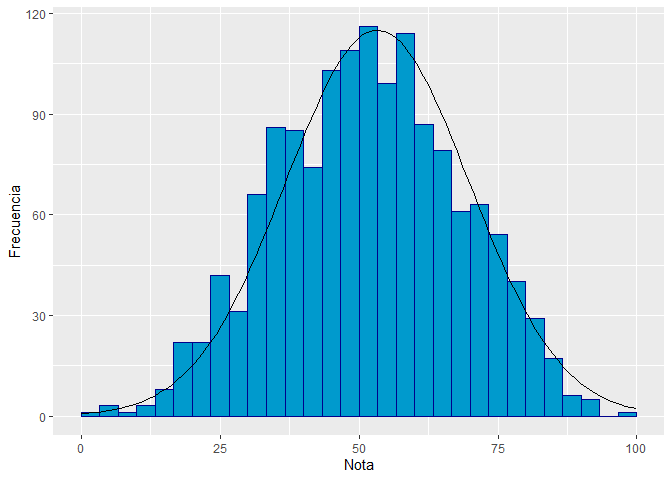<!-- -->

``` r
moda  <- function(x)
{
  tabla <- table(x)
  return(as.numeric(names(tabla)[tabla==max(tabla)]))
}
```

#### Datos estadísticos de las notas obtenidas por los estudiantes de cuarto primaria

``` r
library(e1071)
cuarto <- data.frame(Media = mean(cuarto0$Nota),
                     Mediana = median(cuarto0$Nota),
                     Moda = moda(cuarto0$Nota),
                     DesviacionEstandar = sd(cuarto0$Nota),
                     Minimo = min(cuarto0$Nota),
                     Maximo = max(cuarto0$Nota),
                     Asimetria = skewness(cuarto0$Nota),
                     Curtosis = kurtosis(cuarto0$Nota))
as.data.frame(t(cuarto))
```

    ##                              V1
    ## Media               53.30530250
    ## Mediana             53.33333333
    ## Moda                53.33333333
    ## DesviacionEstandar  16.49889827
    ## Minimo               3.33333333
    ## Maximo             100.00000000
    ## Asimetria           -0.03550947
    ## Curtosis            -0.44796798

#### Porcentaje de estudiantes que contestaron correctamente cada ítem junto con su dificultad calculada usando el Modelo de Rasch.

``` r
respuestasc <- cuarto0[, 44:73]
rm_sumc <- RM(respuestasc)
tabc <- data.frame(porcentaje = colSums(respuestasc)/14.27,
                   dificultad = -coef(rm_sumc)) %>% arrange(porcentaje)
tabc
```

    ##        porcentaje  dificultad
    ## Item20   6.377015  3.16738286
    ## Item14  14.225648  2.21348737
    ## Item13  25.367905  1.41658306
    ## Item28  27.960757  1.26644088
    ## Item15  28.801682  1.21946468
    ## Item17  31.324457  1.08277713
    ## Item29  33.847232  0.95146473
    ## Item12  35.669236  0.85936081
    ## Item27  37.491240  0.76915838
    ## Item3   38.051857  0.74173849
    ## Item25  38.472320  0.72126774
    ## Item23  44.078486  0.45444178
    ## Item26  47.652418  0.28823823
    ## Item16  51.296426  0.11990390
    ## Item4   51.646811  0.10371833
    ## Item24  53.538893  0.01617753
    ## Item18  55.921514 -0.09466111
    ## Item19  57.112824 -0.15046860
    ## Item7   60.826910 -0.32694458
    ## Item30  64.891381 -0.52635760
    ## Item6   66.433076 -0.60435448
    ## Item22  68.955851 -0.73557407
    ## Item2   74.001402 -1.01564817
    ## Item8   76.664331 -1.17633884
    ## Item9   78.135950 -1.27017692
    ## Item5   82.130343 -1.54866759
    ## Item1   84.863350 -1.76632891
    ## Item21  85.353889 -1.80853273
    ## Item10  87.035739 -1.96203779
    ## Item11  91.030133 -2.40551449

#### Resumen estadístico de los ítems.

``` r
eRm::itemfit(eRm::person.parameter(rm_sumc))
```

    ## 
    ## Itemfit Statistics: 
    ##           Chisq   df p-value Outfit MSQ Infit MSQ Outfit t Infit t Discrim
    ## Item1  1446.654 1425   0.339      1.014     0.997    0.203  -0.047   0.241
    ## Item2  1459.826 1425   0.255      1.024     0.994    0.468  -0.197   0.315
    ## Item3  1667.625 1425   0.000      1.169     1.129    4.549   5.347   0.188
    ## Item4  1650.470 1425   0.000      1.157     1.119    5.027   5.606   0.216
    ## Item5  1219.208 1425   1.000      0.855     0.921   -2.083  -1.927   0.351
    ## Item6  1283.702 1425   0.997      0.900     0.938   -2.548  -2.541   0.411
    ## Item7  1210.942 1425   1.000      0.849     0.905   -4.609  -4.404   0.467
    ## Item8  1170.656 1425   1.000      0.821     0.889   -3.288  -3.397   0.431
    ## Item9  1203.311 1425   1.000      0.844     0.930   -2.677  -1.988   0.389
    ## Item10 1545.238 1425   0.014      1.084     0.940    0.915  -1.125   0.262
    ## Item11 1177.496 1425   1.000      0.826     0.901   -1.536  -1.469   0.281
    ## Item12 1532.716 1425   0.024      1.075     1.040    1.943   1.637   0.282
    ## Item13 1583.929 1425   0.002      1.111     1.057    2.015   1.743   0.222
    ## Item14 1727.403 1425   0.000      1.211     0.987    2.318  -0.241   0.182
    ## Item15 1451.316 1425   0.308      1.018     0.959    0.389  -1.430   0.339
    ## Item16 1358.039 1425   0.897      0.952     0.955   -1.615  -2.234   0.403
    ## Item17 1655.003 1425   0.000      1.161     1.076    3.536   2.754   0.220
    ## Item18 1211.320 1425   1.000      0.849     0.891   -5.083  -5.422   0.488
    ## Item19 1227.655 1425   1.000      0.861     0.906   -4.583  -4.561   0.474
    ## Item20 3203.074 1425   0.000      2.246     1.061    6.410   0.739  -0.081
    ## Item21 1031.228 1425   1.000      0.723     0.855   -3.614  -3.117   0.422
    ## Item22 1057.231 1425   1.000      0.741     0.839   -6.495  -6.398   0.536
    ## Item23 1478.645 1425   0.157      1.037     1.043    1.181   1.991   0.304
    ## Item24 1371.512 1425   0.842      0.962     0.976   -1.269  -1.184   0.383
    ## Item25 1376.393 1425   0.818      0.965     0.962   -0.993  -1.669   0.379
    ## Item26 1302.748 1425   0.991      0.914     0.922   -2.962  -3.882   0.443
    ## Item27 1389.326 1425   0.746      0.974     0.945   -0.710  -2.360   0.391
    ## Item28 1565.444 1425   0.005      1.098     1.000    1.963   0.002   0.284
    ## Item29 1761.602 1425   0.000      1.235     1.140    5.491   5.290   0.165
    ## Item30 1477.376 1425   0.163      1.036     1.013    0.938   0.559   0.313

#### Coeficiente alfa de Cronbach

``` r
library(psych)
```

    ## 
    ## Adjuntando el paquete: 'psych'

    ## The following object is masked from 'package:eRm':
    ## 
    ##     sim.rasch

    ## The following objects are masked from 'package:ggplot2':
    ## 
    ##     %+%, alpha

``` r
alfa <- psych::alpha(respuestasc, check.keys=TRUE)
```

    ## Warning in psych::alpha(respuestasc, check.keys = TRUE): Some items were negatively correlated with the first principal component and were automatically reversed.
    ##  This is indicated by a negative sign for the variable name.

``` r
alfa$total$raw_alpha
```

    ## [1] 0.7871026

#### Mapa Person-Item de los ítems de la prueba realizada a los alumnos de cuarto primaria.

``` r
plotPImap(rm_sumc, item.subset = 1:15) #Para ordenar: sorted = TRUE
```

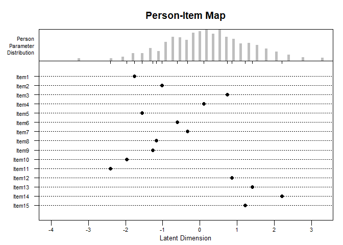<!-- -->

``` r
plotPImap(rm_sumc, item.subset = 16:30)
```

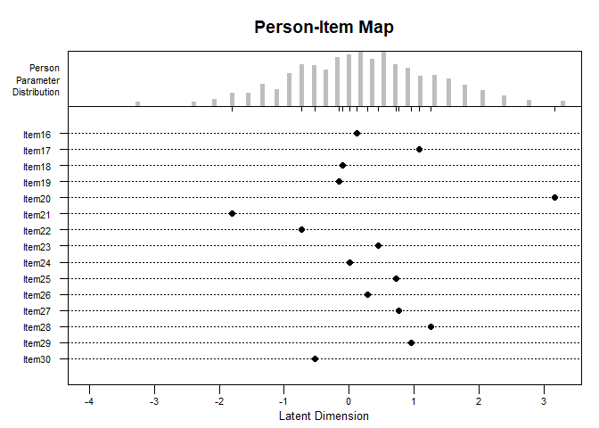<!-- -->

#### Curva característica del ítem 20

``` r
plotICC(rm_sumc, item.subset = 20, empICC = list("raw"), empCI = list())
```

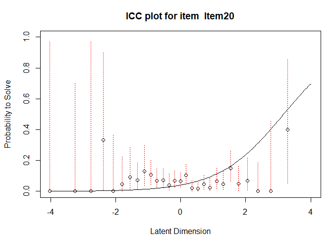<!-- -->

## Resultados quinto primaria

``` r
quinto0 <- read_xlsx("data/Quinto.xlsx")
```

#### Número de estudiantes de quinto primaria evaluados y promedio obtenido en cada departamento.

``` r
quin <- quinto0 %>% mutate(Departamento = as.factor(Departamento)) %>% 
  group_by(Departamento) %>% 
  summarise(Estudiantes = n(), 
            Promedio = mean(Nota), SD = sd(Nota)) %>% 
  arrange(Promedio)
quin
```

    ## # A tibble: 13 × 4
    ##    Departamento   Estudiantes Promedio    SD
    ##    <fct>                <int>    <dbl> <dbl>
    ##  1 Alta Verapaz            85     35.1  12.3
    ##  2 Baja Verapaz            94     36.9  12.2
    ##  3 Santa Rosa             104     40.4  12.6
    ##  4 Escuintla               70     40.9  16.0
    ##  5 Quetzaltenango          62     41.8  15.6
    ##  6 Zacapa                  70     43.0  16.1
    ##  7 Petén                   92     46.1  14.1
    ##  8 Totonicapán             92     47.4  15.8
    ##  9 Guatemala              224     47.6  16.5
    ## 10 Izabal                 170     49.2  14.8
    ## 11 Sacatepéquez           100     50.0  16.7
    ## 12 Sololá                 100     50.6  15.3
    ## 13 San Marcos              90     53.4  15.3

#### Distribución de notas de los alumnos de quinto primaria

``` r
x <- seq(0, 100, length.out = 100)
y <- dnorm(x, mean(quinto0$Nota), sd(quinto0$Nota))
campana <- data.frame(x = x, y = y)
  
quinto0 %>% ggplot(aes(x = Nota)) +
  geom_histogram(binwidth = 100/33, 
                 color = "blue4", fill = "deepskyblue3", 
                 center = 100/66) +
  geom_line(data = campana, mapping = aes(x, y*135300/33)) +
  ylab("Frecuencia")
```

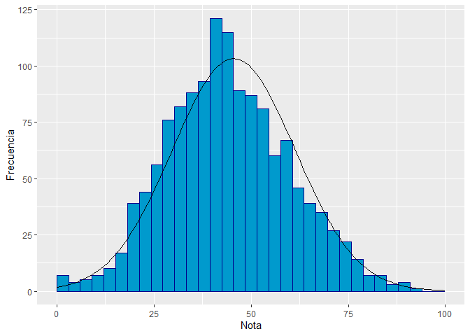<!-- -->

#### Porcentaje de estudiantes que contestaron correctamente cada ítem junto con su dificultad calculada usando el Modelo de Rasch

``` r
respuestasq <- quinto0[, 47:79]
rm_sumq <- RM(respuestasq)
tabq <- data.frame(promedio = colSums(respuestasq)/13.53, 
                   dificultad = -coef(rm_sumq)) %>% arrange(promedio)
tabq
```

    ##        promedio   dificultad
    ## Item15 15.07761  1.689917541
    ## Item11 16.62971  1.564423068
    ## Item32 17.88618  1.469144155
    ## Item4  21.06430  1.248267603
    ## Item33 22.02513  1.186156802
    ## Item29 29.34220  0.762345786
    ## Item8  29.41611  0.758407506
    ## Item31 29.78566  0.738796841
    ## Item7  32.74205  0.586309949
    ## Item24 32.88987  0.578871228
    ## Item19 33.25942  0.560344074
    ## Item9  34.95935  0.476322007
    ## Item20 35.18108  0.465498586
    ## Item28 35.32890  0.458299353
    ## Item13 37.32446  0.362301023
    ## Item18 39.83740  0.244133744
    ## Item25 41.98078  0.145238539
    ## Item27 42.94161  0.101356925
    ## Item26 45.23282 -0.002414102
    ## Item14 49.96305 -0.214349761
    ## Item21 50.77605 -0.250665760
    ## Item22 51.07169 -0.263874265
    ## Item17 54.84109 -0.432832092
    ## Item23 56.61493 -0.513026085
    ## Item6  62.01035 -0.762272478
    ## Item12 64.74501 -0.893222615
    ## Item3  65.85366 -0.947516480
    ## Item16 68.73614 -1.092696154
    ## Item2  71.02735 -1.213098308
    ## Item10 71.32299 -1.229012499
    ## Item5  73.54028 -1.351550069
    ## Item30 83.81375 -2.033583496
    ## Item1  85.73540 -2.196020565

#### Datos estadísticos de las notas obtenidas por los estudiantes de quinto primaria

``` r
quinto <- data.frame(Media = mean(quinto0$Nota),
                     Mediana = median(quinto0$Nota),
                     Moda = moda(quinto0$Nota),
                     DesviacionEstandar = sd(quinto0$Nota),
                     Minimo = min(quinto0$Nota),
                     Maximo = max(quinto0$Nota),
                     simetria = skewness(quinto0$Nota),
                     Curtosis = kurtosis(quinto0$Nota))
as.data.frame(t(quinto))
```

    ##                             V1
    ## Media              45.54413313
    ## Mediana            45.45454545
    ## Moda               42.42424242
    ## DesviacionEstandar 15.83641568
    ## Minimo              0.00000000
    ## Maximo             93.93939394
    ## simetria            0.15596630
    ## Curtosis           -0.06134356

#### Resumen estadístico de los ítems.

``` r
eRm::itemfit(eRm::person.parameter(rm_sumq))
```

    ## 
    ## Itemfit Statistics: 
    ##           Chisq   df p-value Outfit MSQ Infit MSQ Outfit t Infit t Discrim
    ## Item1  1261.951 1347   0.952      0.936     0.963   -0.777  -0.704   0.234
    ## Item2  1136.338 1347   1.000      0.843     0.914   -3.813  -3.134   0.393
    ## Item3  1190.465 1347   0.999      0.883     0.929   -3.346  -3.041   0.394
    ## Item4  1752.244 1347   0.000      1.300     1.137    4.644   3.436   0.041
    ## Item5  1320.352 1347   0.693      0.979     0.983   -0.418  -0.546   0.285
    ## Item6  1164.641 1347   1.000      0.864     0.912   -4.419  -4.210   0.432
    ## Item7  1459.040 1347   0.017      1.082     1.041    2.117   1.613   0.227
    ## Item8  1459.139 1347   0.017      1.082     1.054    1.888   1.883   0.212
    ## Item9  1365.309 1347   0.358      1.013     1.009    0.373   0.383   0.287
    ## Item10 1186.391 1347   0.999      0.880     0.905   -2.837  -3.440   0.395
    ## Item11 1678.191 1347   0.000      1.245     1.085    3.174   1.804   0.086
    ## Item12 1450.026 1347   0.026      1.076     1.032    2.123   1.369   0.231
    ## Item13 1259.311 1347   0.957      0.934     0.953   -2.032  -2.147   0.370
    ## Item14 1265.455 1347   0.944      0.939     0.949   -2.345  -2.777   0.386
    ## Item15 1768.130 1347   0.000      1.312     1.091    3.674   1.795   0.059
    ## Item16 1206.450 1347   0.997      0.895     0.921   -2.712  -3.116   0.382
    ## Item17 1177.322 1347   1.000      0.873     0.894   -4.804  -5.806   0.471
    ## Item18 1337.033 1347   0.571      0.992     0.996   -0.255  -0.200   0.314
    ## Item19 1485.156 1347   0.005      1.102     1.101    2.641   3.921   0.166
    ## Item20 1400.698 1347   0.151      1.039     1.033    1.109   1.378   0.252
    ## Item21 1189.541 1347   0.999      0.882     0.905   -4.598  -5.268   0.445
    ## Item22 1195.860 1347   0.999      0.887     0.917   -4.403  -4.585   0.433
    ## Item23 1271.326 1347   0.930      0.943     0.956   -2.039  -2.287   0.366
    ## Item24 1229.184 1347   0.990      0.912     0.930   -2.383  -2.823   0.395
    ## Item25 1150.092 1347   1.000      0.853     0.883   -5.289  -6.023   0.480
    ## Item26 1439.541 1347   0.040      1.068     1.060    2.424   3.053   0.227
    ## Item27 1336.858 1347   0.573      0.992     0.998   -0.280  -0.112   0.315
    ## Item28 1369.249 1347   0.330      1.016     0.935    0.460  -2.799   0.382
    ## Item29 1544.261 1347   0.000      1.146     1.112    3.251   3.822   0.129
    ## Item30 1292.976 1347   0.851      0.959     0.959   -0.538  -0.859   0.241
    ## Item31 1495.220 1347   0.003      1.109     1.049    2.509   1.732   0.215
    ## Item32 1634.334 1347   0.000      1.212     0.987    2.945  -0.283   0.212
    ## Item33 1555.496 1347   0.000      1.154     1.009    2.594   0.267   0.238

#### Coeficiente alfa de Cronbach

``` r
alfa <- psych::alpha(respuestasq, check.keys=TRUE)
alfa$total$raw_alpha
```

    ## [1] 0.7689337

#### Mapa Person-Item con los ítems de la prueba realizada a los alumnos de quinto primaria.

``` r
plotPImap(rm_sumq, item.subset = 1:17)
```

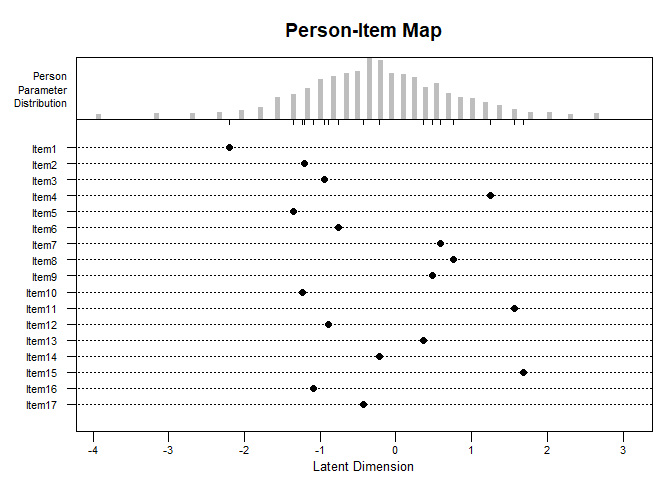<!-- -->

``` r
plotPImap(rm_sumq, item.subset = 18:33)
```

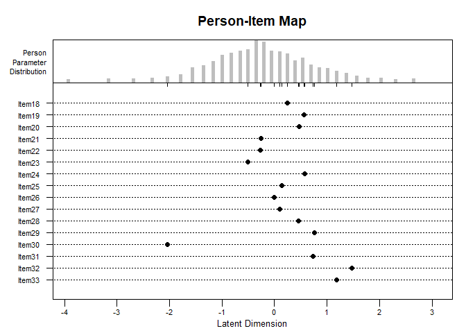<!-- -->

#### Curva característica del ítem 1

``` r
plotICC(rm_sumq, item.subset =4, empICC = list("raw"), empCI = list())
```

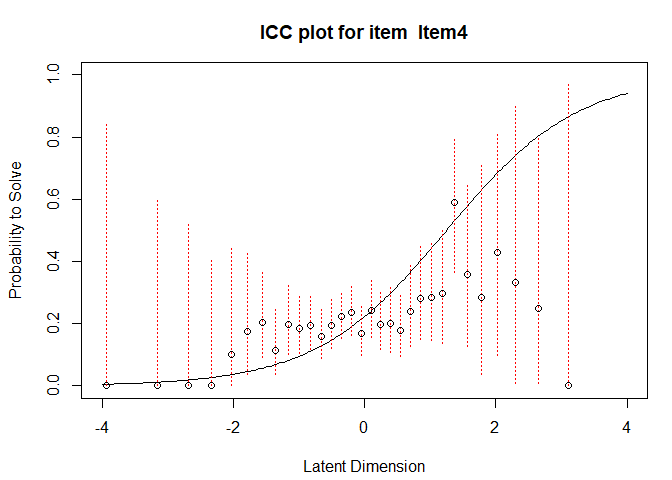<!-- -->

## Resultados sexto primaria

``` r
sexto0 <- read_xlsx("data/Sexto.xlsx")
```

#### Número de estudiantes de sexto primaria evaluados y promedio obtenido en cada departamento.

``` r
se <- sexto0 %>% mutate(Departamento = as.factor(Departamento)) %>% 
  group_by(Departamento) %>% 
  summarise(Estudiantes = n(), 
            Promedio = mean(Nota), SD = sd(Nota)) %>% 
  arrange(Promedio)
se
```

    ## # A tibble: 13 × 4
    ##    Departamento   Estudiantes Promedio    SD
    ##    <fct>                <int>    <dbl> <dbl>
    ##  1 Quetzaltenango          84     42.6  15.1
    ##  2 Santa Rosa             117     42.6  15.6
    ##  3 Escuintla               73     43.8  14.3
    ##  4 Totonicapán             92     43.9  13.7
    ##  5 Zacapa                  70     45.6  18.0
    ##  6 Alta Verapaz            74     46.6  14.5
    ##  7 Baja Verapaz            87     47.8  14.3
    ##  8 Guatemala              258     48.9  15.5
    ##  9 Sacatepéquez            97     50.2  13.0
    ## 10 Izabal                 170     51.1  15.2
    ## 11 Petén                  125     55.4  14.4
    ## 12 San Marcos              94     57.0  16.7
    ## 13 Sololá                 100     57.7  15.1

#### Distribución de notas de los alumnos de sexto primaria

``` r
x <- seq(0, 100, length.out = 100)
y <- dnorm(x, mean(quinto0$Nota), sd(sexto0$Nota))
campana <- data.frame(x = x, y = y)
  
sexto0 %>% ggplot(aes(x = Nota)) +
  geom_histogram(binwidth = 100/33, 
                 color = "blue4", fill = "deepskyblue3", 
                 center = 100/66) +
  geom_line(data = campana, mapping = aes(x, y*144100/33)) +
  ylab("Frecuencia")
```

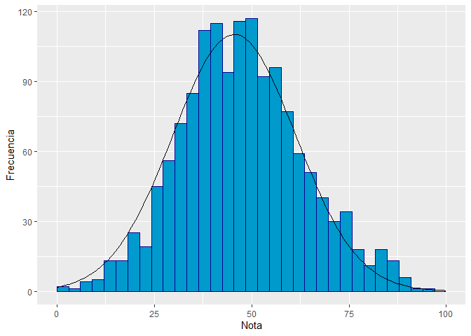<!-- -->

#### Datos estadísticos de las notas obtenidas por los estudiantes de sexto primaria

``` r
sexto <- data.frame(Media = mean(sexto0$Nota),
                     Mediana = median(sexto0$Nota),
                     Moda = moda(sexto0$Nota),
                     DesviacionEstandar = sd(sexto0$Nota),
                     Minimo = min(sexto0$Nota),
                     Maximo = max(sexto0$Nota),
                     simetria = skewness(sexto0$Nota),
                     Curtosis = kurtosis(sexto0$Nota))
as.data.frame(t(sexto))
```

    ##                            V1
    ## Media              49.1325468
    ## Mediana            48.4848485
    ## Moda               51.5151515
    ## DesviacionEstandar 15.7977037
    ## Minimo              3.0303030
    ## Maximo             96.9696970
    ## simetria            0.1987333
    ## Curtosis           -0.0508302

#### Porcentaje de estudiantes que contestaron correctamente cada ítem junto con su dificultad calculada usando el Modelo de Rasch

``` r
respuestass <- sexto0[, 47:79]
rm_sums <- RM(respuestass)
tabs <- data.frame(promedio = colSums(respuestass)/14.41, 
                   dificultad = -coef(rm_sums)) %>% arrange(promedio)
tabs
```

    ##        promedio   dificultad
    ## Item29 15.89174  1.843623373
    ## Item20 22.34559  1.383910034
    ## Item24 22.34559  1.383910038
    ## Item30 23.38654  1.318937129
    ## Item9  25.46842  1.194475907
    ## Item3  27.82790  1.060901159
    ## Item7  30.81194  0.901116736
    ## Item17 33.58779  0.759741640
    ## Item28 34.69813  0.704795126
    ## Item31 39.41707  0.479200088
    ## Item22 41.77654  0.370097780
    ## Item25 43.37266  0.297295591
    ## Item19 43.44205  0.294145608
    ## Item21 43.78904  0.278412852
    ## Item14 44.27481  0.256433209
    ## Item32 44.48300  0.247028863
    ## Item26 45.59334  0.197014512
    ## Item16 46.70368  0.147203442
    ## Item27 49.82651  0.007790298
    ## Item15 50.79806 -0.035495611
    ## Item8  53.15753 -0.140732979
    ## Item33 56.21096 -0.277767355
    ## Item4  57.25191 -0.324863668
    ## Item10 57.94587 -0.356404083
    ## Item11 58.29285 -0.372221939
    ## Item6  58.63983 -0.388073723
    ## Item2  59.68078 -0.435849558
    ## Item23 73.69882 -1.138591474
    ## Item18 73.76822 -1.142506772
    ## Item13 79.04233 -1.461971874
    ## Item5  81.33241 -1.618056654
    ## Item12 86.60652 -2.041868228
    ## Item1  95.90562 -3.391629468

#### Resumen estadístico de los ítems

``` r
eRm::itemfit(eRm::person.parameter(rm_sums))
```

    ## 
    ## Itemfit Statistics: 
    ##           Chisq   df p-value Outfit MSQ Infit MSQ Outfit t Infit t Discrim
    ## Item1  1154.390 1440   1.000      0.801     0.890   -1.176  -0.986   0.191
    ## Item2  1492.249 1440   0.165      1.036     1.031    1.165   1.556   0.266
    ## Item3  1674.132 1440   0.000      1.162     1.028    3.432   0.959   0.227
    ## Item4  1376.560 1440   0.882      0.955     0.959   -1.561  -2.215   0.362
    ## Item5  1305.891 1440   0.995      0.906     0.952   -1.483  -1.197   0.310
    ## Item6  1663.315 1440   0.000      1.154     1.110    4.953   5.569   0.154
    ## Item7  1498.372 1440   0.139      1.040     1.010    0.984   0.403   0.275
    ## Item8  1301.907 1440   0.996      0.903     0.932   -3.651  -3.879   0.414
    ## Item9  1423.463 1440   0.617      0.988     0.963   -0.232  -1.176   0.316
    ## Item10 1409.708 1440   0.711      0.978     0.996   -0.737  -0.185   0.313
    ## Item11 1547.388 1440   0.025      1.074     1.042    2.453   2.184   0.244
    ## Item12 1133.572 1440   1.000      0.787     0.896   -2.752  -2.029   0.336
    ## Item13 1172.392 1440   1.000      0.814     0.914   -3.394  -2.396   0.365
    ## Item14 1472.474 1440   0.270      1.022     1.019    0.780   0.989   0.286
    ## Item15 1260.914 1440   1.000      0.875     0.905   -4.844  -5.512   0.447
    ## Item16 1396.977 1440   0.787      0.969     0.984   -1.121  -0.869   0.337
    ## Item17 1610.854 1440   0.001      1.118     1.106    3.089   4.215   0.165
    ## Item18 1336.149 1440   0.976      0.927     0.948   -1.554  -1.747   0.341
    ## Item19 1389.959 1440   0.824      0.965     0.967   -1.247  -1.761   0.363
    ## Item20 1747.327 1440   0.000      1.213     1.103    3.602   2.804   0.118
    ## Item21 1384.165 1440   0.851      0.961     0.964   -1.400  -1.932   0.360
    ## Item22 1234.874 1440   1.000      0.857     0.891   -5.096  -5.779   0.471
    ## Item23 1276.809 1440   0.999      0.886     0.918   -2.486  -2.823   0.377
    ## Item24 1434.794 1440   0.534      0.996     0.981   -0.059  -0.514   0.282
    ## Item25 1431.521 1440   0.558      0.993     0.983   -0.221  -0.884   0.337
    ## Item26 1268.564 1440   1.000      0.880     0.918   -4.507  -4.577   0.433
    ## Item27 1386.430 1440   0.841      0.962     0.970   -1.418  -1.720   0.356
    ## Item28 1660.578 1440   0.000      1.152     1.118    4.090   4.857   0.141
    ## Item29 1905.663 1440   0.000      1.322     1.103    3.994   2.131   0.058
    ## Item30 1608.572 1440   0.001      1.116     1.029    2.121   0.850   0.200
    ## Item31 1536.011 1440   0.039      1.066     1.046    2.083   2.210   0.246
    ## Item32 1290.007 1440   0.998      0.895     0.923   -3.864  -4.217   0.419
    ## Item33 1345.813 1440   0.963      0.934     0.958   -2.372  -2.296   0.371

#### Coeficiente alfa de Cronbach

``` r
alfa <- psych::alpha(respuestass, check.keys=TRUE)
alfa$total$raw_alpha
```

    ## [1] 0.7657054

#### Mapa Person-Item de los ítems de la prueba realizada a los alumnos de sexto primaria.

``` r
plotPImap(rm_sums, item.subset = 1:18)
```

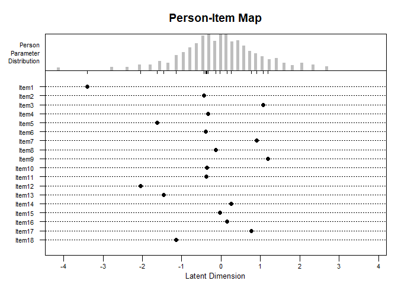<!-- -->

``` r
plotPImap(rm_sums, item.subset = 19:33)
```

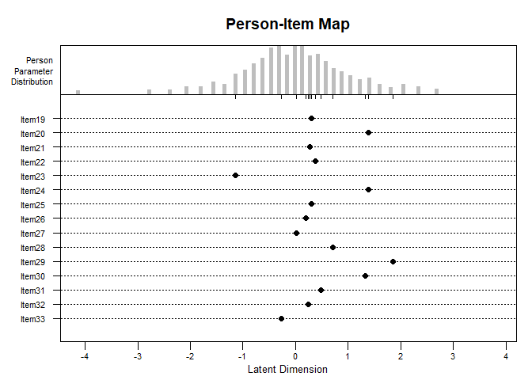<!-- -->

#### Curva característica del ítem 29

``` r
plotICC(rm_sums, item.subset = 29, empICC = list("raw"), empCI = list())
```

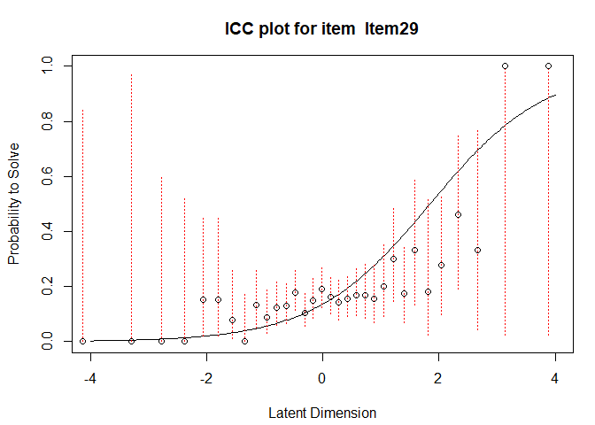<!-- -->

## DIF - Comparación de la dificultad de los ítems entre los departamentos con mejor y peor nota (cuarto primaria)

``` r
cuarto <- read_excel("data/Cuarto.xlsx")
cuartotz <- cuarto %>% filter(Departamento %in% c("Totonicapán", "Zacapa"))
grupo <- as.factor(cuartotz$Departamento)
respuestastz <- cuartotz[, 44:73]
table(grupo)
```

    ## grupo
    ## Totonicapán      Zacapa 
    ##          65          57

``` r
levels(grupo) <- c("Totonicapán", "Zacapa")
```

### Test de Wald

``` r
tz.RM <- RM(respuestastz)
subgroup_diffs <- Waldtest(tz.RM , splitcr = grupo)
subgroup_1_diffs <- subgroup_diffs$betapar1
subgroup_2_diffs <- subgroup_diffs$betapar2
dif <- -subgroup_1_diffs + subgroup_2_diffs
```

``` r
comparisons <- as.data.frame(subgroup_diffs$coef.table)
comparacion <- data.frame("Dificultad Zacapa" = -subgroup_2_diffs,
                          #"SD DZ" = subgroup_diffs$se.beta2,
                          "Dificultad Totonicapán" = -subgroup_1_diffs,
                          #"SD DT" = subgroup_diffs$se.beta1,
                          "Diferencia" = dif,
                          "p" = comparisons$`p-value`)

comparacion %>% arrange(Diferencia)
```

    ##             Dificultad.Zacapa Dificultad.Totonicapán  Diferencia           p
    ## beta Item20        4.58514702             2.12674802 -2.45839899 0.003197956
    ## beta Item12        1.93247219             0.86083809 -1.07163410 0.013077355
    ## beta Item4         0.87344939             0.08447053 -0.78897886 0.043552303
    ## beta Item29        1.47105748             0.68702019 -0.78403730 0.057463756
    ## beta Item30       -0.10846306            -0.65150284 -0.54303978 0.180741578
    ## beta Item26        0.44650332            -0.05268105 -0.49918437 0.203284061
    ## beta Item25        1.12656134             0.68702018 -0.43954116 0.281882466
    ## beta Item16        0.61921507             0.29786988 -0.32134518 0.417698805
    ## beta Item6        -0.42418018            -0.71871303 -0.29453285 0.483297062
    ## beta Item17        1.12656136             0.86083811 -0.26572325 0.523040985
    ## beta Item3         1.04200539             0.86083810 -0.18116728 0.662888845
    ## beta Item27        0.70440029             0.52489633 -0.17950397 0.655501276
    ## beta Item28        1.21154998             1.05003684 -0.16151314 0.705000780
    ## beta Item1        -2.10818159            -2.26953716 -0.16135557 0.802135578
    ## beta Item18        0.08503993            -0.05268104 -0.13772097 0.730794376
    ## beta Item23        0.08503993             0.15441725  0.06937732 0.863440857
    ## beta Item9        -1.23134278            -1.14026423  0.09107855 0.851237970
    ## beta Item5        -1.60775115            -1.45309573  0.15465542 0.772570034
    ## beta Item15        1.21155001             1.37494932  0.16339931 0.715309766
    ## beta Item14        1.93247220             2.12674802  0.19427582 0.717054915
    ## beta Item13        1.29716171             1.49856554  0.20140383 0.660529149
    ## beta Item10       -2.44613101            -2.14304943  0.30308157 0.663580881
    ## beta Item7        -0.42418018             0.08447051  0.50865069 0.228270333
    ## beta Item2        -1.07087028            -0.51837053  0.55249976 0.232773385
    ## beta Item24       -1.07087028            -0.38610022  0.68477006 0.138987525
    ## beta Item22       -0.92364265            -0.18714243  0.73650022 0.102666006
    ## beta Item11       -2.90362042            -2.14304943  0.76057099 0.343446721
    ## beta Item19       -0.53869102             0.44734259  0.98603361 0.023727802
    ## beta Item21       -2.44613100            -1.29216935  1.15396166 0.083567547
    ## beta Item8        -2.44613100            -0.71871303  1.72741797 0.008796655

### Prueba de Razón de Verosimilitud de Andersen

``` r
lrt_dep <- LRtest(tz.RM, splitcr = grupo)
lrt_dep
```

    ## 
    ## Andersen LR-test: 
    ## LR-value: 55.152 
    ## Chi-square df: 29 
    ## p-value:  0.002

### Prueba Gráfica

``` r
plotGOF(lrt_dep, beta.subset = c(8, 21, 19, 12, 4, 20, 29, 11, 22, 24),
        tlab = "item", pos = 1,
        main = "Dificultad por departamento", 
        conf = list(gamma = 0.95, col = 4))
```

<!-- -->

``` r
plotGOF(lrt_dep, beta.subset = c(8, 19, 12, 4, 20), 
        tlab = "item", pos = 1,
        main = "Dificultad por departamento", 
        conf = list(gamma = 0.95, col = 4))
```

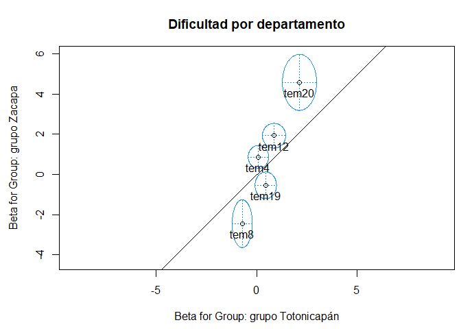<!-- -->

## Dificultad de los ítems utilizando modelos lógisticos de 2 y 3 parámetros

``` r
cuarto <- read_excel("data/Cuarto.xlsx")
respuestasc <- cuarto[, 44:73]
```

``` r
mirt_rm <- mirt(respuestasc, 1, "Rasch")
```

    ## Iteration: 1, Log-Lik: -23425.148, Max-Change: 0.17395Iteration: 2, Log-Lik: -23403.255, Max-Change: 0.06667Iteration: 3, Log-Lik: -23399.103, Max-Change: 0.02908Iteration: 4, Log-Lik: -23398.216, Max-Change: 0.01309Iteration: 5, Log-Lik: -23397.993, Max-Change: 0.00658Iteration: 6, Log-Lik: -23397.941, Max-Change: 0.00316Iteration: 7, Log-Lik: -23397.928, Max-Change: 0.00154Iteration: 8, Log-Lik: -23397.924, Max-Change: 0.00075Iteration: 9, Log-Lik: -23397.923, Max-Change: 0.00036Iteration: 10, Log-Lik: -23397.923, Max-Change: 0.00020Iteration: 11, Log-Lik: -23397.923, Max-Change: 0.00012Iteration: 12, Log-Lik: -23397.923, Max-Change: 0.00010Iteration: 13, Log-Lik: -23397.923, Max-Change: 0.00004

``` r
mirt_2pl <- mirt(respuestasc, 1, "2PL")
```

    ## Iteration: 1, Log-Lik: -23405.766, Max-Change: 0.76125Iteration: 2, Log-Lik: -23169.201, Max-Change: 0.35119Iteration: 3, Log-Lik: -23138.951, Max-Change: 0.12809Iteration: 4, Log-Lik: -23136.900, Max-Change: 0.04271Iteration: 5, Log-Lik: -23136.554, Max-Change: 0.01915Iteration: 6, Log-Lik: -23136.437, Max-Change: 0.01056Iteration: 7, Log-Lik: -23136.378, Max-Change: 0.00490Iteration: 8, Log-Lik: -23136.364, Max-Change: 0.00311Iteration: 9, Log-Lik: -23136.358, Max-Change: 0.00159Iteration: 10, Log-Lik: -23136.355, Max-Change: 0.00145Iteration: 11, Log-Lik: -23136.354, Max-Change: 0.00026Iteration: 12, Log-Lik: -23136.354, Max-Change: 0.00015Iteration: 13, Log-Lik: -23136.354, Max-Change: 0.00057Iteration: 14, Log-Lik: -23136.354, Max-Change: 0.00032Iteration: 15, Log-Lik: -23136.354, Max-Change: 0.00006

``` r
mirt_3pl <- mirt(respuestasc, 1, "3PL")
```

    ## Iteration: 1, Log-Lik: -23658.808, Max-Change: 2.70250Iteration: 2, Log-Lik: -23186.193, Max-Change: 0.74551Iteration: 3, Log-Lik: -23111.906, Max-Change: 0.57735Iteration: 4, Log-Lik: -23088.544, Max-Change: 0.40898Iteration: 5, Log-Lik: -23078.396, Max-Change: 0.60803Iteration: 6, Log-Lik: -23072.294, Max-Change: 0.37806Iteration: 7, Log-Lik: -23068.910, Max-Change: 0.11311Iteration: 8, Log-Lik: -23066.424, Max-Change: 0.10226Iteration: 9, Log-Lik: -23064.996, Max-Change: 0.10687Iteration: 10, Log-Lik: -23062.966, Max-Change: 0.05982Iteration: 11, Log-Lik: -23062.348, Max-Change: 0.18846Iteration: 12, Log-Lik: -23062.221, Max-Change: 1.16436Iteration: 13, Log-Lik: -23062.008, Max-Change: 0.02019Iteration: 14, Log-Lik: -23061.955, Max-Change: 0.00291Iteration: 15, Log-Lik: -23061.952, Max-Change: 0.00134Iteration: 16, Log-Lik: -23061.952, Max-Change: 0.00063Iteration: 17, Log-Lik: -23061.951, Max-Change: 0.00315Iteration: 18, Log-Lik: -23061.951, Max-Change: 0.00152Iteration: 19, Log-Lik: -23061.950, Max-Change: 0.00052Iteration: 20, Log-Lik: -23061.950, Max-Change: 0.00090Iteration: 21, Log-Lik: -23061.950, Max-Change: 0.00153Iteration: 22, Log-Lik: -23061.950, Max-Change: 0.00140Iteration: 23, Log-Lik: -23061.950, Max-Change: 0.00046Iteration: 24, Log-Lik: -23061.950, Max-Change: 0.00109Iteration: 25, Log-Lik: -23061.950, Max-Change: 0.00063Iteration: 26, Log-Lik: -23061.949, Max-Change: 0.00148Iteration: 27, Log-Lik: -23061.949, Max-Change: 0.00049Iteration: 28, Log-Lik: -23061.949, Max-Change: 0.00042Iteration: 29, Log-Lik: -23061.949, Max-Change: 0.00100Iteration: 30, Log-Lik: -23061.949, Max-Change: 0.00033Iteration: 31, Log-Lik: -23061.949, Max-Change: 0.00142Iteration: 32, Log-Lik: -23061.949, Max-Change: 0.00046Iteration: 33, Log-Lik: -23061.949, Max-Change: 0.00110Iteration: 34, Log-Lik: -23061.949, Max-Change: 0.00065Iteration: 35, Log-Lik: -23061.949, Max-Change: 0.00031Iteration: 36, Log-Lik: -23061.949, Max-Change: 0.00072Iteration: 37, Log-Lik: -23061.949, Max-Change: 0.00039Iteration: 38, Log-Lik: -23061.949, Max-Change: 0.00093Iteration: 39, Log-Lik: -23061.948, Max-Change: 0.00030Iteration: 40, Log-Lik: -23061.948, Max-Change: 0.00026Iteration: 41, Log-Lik: -23061.948, Max-Change: 0.00062Iteration: 42, Log-Lik: -23061.948, Max-Change: 0.00102Iteration: 43, Log-Lik: -23061.948, Max-Change: 0.00105Iteration: 44, Log-Lik: -23061.948, Max-Change: 0.00034Iteration: 45, Log-Lik: -23061.948, Max-Change: 0.00082Iteration: 46, Log-Lik: -23061.948, Max-Change: 0.00046Iteration: 47, Log-Lik: -23061.948, Max-Change: 0.00109Iteration: 48, Log-Lik: -23061.948, Max-Change: 0.00036Iteration: 49, Log-Lik: -23061.948, Max-Change: 0.00031Iteration: 50, Log-Lik: -23061.948, Max-Change: 0.00074Iteration: 51, Log-Lik: -23061.948, Max-Change: 0.00024Iteration: 52, Log-Lik: -23061.948, Max-Change: 0.00104Iteration: 53, Log-Lik: -23061.948, Max-Change: 0.00034Iteration: 54, Log-Lik: -23061.948, Max-Change: 0.00081Iteration: 55, Log-Lik: -23061.948, Max-Change: 0.00046Iteration: 56, Log-Lik: -23061.948, Max-Change: 0.00022Iteration: 57, Log-Lik: -23061.948, Max-Change: 0.00052Iteration: 58, Log-Lik: -23061.948, Max-Change: 0.00028Iteration: 59, Log-Lik: -23061.947, Max-Change: 0.00066Iteration: 60, Log-Lik: -23061.947, Max-Change: 0.00021Iteration: 61, Log-Lik: -23061.947, Max-Change: 0.00093Iteration: 62, Log-Lik: -23061.947, Max-Change: 0.00030Iteration: 63, Log-Lik: -23061.947, Max-Change: 0.00072Iteration: 64, Log-Lik: -23061.947, Max-Change: 0.00041Iteration: 65, Log-Lik: -23061.947, Max-Change: 0.00098Iteration: 66, Log-Lik: -23061.947, Max-Change: 0.00032Iteration: 67, Log-Lik: -23061.947, Max-Change: 0.00028Iteration: 68, Log-Lik: -23061.947, Max-Change: 0.00066Iteration: 69, Log-Lik: -23061.947, Max-Change: 0.00021Iteration: 70, Log-Lik: -23061.947, Max-Change: 0.00093Iteration: 71, Log-Lik: -23061.947, Max-Change: 0.00031Iteration: 72, Log-Lik: -23061.947, Max-Change: 0.00073Iteration: 73, Log-Lik: -23061.947, Max-Change: 0.00042Iteration: 74, Log-Lik: -23061.947, Max-Change: 0.00020Iteration: 75, Log-Lik: -23061.947, Max-Change: 0.00047Iteration: 76, Log-Lik: -23061.947, Max-Change: 0.00026Iteration: 77, Log-Lik: -23061.947, Max-Change: 0.00061Iteration: 78, Log-Lik: -23061.947, Max-Change: 0.00020Iteration: 79, Log-Lik: -23061.947, Max-Change: 0.00086Iteration: 80, Log-Lik: -23061.947, Max-Change: 0.00028Iteration: 81, Log-Lik: -23061.947, Max-Change: 0.00067Iteration: 82, Log-Lik: -23061.947, Max-Change: 0.00039Iteration: 83, Log-Lik: -23061.947, Max-Change: 0.00018Iteration: 84, Log-Lik: -23061.947, Max-Change: 0.00044Iteration: 85, Log-Lik: -23061.947, Max-Change: 0.00024Iteration: 86, Log-Lik: -23061.947, Max-Change: 0.00056Iteration: 87, Log-Lik: -23061.947, Max-Change: 0.00018Iteration: 88, Log-Lik: -23061.947, Max-Change: 0.00079Iteration: 89, Log-Lik: -23061.947, Max-Change: 0.00026Iteration: 90, Log-Lik: -23061.947, Max-Change: 0.00062Iteration: 91, Log-Lik: -23061.947, Max-Change: 0.00036Iteration: 92, Log-Lik: -23061.946, Max-Change: 0.00017Iteration: 93, Log-Lik: -23061.946, Max-Change: 0.00040Iteration: 94, Log-Lik: -23061.946, Max-Change: 0.00022Iteration: 95, Log-Lik: -23061.946, Max-Change: 0.00052Iteration: 96, Log-Lik: -23061.946, Max-Change: 0.00017Iteration: 97, Log-Lik: -23061.946, Max-Change: 0.00073Iteration: 98, Log-Lik: -23061.946, Max-Change: 0.00024Iteration: 99, Log-Lik: -23061.946, Max-Change: 0.00057Iteration: 100, Log-Lik: -23061.946, Max-Change: 0.00033Iteration: 101, Log-Lik: -23061.946, Max-Change: 0.00016Iteration: 102, Log-Lik: -23061.946, Max-Change: 0.00037Iteration: 103, Log-Lik: -23061.946, Max-Change: 0.00020Iteration: 104, Log-Lik: -23061.946, Max-Change: 0.00047Iteration: 105, Log-Lik: -23061.946, Max-Change: 0.00015Iteration: 106, Log-Lik: -23061.946, Max-Change: 0.00066Iteration: 107, Log-Lik: -23061.946, Max-Change: 0.00022Iteration: 108, Log-Lik: -23061.946, Max-Change: 0.00051Iteration: 109, Log-Lik: -23061.946, Max-Change: 0.00030Iteration: 110, Log-Lik: -23061.946, Max-Change: 0.00014Iteration: 111, Log-Lik: -23061.946, Max-Change: 0.00033Iteration: 112, Log-Lik: -23061.946, Max-Change: 0.00018Iteration: 113, Log-Lik: -23061.946, Max-Change: 0.00042Iteration: 114, Log-Lik: -23061.946, Max-Change: 0.00014Iteration: 115, Log-Lik: -23061.946, Max-Change: 0.00059Iteration: 116, Log-Lik: -23061.946, Max-Change: 0.00019Iteration: 117, Log-Lik: -23061.946, Max-Change: 0.00046Iteration: 118, Log-Lik: -23061.946, Max-Change: 0.00026Iteration: 119, Log-Lik: -23061.946, Max-Change: 0.00062Iteration: 120, Log-Lik: -23061.946, Max-Change: 0.00020Iteration: 121, Log-Lik: -23061.946, Max-Change: 0.00018Iteration: 122, Log-Lik: -23061.946, Max-Change: 0.00042Iteration: 123, Log-Lik: -23061.946, Max-Change: 0.00014Iteration: 124, Log-Lik: -23061.946, Max-Change: 0.00059Iteration: 125, Log-Lik: -23061.946, Max-Change: 0.00019Iteration: 126, Log-Lik: -23061.946, Max-Change: 0.00046Iteration: 127, Log-Lik: -23061.946, Max-Change: 0.00027Iteration: 128, Log-Lik: -23061.946, Max-Change: 0.00013Iteration: 129, Log-Lik: -23061.946, Max-Change: 0.00030Iteration: 130, Log-Lik: -23061.946, Max-Change: 0.00016Iteration: 131, Log-Lik: -23061.946, Max-Change: 0.00038Iteration: 132, Log-Lik: -23061.946, Max-Change: 0.00012Iteration: 133, Log-Lik: -23061.946, Max-Change: 0.00053Iteration: 134, Log-Lik: -23061.946, Max-Change: 0.00017Iteration: 135, Log-Lik: -23061.946, Max-Change: 0.00042Iteration: 136, Log-Lik: -23061.946, Max-Change: 0.00024Iteration: 137, Log-Lik: -23061.946, Max-Change: 0.00056Iteration: 138, Log-Lik: -23061.946, Max-Change: 0.00018Iteration: 139, Log-Lik: -23061.946, Max-Change: 0.00016Iteration: 140, Log-Lik: -23061.946, Max-Change: 0.00038Iteration: 141, Log-Lik: -23061.946, Max-Change: 0.00012Iteration: 142, Log-Lik: -23061.946, Max-Change: 0.00053Iteration: 143, Log-Lik: -23061.946, Max-Change: 0.00017Iteration: 144, Log-Lik: -23061.946, Max-Change: 0.00041Iteration: 145, Log-Lik: -23061.946, Max-Change: 0.00024Iteration: 146, Log-Lik: -23061.946, Max-Change: 0.00056Iteration: 147, Log-Lik: -23061.946, Max-Change: 0.00018Iteration: 148, Log-Lik: -23061.946, Max-Change: 0.00016Iteration: 149, Log-Lik: -23061.946, Max-Change: 0.00038Iteration: 150, Log-Lik: -23061.946, Max-Change: 0.00012Iteration: 151, Log-Lik: -23061.946, Max-Change: 0.00054Iteration: 152, Log-Lik: -23061.946, Max-Change: 0.00018Iteration: 153, Log-Lik: -23061.946, Max-Change: 0.00042Iteration: 154, Log-Lik: -23061.946, Max-Change: 0.00024Iteration: 155, Log-Lik: -23061.945, Max-Change: 0.00011Iteration: 156, Log-Lik: -23061.945, Max-Change: 0.00027Iteration: 157, Log-Lik: -23061.945, Max-Change: 0.00015Iteration: 158, Log-Lik: -23061.945, Max-Change: 0.00035Iteration: 159, Log-Lik: -23061.945, Max-Change: 0.00011Iteration: 160, Log-Lik: -23061.945, Max-Change: 0.00049Iteration: 161, Log-Lik: -23061.945, Max-Change: 0.00016Iteration: 162, Log-Lik: -23061.945, Max-Change: 0.00038Iteration: 163, Log-Lik: -23061.945, Max-Change: 0.00022Iteration: 164, Log-Lik: -23061.945, Max-Change: 0.00052Iteration: 165, Log-Lik: -23061.945, Max-Change: 0.00017Iteration: 166, Log-Lik: -23061.945, Max-Change: 0.00015Iteration: 167, Log-Lik: -23061.945, Max-Change: 0.00035Iteration: 168, Log-Lik: -23061.945, Max-Change: 0.00011Iteration: 169, Log-Lik: -23061.945, Max-Change: 0.00049Iteration: 170, Log-Lik: -23061.945, Max-Change: 0.00016Iteration: 171, Log-Lik: -23061.945, Max-Change: 0.00038Iteration: 172, Log-Lik: -23061.945, Max-Change: 0.00022Iteration: 173, Log-Lik: -23061.945, Max-Change: 0.00011Iteration: 174, Log-Lik: -23061.945, Max-Change: 0.00025Iteration: 175, Log-Lik: -23061.945, Max-Change: 0.00014Iteration: 176, Log-Lik: -23061.945, Max-Change: 0.00032Iteration: 177, Log-Lik: -23061.945, Max-Change: 0.00010Iteration: 178, Log-Lik: -23061.945, Max-Change: 0.00045Iteration: 179, Log-Lik: -23061.945, Max-Change: 0.00015Iteration: 180, Log-Lik: -23061.945, Max-Change: 0.00035Iteration: 181, Log-Lik: -23061.945, Max-Change: 0.00020Iteration: 182, Log-Lik: -23061.945, Max-Change: 0.00048Iteration: 183, Log-Lik: -23061.945, Max-Change: 0.00016Iteration: 184, Log-Lik: -23061.945, Max-Change: 0.00014Iteration: 185, Log-Lik: -23061.945, Max-Change: 0.00032Iteration: 186, Log-Lik: -23061.945, Max-Change: 0.00010Iteration: 187, Log-Lik: -23061.945, Max-Change: 0.00045Iteration: 188, Log-Lik: -23061.945, Max-Change: 0.00015Iteration: 189, Log-Lik: -23061.945, Max-Change: 0.00035Iteration: 190, Log-Lik: -23061.945, Max-Change: 0.00020Iteration: 191, Log-Lik: -23061.945, Max-Change: 0.00010

### Curvas características de los ítems utilizando el modelo de Rasch y los modelos logisticos de 2 y 3 parámetros

``` r
plot(mirt_rm, type = "trace", main = "Item Probability Functions RM")
```

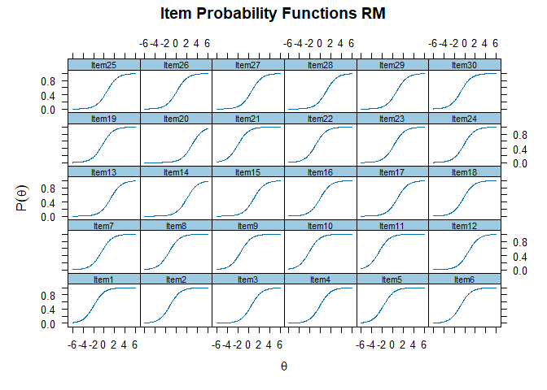<!-- -->

``` r
plot(mirt_2pl, type = "trace", main = "Item Probability Functions 2PL")
```

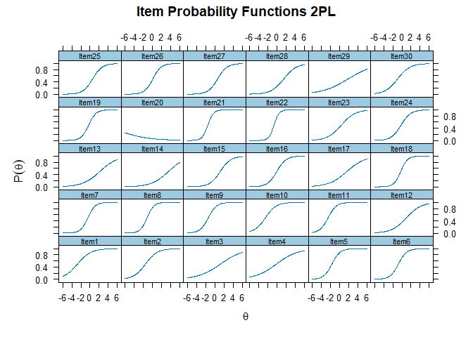<!-- -->

``` r
plot(mirt_3pl, type = "trace", , main = "Item Probability Functions 3PL")
```

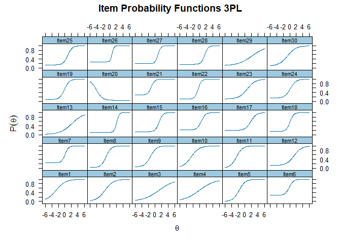<!-- -->

### Dificultad de los ítems obtenida con los modelos de Rasch y los modelos lógisticos de 2 y 3 parámetros

``` r
theta_eap <- fscores(mirt_rm)
theta_eap2 <- fscores(mirt_2pl)
theta_eap3 <- fscores(mirt_3pl)
```

``` r
coef <- coef(mirt_rm, IRTpars = TRUE)
coef_rm <- c(coef$Item1[2], coef$Item2[2], coef$Item3[2], coef$Item4[2], 
             coef$Item5[2], coef$Item6[2], coef$Item7[2], coef$Item8[2],
             coef$Item9[2], coef$Item10[2], coef$Item11[2], coef$Item12[2],
             coef$Item13[2], coef$Item14[2], coef$Item15[2], coef$Item16[2],
             coef$Item17[2], coef$Item18[2], coef$Item19[2], coef$Item20[2],
             coef$Item21[2], coef$Item22[2], coef$Item23[2], coef$Item24[2],
             coef$Item25[2], coef$Item26[2], coef$Item27[2], coef$Item28[2],
             coef$Item29[2], coef$Item30[2])
coef2 <- coef(mirt_2pl, IRTpars = TRUE)
coef_2pl <- c(coef2$Item1[2], coef2$Item2[2], coef2$Item3[2], coef2$Item4[2], 
             coef2$Item5[2], coef2$Item6[2], coef2$Item7[2], coef2$Item8[2],
             coef2$Item9[2], coef2$Item10[2], coef2$Item11[2], coef2$Item12[2],
             coef2$Item13[2], coef2$Item14[2], coef2$Item15[2], coef2$Item16[2],
             coef2$Item17[2], coef2$Item18[2], coef2$Item19[2], coef2$Item20[2],
             coef2$Item21[2], coef2$Item22[2], coef2$Item23[2], coef2$Item24[2],
             coef2$Item25[2], coef2$Item26[2], coef2$Item27[2], coef2$Item28[2],
             coef2$Item29[2], coef2$Item30[2])
coef3 <- coef(mirt_3pl, IRTpars = TRUE)
coef_3pl <- c(coef3$Item1[2], coef3$Item2[2], coef3$Item3[2], coef3$Item4[2], 
             coef3$Item5[2], coef3$Item6[2], coef3$Item7[2], coef3$Item8[2],
             coef3$Item9[2], coef3$Item10[2], coef3$Item11[2], coef3$Item12[2],
             coef3$Item13[2], coef3$Item14[2], coef3$Item15[2], coef3$Item16[2],
             coef3$Item17[2], coef3$Item18[2], coef3$Item19[2], coef3$Item20[2],
             coef3$Item21[2], coef3$Item22[2], coef3$Item23[2], coef3$Item24[2],
             coef3$Item25[2], coef3$Item26[2], coef3$Item27[2], coef3$Item28[2],
             coef3$Item29[2], coef3$Item30[2])
```

``` r
itempar <- data.frame(item = 1:30,
                      dificultad_RM = coef_rm,
                      dificultad_2pl = coef_2pl,
                      dificultad_3pl = coef_3pl)
itempar %>% arrange(dificultad_RM)
```

    ##    item dificultad_RM dificultad_2pl dificultad_3pl
    ## 1    11   -2.58909833    -2.50077493    -2.54752637
    ## 2    10   -2.14566560    -2.56299576    -2.64664055
    ## 3    21   -1.99194123    -1.52806470    -1.11297579
    ## 4     1   -1.94971225    -2.74961492    -2.68355624
    ## 5     5   -1.73171698    -1.67149302    -1.71614648
    ## 6     9   -1.45282792    -1.41899711    -1.32293755
    ## 7     8   -1.35883721    -1.17390700    -1.15784394
    ## 8     2   -1.19787075    -1.51576051    -1.48335616
    ## 9    22   -0.91733606    -0.69961258    -0.50891576
    ## 10    6   -0.78593305    -0.77443126    -0.12456307
    ## 11   30   -0.70783983    -0.93684961    -0.68566952
    ## 12    7   -0.50822480    -0.47207962     0.06485899
    ## 13   19   -0.33162365    -0.31559616    -0.13450328
    ## 14   18   -0.27578746    -0.25490676     0.06862844
    ## 15   24   -0.16490828    -0.19112332     0.19996475
    ## 16    4   -0.07735193    -0.16280887    -0.14266295
    ## 17   16   -0.06116516    -0.07552113     0.45647271
    ## 18   26    0.10714896     0.09116018     0.66789088
    ## 19   23    0.27327114     0.38773492     0.74475508
    ## 20   25    0.53984283     0.57355655     0.86540608
    ## 21    3    0.56028862     1.23885548     1.23783547
    ## 22   27    0.58767404     0.62025721     0.94492224
    ## 23   12    0.67775583     1.01906890     1.30749228
    ## 24   29    0.76972760     1.91173707     2.29200786
    ## 25   17    0.90084195     1.62073652     1.85188815
    ## 26   15    1.03731879     1.19896874     1.29185643
    ## 27   28    1.08422249     1.45662273     1.45536755
    ## 28   13    1.23413377     2.15214274     2.14595099
    ## 29   14    2.03008454     3.52607071     2.06852664
    ## 30   20    2.98204334    -9.91393988    -4.13602906

## Habilidad de los estudiantes obtenida con los modelos de Rasch y los modelos lógisticos de 2 y 3 parámetros

``` r
personpar <- data.frame(codigo = cuarto$code_estud,
                        Departamento = as.factor(cuarto$Departamento),
                        Municipio = as.factor(cuarto$Municipio),
                        Establecimiento = as.factor(cuarto$Nom_estab),
                        p_rm = theta_eap,
                        p_2pl = theta_eap2,
                        p_3pl = theta_eap3)
names(personpar) <- c("codigo", "Departamento", "Municipio", 
                      "Establecimiento", "habilidad_rm", 
                      "habilidad_2pl", "habilidad_3pl")
personpar %>% arrange(habilidad_2pl)
```

    ##       codigo   Departamento                 Municipio
    ## 1       1315      Guatemala                 Guatemala
    ## 2      15064   Baja Verapaz                    Salamá
    ## 3     12-081     San Marcos                San marcos
    ## 4     05-048      Escuintla Santa Lucia Cotzumalguapa
    ## 5     07-071         Sololá                    Sololá
    ## 6     05-039      Escuintla Santa Lucia Cotzumalguapa
    ## 7     12-064     San Marcos                San marcos
    ## 8      15066   Baja Verapaz                    Salamá
    ## 9     05-030      Escuintla Santa Lucia Cotzumalguapa
    ## 10   M405GKP Quetzaltenango        San miguel Siguila
    ## 11    05-016      Escuintla                 Escuintla
    ## 12    05-024      Escuintla                 Escuintla
    ## 13   L803UVU Quetzaltenango        San miguel Siguila
    ## 14    05-047      Escuintla Santa Lucia Cotzumalguapa
    ## 15     19018         Zacapa                    Zacapa
    ## 16     19032         Zacapa                    Zacapa
    ## 17     17134          Petén                    Flores
    ## 18       166      Guatemala               Villa Nueva
    ## 19       104      Guatemala               Villa Nueva
    ## 20      8014    Totonicapán               Totonicapán
    ## 21    12-088     San Marcos                San marcos
    ## 22   L803BIJ Quetzaltenango        San miguel Siguila
    ## 23      1336      Guatemala                 Guatemala
    ## 24      1320      Guatemala                 Guatemala
    ## 25   J889ISB Quetzaltenango                    Cantel
    ## 26      6059     Santa Rosa        Pueblo Nuevo Viñas
    ## 27    05-037      Escuintla Santa Lucia Cotzumalguapa
    ## 28    05-022      Escuintla                 Escuintla
    ## 29       133      Guatemala               Villa Nueva
    ## 30      8050    Totonicapán          San Andrés Xecul
    ## 31      1307      Guatemala                 Guatemala
    ## 32      6062     Santa Rosa        Pueblo Nuevo Viñas
    ## 33      6035     Santa Rosa        Pueblo Nuevo Viñas
    ## 34     16012   Alta Verapaz     San Cristóbal Verapaz
    ## 35      1303      Guatemala                 Guatemala
    ## 36   J480USJ Quetzaltenango                     zunil
    ## 37      6052     Santa Rosa        Pueblo Nuevo Viñas
    ## 38      6063     Santa Rosa        Pueblo Nuevo Viñas
    ## 39     33045      Guatemala           San Jose Pinula
    ## 40      6032     Santa Rosa        Pueblo Nuevo Viñas
    ## 41      1310      Guatemala                 Guatemala
    ## 42      1318      Guatemala                 Guatemala
    ## 43     15025   Baja Verapaz         San Miguel Chicaj
    ## 44      8043    Totonicapán          San Andrés Xecul
    ## 45    05-012      Escuintla                 Escuintla
    ## 46      8006    Totonicapán               Totonicapán
    ## 47     16073   Alta Verapaz          San Pedro Carchá
    ## 48     03077   Sacatepéquez  Santa Lucía Milpas Altas
    ## 49   M605FNM Quetzaltenango        San miguel Siguila
    ## 50   N211EXB Quetzaltenango                     zunil
    ## 51      6054     Santa Rosa        Pueblo Nuevo Viñas
    ## 52      6064     Santa Rosa        Pueblo Nuevo Viñas
    ## 53      6050     Santa Rosa        Pueblo Nuevo Viñas
    ## 54      1330      Guatemala                 Guatemala
    ## 55     18077         Izabal            Puerto Barrios
    ## 56      8009    Totonicapán               Totonicapán
    ## 57    12-084     San Marcos                San marcos
    ## 58    180051         Izabal            Puerto Barrios
    ## 59      8052    Totonicapán          San Andrés Xecul
    ## 60      6007     Santa Rosa                  Oratorio
    ## 61    05-020      Escuintla                 Escuintla
    ## 62     17256          Petén                San Benito
    ## 63   L903BDM Quetzaltenango        San miguel Siguila
    ## 64    05-052      Escuintla Santa Lucia Cotzumalguapa
    ## 65      6111     Santa Rosa                   Cuilapa
    ## 66    07-050         Sololá                    Sololá
    ## 67     16060   Alta Verapaz          San Pedro Carchá
    ## 68   L004ELK Quetzaltenango                     zunil
    ## 69    180045         Izabal            Puerto Barrios
    ## 70      1319      Guatemala                 Guatemala
    ## 71   M205IQS Quetzaltenango                     zunil
    ## 72      6024     Santa Rosa                  Oratorio
    ## 73    07-046         Sololá                    Sololá
    ## 74      8041    Totonicapán          San Andrés Xecul
    ## 75    17-009          Petén             San Francisco
    ## 76   F264UCJ Quetzaltenango                     zunil
    ## 77       120      Guatemala               Villa Nueva
    ## 78      6031     Santa Rosa        Pueblo Nuevo Viñas
    ## 79      1309      Guatemala                 Guatemala
    ## 80      8059    Totonicapán          San Andrés Xecul
    ## 81    07-078         Sololá                    Sololá
    ## 82     15070   Baja Verapaz                    Salamá
    ## 83       165      Guatemala               Villa Nueva
    ## 84     03036   Sacatepéquez     Santiago Sacatepequez
    ## 85       128      Guatemala               Villa Nueva
    ## 86      1308      Guatemala                 Guatemala
    ## 87    07-044         Sololá                    Sololá
    ## 88     17128          Petén                    Flores
    ## 89      8049    Totonicapán          San Andrés Xecul
    ## 90   M605DSS Quetzaltenango        San miguel Siguila
    ## 91      6027     Santa Rosa                  Oratorio
    ## 92     03082   Sacatepéquez  Santa Lucía Milpas Altas
    ## 93     15068   Baja Verapaz                    Salamá
    ## 94      8005    Totonicapán               Totonicapán
    ## 95   M405YTQ Quetzaltenango                    Cantel
    ## 96      1316      Guatemala                 Guatemala
    ## 97       153      Guatemala               Villa Nueva
    ## 98      1317      Guatemala                 Guatemala
    ## 99   L103FVR Quetzaltenango                     zunil
    ## 100     8053    Totonicapán          San Andrés Xecul
    ## 101      150      Guatemala               Villa Nueva
    ## 102     8046    Totonicapán          San Andrés Xecul
    ## 103  L203PNP Quetzaltenango                    Cantel
    ## 104  M305WPJ Quetzaltenango                    Cantel
    ## 105     1301      Guatemala                 Guatemala
    ## 106      119      Guatemala               Villa Nueva
    ## 107    33099      Guatemala                 Guatemala
    ## 108    15007   Baja Verapaz         San Miguel Chicaj
    ## 109     1309      Guatemala                 Guatemala
    ## 110    15010   Baja Verapaz         San Miguel Chicaj
    ## 111     6030     Santa Rosa                  Oratorio
    ## 112      109      Guatemala               Villa Nueva
    ## 113   12-037     San Marcos                San marcos
    ## 114  M505JCX Quetzaltenango        San miguel Siguila
    ## 115      114      Guatemala               Villa Nueva
    ## 116    18067         Izabal            Puerto Barrios
    ## 117   180059         Izabal            Puerto Barrios
    ## 118   05-043      Escuintla Santa Lucia Cotzumalguapa
    ## 119    03033   Sacatepéquez         Antigua Guatemala
    ## 120     6115     Santa Rosa                   Cuilapa
    ## 121     6099     Santa Rosa                   Cuilapa
    ## 122   180044         Izabal            Puerto Barrios
    ## 123   12-087     San Marcos                San marcos
    ## 124  M210AZY Quetzaltenango                     zunil
    ## 125   05-063      Escuintla Santa Lucia Cotzumalguapa
    ## 126   05-023      Escuintla                 Escuintla
    ## 127     6061     Santa Rosa        Pueblo Nuevo Viñas
    ## 128   07-100         Sololá                    Sololá
    ## 129    15006   Baja Verapaz         San Miguel Chicaj
    ## 130     6013     Santa Rosa                  Oratorio
    ## 131    16020   Alta Verapaz     San Cristóbal Verapaz
    ## 132     8021    Totonicapán               Totonicapán
    ## 133  N013GAZ Quetzaltenango                     zunil
    ## 134    16007   Alta Verapaz     San Cristóbal Verapaz
    ## 135     6025     Santa Rosa                  Oratorio
    ## 136     6060     Santa Rosa        Pueblo Nuevo Viñas
    ## 137   05-070      Escuintla Santa Lucia Cotzumalguapa
    ## 138      164      Guatemala               Villa Nueva
    ## 139   05-055      Escuintla Santa Lucia Cotzumalguapa
    ## 140   17-011          Petén             San Francisco
    ## 141     8060    Totonicapán          San Andrés Xecul
    ## 142     8020    Totonicapán               Totonicapán
    ## 143    15061   Baja Verapaz              San Jerónimo
    ## 144     6103     Santa Rosa                   Cuilapa
    ## 145     6028     Santa Rosa                  Oratorio
    ## 146   07-087         Sololá                    Sololá
    ## 147    16034   Alta Verapaz                     Cobán
    ## 148     1315      Guatemala                 Guatemala
    ## 149   17-008          Petén             San Francisco
    ## 150     8048    Totonicapán          San Andrés Xecul
    ## 151  K101QLP Quetzaltenango        San miguel Siguila
    ## 152     6010     Santa Rosa                  Oratorio
    ## 153     1302      Guatemala                 Guatemala
    ## 154  J043KFD Quetzaltenango                     zunil
    ## 155    16017   Alta Verapaz     San Cristóbal Verapaz
    ## 156    18153         Izabal            Puerto Barrios
    ## 157    16063   Alta Verapaz          San Pedro Carchá
    ## 158    33066      Guatemala           San Jose Pinula
    ## 159    03096   Sacatepéquez  Santa Lucía Milpas Altas
    ## 160     8044    Totonicapán          San Andrés Xecul
    ## 161   07-041         Sololá                    Sololá
    ## 162     1304      Guatemala                 Guatemala
    ## 163   07-026         Sololá                    Sololá
    ## 164    15008   Baja Verapaz         San Miguel Chicaj
    ## 165    15045   Baja Verapaz              San Jerónimo
    ## 166   180041         Izabal            Puerto Barrios
    ## 167   12-021     San Marcos                San marcos
    ## 168   17-013          Petén             San Francisco
    ## 169   05-067      Escuintla Santa Lucia Cotzumalguapa
    ## 170   05-034      Escuintla Santa Lucia Cotzumalguapa
    ## 171   12-035     San Marcos                San marcos
    ## 172  M005CUN Quetzaltenango                     zunil
    ## 173   05-040      Escuintla Santa Lucia Cotzumalguapa
    ## 174   07-049         Sololá                    Sololá
    ## 175    33052      Guatemala           San Jose Pinula
    ## 176    17109          Petén                    Flores
    ## 177    16022   Alta Verapaz     San Cristóbal Verapaz
    ## 178    16057   Alta Verapaz                     Cobán
    ## 179   12-020     San Marcos                San marcos
    ## 180  M009VRB Quetzaltenango                    Cantel
    ## 181     1312      Guatemala                 Guatemala
    ## 182      101      Guatemala               Villa Nueva
    ## 183  N511QIP Quetzaltenango                    Cantel
    ## 184   12-089     San Marcos                San marcos
    ## 185  N811ZRK Quetzaltenango                    Cantel
    ## 186    16028   Alta Verapaz                     Cobán
    ## 187     6051     Santa Rosa        Pueblo Nuevo Viñas
    ## 188    17234          Petén                San Benito
    ## 189     6072     Santa Rosa                   Cuilapa
    ## 190    18105         Izabal            Puerto Barrios
    ## 191    18107         Izabal            Puerto Barrios
    ## 192    18160         Izabal            Puerto Barrios
    ## 193      162      Guatemala               Villa Nueva
    ## 194   12-091     San Marcos                San marcos
    ## 195     1324      Guatemala                 Guatemala
    ## 196    15057   Baja Verapaz              San Jerónimo
    ## 197   07-040         Sololá                    Sololá
    ## 198   05-017      Escuintla                 Escuintla
    ## 199     6114     Santa Rosa                   Cuilapa
    ## 200     6009     Santa Rosa                  Oratorio
    ## 201     6005     Santa Rosa                  Oratorio
    ## 202  M705DIL Quetzaltenango        San miguel Siguila
    ## 203     1318      Guatemala                 Guatemala
    ## 204     6065     Santa Rosa        Pueblo Nuevo Viñas
    ## 205    03072   Sacatepéquez  Santa Lucía Milpas Altas
    ## 206    15036   Baja Verapaz              San Jerónimo
    ## 207      121      Guatemala               Villa Nueva
    ## 208     6029     Santa Rosa                  Oratorio
    ## 209   07-039         Sololá                    Sololá
    ## 210    33055      Guatemala           San Jose Pinula
    ## 211  L902VUT Quetzaltenango                     zunil
    ## 212  M505GCS Quetzaltenango                    Cantel
    ## 213   12-071     San Marcos                San marcos
    ## 214    19040         Zacapa                    Zacapa
    ## 215     1326      Guatemala                 Guatemala
    ## 216    18028         Izabal            Puerto Barrios
    ## 217   17-001          Petén             San Francisco
    ## 218     6018     Santa Rosa                  Oratorio
    ## 219   180053         Izabal            Puerto Barrios
    ## 220    18157         Izabal            Puerto Barrios
    ## 221   17-025          Petén             San Francisco
    ## 222    18031         Izabal            Puerto Barrios
    ## 223    17122          Petén                    Flores
    ## 224    03084   Sacatepéquez  Santa Lucía Milpas Altas
    ## 225      108      Guatemala               Villa Nueva
    ## 226    17118          Petén                    Flores
    ## 227     8058    Totonicapán          San Andrés Xecul
    ## 228    33003      Guatemala                 Guatemala
    ## 229    16078   Alta Verapaz          San Pedro Carchá
    ## 230    03043   Sacatepéquez     Santiago Sacatepequez
    ## 231     8040    Totonicapán          San Andrés Xecul
    ## 232     1316      Guatemala                 Guatemala
    ## 233     8057    Totonicapán          San Andrés Xecul
    ## 234    17148          Petén                    Flores
    ## 235    33042      Guatemala           San Jose Pinula
    ## 236     6043     Santa Rosa        Pueblo Nuevo Viñas
    ## 237     6102     Santa Rosa                   Cuilapa
    ## 238  M605EMS Quetzaltenango                    Cantel
    ## 239    18086         Izabal            Puerto Barrios
    ## 240    33047      Guatemala           San Jose Pinula
    ## 241    16019   Alta Verapaz     San Cristóbal Verapaz
    ## 242     8022    Totonicapán               Totonicapán
    ## 243    15065   Baja Verapaz                    Salamá
    ## 244   05-009      Escuintla                 Escuintla
    ## 245    33061      Guatemala           San Jose Pinula
    ## 246    16079   Alta Verapaz          San Pedro Carchá
    ## 247  J034HQC Quetzaltenango                    Cantel
    ## 248   12-036     San Marcos                San marcos
    ## 249   180040         Izabal            Puerto Barrios
    ## 250   12-072     San Marcos                San marcos
    ## 251     1314      Guatemala                 Guatemala
    ## 252     6105     Santa Rosa                   Cuilapa
    ## 253    17113          Petén                    Flores
    ## 254    03075   Sacatepéquez  Santa Lucía Milpas Altas
    ## 255     6004     Santa Rosa                  Oratorio
    ## 256   180049         Izabal            Puerto Barrios
    ## 257    15053   Baja Verapaz              San Jerónimo
    ## 258     8051    Totonicapán          San Andrés Xecul
    ## 259     8002    Totonicapán               Totonicapán
    ## 260      144      Guatemala               Villa Nueva
    ## 261     1318      Guatemala                 Guatemala
    ## 262   05-065      Escuintla Santa Lucia Cotzumalguapa
    ## 263   07-064         Sololá                    Sololá
    ## 264   07-035         Sololá                    Sololá
    ## 265     6107     Santa Rosa                   Cuilapa
    ## 266    03026   Sacatepéquez         Antigua Guatemala
    ## 267    15051   Baja Verapaz              San Jerónimo
    ## 268      107      Guatemala               Villa Nueva
    ## 269    16064   Alta Verapaz          San Pedro Carchá
    ## 270    33029      Guatemala                 Guatemala
    ## 271     8045    Totonicapán          San Andrés Xecul
    ## 272  M905LBC Quetzaltenango                     zunil
    ## 273     6092     Santa Rosa                   Cuilapa
    ## 274    16011   Alta Verapaz     San Cristóbal Verapaz
    ## 275    18030         Izabal            Puerto Barrios
    ## 276     8001    Totonicapán               Totonicapán
    ## 277   05-008      Escuintla                 Escuintla
    ## 278    18094         Izabal            Puerto Barrios
    ## 279     8039    Totonicapán          San Andrés Xecul
    ## 280   180043         Izabal            Puerto Barrios
    ## 281    16052   Alta Verapaz                     Cobán
    ## 282     6039     Santa Rosa        Pueblo Nuevo Viñas
    ## 283      103      Guatemala               Villa Nueva
    ## 284    18103         Izabal            Puerto Barrios
    ## 285    17258          Petén                San Benito
    ## 286    16001   Alta Verapaz     San Cristóbal Verapaz
    ## 287    15059   Baja Verapaz              San Jerónimo
    ## 288    15063   Baja Verapaz              San Jerónimo
    ## 289  N211HXP Quetzaltenango                    Cantel
    ## 290    33053      Guatemala           San Jose Pinula
    ## 291    03093   Sacatepéquez  Santa Lucía Milpas Altas
    ## 292  M305MQT Quetzaltenango        San miguel Siguila
    ## 293    15021   Baja Verapaz         San Miguel Chicaj
    ## 294     6017     Santa Rosa                  Oratorio
    ## 295    19035         Zacapa                    Zacapa
    ## 296   05-045      Escuintla Santa Lucia Cotzumalguapa
    ## 297     6042     Santa Rosa        Pueblo Nuevo Viñas
    ## 298   05-029      Escuintla Santa Lucia Cotzumalguapa
    ## 299   180047         Izabal            Puerto Barrios
    ## 300    15022   Baja Verapaz         San Miguel Chicaj
    ## 301    15077   Baja Verapaz                    Salamá
    ## 302    03086   Sacatepéquez  Santa Lucía Milpas Altas
    ## 303    17110          Petén                    Flores
    ## 304    33070      Guatemala           San Jose Pinula
    ## 305  K102HZI Quetzaltenango                    Cantel
    ## 306    16008   Alta Verapaz     San Cristóbal Verapaz
    ## 307      142      Guatemala               Villa Nueva
    ## 308    03083   Sacatepéquez  Santa Lucía Milpas Altas
    ## 309    16018   Alta Verapaz     San Cristóbal Verapaz
    ## 310     8004    Totonicapán               Totonicapán
    ## 311    15058   Baja Verapaz              San Jerónimo
    ## 312    16049   Alta Verapaz                     Cobán
    ## 313  L603IBU Quetzaltenango                     zunil
    ## 314     1305      Guatemala                 Guatemala
    ## 315    18017         Izabal            Puerto Barrios
    ## 316   05-013      Escuintla                 Escuintla
    ## 317   05-071      Escuintla Santa Lucia Cotzumalguapa
    ## 318  N209LLS Quetzaltenango        San miguel Siguila
    ## 319    17136          Petén                    Flores
    ## 320    15086   Baja Verapaz                    Salamá
    ## 321      168      Guatemala               Villa Nueva
    ## 322   12-078     San Marcos                San marcos
    ## 323    33069      Guatemala           San Jose Pinula
    ## 324    16072   Alta Verapaz          San Pedro Carchá
    ## 325  M310HRE Quetzaltenango                     zunil
    ## 326     6003     Santa Rosa                  Oratorio
    ## 327  M505KSY Quetzaltenango        San miguel Siguila
    ## 328     8011    Totonicapán               Totonicapán
    ## 329   17-024          Petén             San Francisco
    ## 330     6077     Santa Rosa                   Cuilapa
    ## 331   05-025      Escuintla                 Escuintla
    ## 332   17-005          Petén             San Francisco
    ## 333  N310LTA Quetzaltenango                     zunil
    ## 334     8054    Totonicapán          San Andrés Xecul
    ## 335     8008    Totonicapán               Totonicapán
    ## 336    16016   Alta Verapaz     San Cristóbal Verapaz
    ## 337    16015   Alta Verapaz     San Cristóbal Verapaz
    ## 338   07-030         Sololá                    Sololá
    ## 339     8017    Totonicapán               Totonicapán
    ## 340     6055     Santa Rosa        Pueblo Nuevo Viñas
    ## 341     1311      Guatemala                 Guatemala
    ## 342     8010    Totonicapán               Totonicapán
    ## 343   05-011      Escuintla                 Escuintla
    ## 344    03069   Sacatepéquez  Santa Lucía Milpas Altas
    ## 345  M505QRD Quetzaltenango                    Cantel
    ## 346     8003    Totonicapán               Totonicapán
    ## 347   05-005      Escuintla                 Escuintla
    ## 348   07-067         Sololá                    Sololá
    ## 349     6019     Santa Rosa                  Oratorio
    ## 350    03051   Sacatepéquez     Santiago Sacatepequez
    ## 351  M509FVG Quetzaltenango        San miguel Siguila
    ## 352    18158         Izabal            Puerto Barrios
    ## 353    16021   Alta Verapaz     San Cristóbal Verapaz
    ## 354     6026     Santa Rosa                  Oratorio
    ## 355   17-002          Petén             San Francisco
    ## 356  N511VQM Quetzaltenango                    Cantel
    ## 357    16068   Alta Verapaz          San Pedro Carchá
    ## 358    16069   Alta Verapaz          San Pedro Carchá
    ## 359     6085     Santa Rosa                   Cuilapa
    ## 360    15081   Baja Verapaz                    Salamá
    ## 361      156      Guatemala               Villa Nueva
    ## 362  L803LPB Quetzaltenango                     zunil
    ## 363     1307      Guatemala                 Guatemala
    ## 364   07-001         Sololá                    Sololá
    ## 365   17-032          Petén             San Francisco
    ## 366    16029   Alta Verapaz                     Cobán
    ## 367    16031   Alta Verapaz                     Cobán
    ## 368  M905QYA Quetzaltenango                     zunil
    ## 369     6049     Santa Rosa        Pueblo Nuevo Viñas
    ## 370   07-028         Sololá                    Sololá
    ## 371    03095   Sacatepéquez  Santa Lucía Milpas Altas
    ## 372   07-020         Sololá                    Sololá
    ## 373    17250          Petén                San Benito
    ## 374    15039   Baja Verapaz              San Jerónimo
    ## 375    19036         Zacapa                    Zacapa
    ## 376    16006   Alta Verapaz     San Cristóbal Verapaz
    ## 377    03076   Sacatepéquez  Santa Lucía Milpas Altas
    ## 378    18110         Izabal            Puerto Barrios
    ## 379     6106     Santa Rosa                   Cuilapa
    ## 380     8036    Totonicapán               Totonicapán
    ## 381    17112          Petén                    Flores
    ## 382      113      Guatemala               Villa Nueva
    ## 383    15005   Baja Verapaz         San Miguel Chicaj
    ## 384   05-004      Escuintla                 Escuintla
    ## 385    18073         Izabal            Puerto Barrios
    ## 386     8018    Totonicapán               Totonicapán
    ## 387    16005   Alta Verapaz     San Cristóbal Verapaz
    ## 388    18063         Izabal            Puerto Barrios
    ## 389    15009   Baja Verapaz         San Miguel Chicaj
    ## 390     1329      Guatemala                 Guatemala
    ## 391    16084   Alta Verapaz          San Pedro Carchá
    ## 392    03006   Sacatepéquez         Antigua Guatemala
    ## 393     6053     Santa Rosa        Pueblo Nuevo Viñas
    ## 394   180042         Izabal            Puerto Barrios
    ## 395     6066     Santa Rosa        Pueblo Nuevo Viñas
    ## 396    33019      Guatemala                 Guatemala
    ## 397    18069         Izabal            Puerto Barrios
    ## 398    17253          Petén                San Benito
    ## 399   07-006         Sololá                    Sololá
    ## 400   12-038     San Marcos                San marcos
    ## 401    33062      Guatemala           San Jose Pinula
    ## 402   07-082         Sololá                    Sololá
    ## 403  N640LAV Quetzaltenango                     zunil
    ## 404   12-012     San Marcos                San marcos
    ## 405    18159         Izabal            Puerto Barrios
    ## 406    33046      Guatemala           San Jose Pinula
    ## 407  M605MPL Quetzaltenango        San miguel Siguila
    ## 408    18108         Izabal            Puerto Barrios
    ## 409      154      Guatemala               Villa Nueva
    ## 410    03020   Sacatepéquez         Antigua Guatemala
    ## 411  N309MQE Quetzaltenango                     zunil
    ## 412   180056         Izabal            Puerto Barrios
    ## 413    33073      Guatemala           San Jose Pinula
    ## 414    18162         Izabal            Puerto Barrios
    ## 415   05-058      Escuintla Santa Lucia Cotzumalguapa
    ## 416   05-007      Escuintla                 Escuintla
    ## 417   12-024     San Marcos                San marcos
    ## 418     1316      Guatemala                 Guatemala
    ## 419    16059   Alta Verapaz                     Cobán
    ## 420  M705LZV Quetzaltenango        San miguel Siguila
    ## 421  M405EXM Quetzaltenango        San miguel Siguila
    ## 422   07-032         Sololá                    Sololá
    ## 423     6075     Santa Rosa                   Cuilapa
    ## 424    15003   Baja Verapaz         San Miguel Chicaj
    ## 425   07-062         Sololá                    Sololá
    ## 426    16062   Alta Verapaz          San Pedro Carchá
    ## 427    16010   Alta Verapaz     San Cristóbal Verapaz
    ## 428    16013   Alta Verapaz     San Cristóbal Verapaz
    ## 429    18155         Izabal            Puerto Barrios
    ## 430     1301      Guatemala                 Guatemala
    ## 431  M805DCJ Quetzaltenango        San miguel Siguila
    ## 432     6071     Santa Rosa                   Cuilapa
    ## 433     1311      Guatemala                 Guatemala
    ## 434   12-067     San Marcos                San marcos
    ## 435   12-086     San Marcos                San marcos
    ## 436    17146          Petén                    Flores
    ## 437    19021         Zacapa                    Zacapa
    ## 438      158      Guatemala               Villa Nueva
    ## 439     1320      Guatemala                 Guatemala
    ## 440      117      Guatemala               Villa Nueva
    ## 441     8061    Totonicapán          San Andrés Xecul
    ## 442  N311SHQ Quetzaltenango                     zunil
    ## 443     8033    Totonicapán               Totonicapán
    ## 444   05-044      Escuintla Santa Lucia Cotzumalguapa
    ## 445     6015     Santa Rosa                  Oratorio
    ## 446    18144         Izabal            Puerto Barrios
    ## 447      163      Guatemala               Villa Nueva
    ## 448   07-015         Sololá                    Sololá
    ## 449     8065    Totonicapán          San Andrés Xecul
    ## 450   05-061      Escuintla Santa Lucia Cotzumalguapa
    ## 451     8064    Totonicapán          San Andrés Xecul
    ## 452   12-017     San Marcos                San marcos
    ## 453     6047     Santa Rosa        Pueblo Nuevo Viñas
    ## 454    17132          Petén                    Flores
    ## 455   07-031         Sololá                    Sololá
    ## 456  M405NCQ Quetzaltenango                    Cantel
    ## 457    15002   Baja Verapaz         San Miguel Chicaj
    ## 458     1313      Guatemala                 Guatemala
    ## 459   180058         Izabal            Puerto Barrios
    ## 460    15088   Baja Verapaz                    Salamá
    ## 461    19011         Zacapa                    Zacapa
    ## 462     8038    Totonicapán               Totonicapán
    ## 463  M311EPG Quetzaltenango                     zunil
    ## 464      132      Guatemala               Villa Nueva
    ## 465  M904AFC Quetzaltenango                     zunil
    ## 466  K301EIR Quetzaltenango        San miguel Siguila
    ## 467   05-066      Escuintla Santa Lucia Cotzumalguapa
    ## 468   07-076         Sololá                    Sololá
    ## 469     1321      Guatemala                 Guatemala
    ## 470   07-099         Sololá                    Sololá
    ## 471    03088   Sacatepéquez  Santa Lucía Milpas Altas
    ## 472    17142          Petén                    Flores
    ## 473    33009      Guatemala                 Guatemala
    ## 474    16053   Alta Verapaz                     Cobán
    ## 475  L302DZR Quetzaltenango                     zunil
    ## 476  M105UCV Quetzaltenango                     zunil
    ## 477    17120          Petén                    Flores
    ## 478     8012    Totonicapán               Totonicapán
    ## 479     8037    Totonicapán               Totonicapán
    ## 480    18102         Izabal            Puerto Barrios
    ## 481      125      Guatemala               Villa Nueva
    ## 482    18029         Izabal            Puerto Barrios
    ## 483     1311      Guatemala                 Guatemala
    ## 484     6036     Santa Rosa        Pueblo Nuevo Viñas
    ## 485    16027   Alta Verapaz                     Cobán
    ## 486    33078      Guatemala                 Guatemala
    ## 487     1304      Guatemala                 Guatemala
    ## 488  L103FDF Quetzaltenango        San miguel Siguila
    ## 489    15052   Baja Verapaz              San Jerónimo
    ## 490    16089   Alta Verapaz          San Pedro Carchá
    ## 491   05-006      Escuintla                 Escuintla
    ## 492    19004         Zacapa                    Zacapa
    ## 493     1314      Guatemala                 Guatemala
    ## 494    16009   Alta Verapaz     San Cristóbal Verapaz
    ## 495    15060   Baja Verapaz              San Jerónimo
    ## 496     6089     Santa Rosa                   Cuilapa
    ## 497   05-027      Escuintla Santa Lucia Cotzumalguapa
    ## 498    33064      Guatemala           San Jose Pinula
    ## 499  N209CTQ Quetzaltenango                     zunil
    ## 500   05-018      Escuintla                 Escuintla
    ## 501   17-007          Petén             San Francisco
    ## 502    03003   Sacatepéquez         Antigua Guatemala
    ## 503  M805KEW Quetzaltenango        San miguel Siguila
    ## 504     6067     Santa Rosa        Pueblo Nuevo Viñas
    ## 505    03092   Sacatepéquez  Santa Lucía Milpas Altas
    ## 506   180060         Izabal            Puerto Barrios
    ## 507     8023    Totonicapán               Totonicapán
    ## 508     1320      Guatemala                 Guatemala
    ## 509    15091   Baja Verapaz                    Salamá
    ## 510      124      Guatemala               Villa Nueva
    ## 511   05-010      Escuintla                 Escuintla
    ## 512   05-019      Escuintla                 Escuintla
    ## 513    19034         Zacapa                    Zacapa
    ## 514   07-085         Sololá                    Sololá
    ## 515   05-035      Escuintla Santa Lucia Cotzumalguapa
    ## 516     6033     Santa Rosa        Pueblo Nuevo Viñas
    ## 517    33044      Guatemala           San Jose Pinula
    ## 518   07-066         Sololá                    Sololá
    ## 519   07-056         Sololá                    Sololá
    ## 520    17147          Petén                    Flores
    ## 521    16003   Alta Verapaz     San Cristóbal Verapaz
    ## 522     6081     Santa Rosa                   Cuilapa
    ## 523   17-022          Petén             San Francisco
    ## 524   07-083         Sololá                    Sololá
    ## 525    33068      Guatemala           San Jose Pinula
    ## 526    15080   Baja Verapaz                    Salamá
    ## 527   07-051         Sololá                    Sololá
    ## 528  J145DWT Quetzaltenango                    Cantel
    ## 529    03089   Sacatepéquez  Santa Lucía Milpas Altas
    ## 530   12-085     San Marcos                San marcos
    ## 531     6090     Santa Rosa                   Cuilapa
    ## 532   05-031      Escuintla Santa Lucia Cotzumalguapa
    ## 533   07-097         Sololá                    Sololá
    ## 534  M205IGU Quetzaltenango                     zunil
    ## 535    15033   Baja Verapaz              San Jerónimo
    ## 536  L103AWC Quetzaltenango        San miguel Siguila
    ## 537    17131          Petén                    Flores
    ## 538      106      Guatemala               Villa Nueva
    ## 539    33096      Guatemala                 Guatemala
    ## 540  M405DNB Quetzaltenango        San miguel Siguila
    ## 541     6091     Santa Rosa                   Cuilapa
    ## 542     6022     Santa Rosa                  Oratorio
    ## 543   12-034     San Marcos                San marcos
    ## 544    15038   Baja Verapaz              San Jerónimo
    ## 545   12-018     San Marcos                San marcos
    ## 546     1331      Guatemala                 Guatemala
    ## 547   05-026      Escuintla                 Escuintla
    ## 548     8047    Totonicapán          San Andrés Xecul
    ## 549     8025    Totonicapán               Totonicapán
    ## 550    03065   Sacatepéquez     Santiago Sacatepequez
    ## 551    17230          Petén                San Benito
    ## 552      151      Guatemala               Villa Nueva
    ## 553   12-063     San Marcos                San marcos
    ## 554   05-068      Escuintla Santa Lucia Cotzumalguapa
    ## 555   07-096         Sololá                    Sololá
    ## 556  N711SRZ Quetzaltenango                    Cantel
    ## 557    15049   Baja Verapaz              San Jerónimo
    ## 558     8007    Totonicapán               Totonicapán
    ## 559    16033   Alta Verapaz                     Cobán
    ## 560     6021     Santa Rosa                  Oratorio
    ## 561    15034   Baja Verapaz              San Jerónimo
    ## 562     8063    Totonicapán          San Andrés Xecul
    ## 563    17140          Petén                    Flores
    ## 564   05-064      Escuintla Santa Lucia Cotzumalguapa
    ## 565     8034    Totonicapán               Totonicapán
    ## 566    16044   Alta Verapaz                     Cobán
    ## 567    19037         Zacapa                    Zacapa
    ## 568   180036         Izabal            Puerto Barrios
    ## 569    16076   Alta Verapaz          San Pedro Carchá
    ## 570   12-079     San Marcos                San marcos
    ## 571   17-030          Petén             San Francisco
    ## 572    17138          Petén                    Flores
    ## 573   180046         Izabal            Puerto Barrios
    ## 574  M305IVV Quetzaltenango                    Cantel
    ## 575    03025   Sacatepéquez         Antigua Guatemala
    ## 576    03001   Sacatepéquez         Antigua Guatemala
    ## 577     1306      Guatemala                 Guatemala
    ## 578     8016    Totonicapán               Totonicapán
    ## 579  L703CCE Quetzaltenango                    Cantel
    ## 580    03011   Sacatepéquez         Antigua Guatemala
    ## 581   12-010     San Marcos                San marcos
    ## 582   05-002      Escuintla                 Escuintla
    ## 583      155      Guatemala               Villa Nueva
    ## 584      129      Guatemala               Villa Nueva
    ## 585     6044     Santa Rosa        Pueblo Nuevo Viñas
    ## 586   05-049      Escuintla Santa Lucia Cotzumalguapa
    ## 587   M11FRV Quetzaltenango                    Cantel
    ## 588    03042   Sacatepéquez     Santiago Sacatepequez
    ## 589    03032   Sacatepéquez         Antigua Guatemala
    ## 590    15027   Baja Verapaz         San Miguel Chicaj
    ## 591    15004   Baja Verapaz         San Miguel Chicaj
    ## 592    17255          Petén                San Benito
    ## 593   07-089         Sololá                    Sololá
    ## 594     8030    Totonicapán               Totonicapán
    ## 595   12-019     San Marcos                San marcos
    ## 596     8029    Totonicapán               Totonicapán
    ## 597    16002   Alta Verapaz     San Cristóbal Verapaz
    ## 598    16014   Alta Verapaz     San Cristóbal Verapaz
    ## 599    03023   Sacatepéquez         Antigua Guatemala
    ## 600     6020     Santa Rosa                  Oratorio
    ## 601   17-003          Petén             San Francisco
    ## 602   07-077         Sololá                    Sololá
    ## 603     8024    Totonicapán               Totonicapán
    ## 604   12-080     San Marcos                San marcos
    ## 605   12-039     San Marcos                San marcos
    ## 606   17-017          Petén             San Francisco
    ## 607    15014   Baja Verapaz         San Miguel Chicaj
    ## 608   07-027         Sololá                    Sololá
    ## 609    18005         Izabal            Puerto Barrios
    ## 610    03070   Sacatepéquez  Santa Lucía Milpas Altas
    ## 611      116      Guatemala               Villa Nueva
    ## 612     1309      Guatemala                 Guatemala
    ## 613    18121         Izabal            Puerto Barrios
    ## 614    16054   Alta Verapaz                     Cobán
    ## 615    03022   Sacatepéquez         Antigua Guatemala
    ## 616     8042    Totonicapán          San Andrés Xecul
    ## 617    03099   Sacatepéquez  Santa Lucía Milpas Altas
    ## 618    33030      Guatemala                 Guatemala
    ## 619    33035      Guatemala                 Guatemala
    ## 620    18084         Izabal            Puerto Barrios
    ## 621   07-093         Sololá                    Sololá
    ## 622    17239          Petén                San Benito
    ## 623      136      Guatemala               Villa Nueva
    ## 624     1314      Guatemala                 Guatemala
    ## 625      157      Guatemala               Villa Nueva
    ## 626   12-004     San Marcos                San marcos
    ## 627   07-047         Sololá                    Sololá
    ## 628   12-008     San Marcos                San marcos
    ## 629    33048      Guatemala           San Jose Pinula
    ## 630    18126         Izabal            Puerto Barrios
    ## 631     1313      Guatemala                 Guatemala
    ## 632     1305      Guatemala                 Guatemala
    ## 633   180050         Izabal            Puerto Barrios
    ## 634     1313      Guatemala                 Guatemala
    ## 635    19009         Zacapa                    Zacapa
    ## 636    15013   Baja Verapaz         San Miguel Chicaj
    ## 637    03080   Sacatepéquez  Santa Lucía Milpas Altas
    ## 638    15017   Baja Verapaz         San Miguel Chicaj
    ## 639     1310      Guatemala                 Guatemala
    ## 640    33050      Guatemala           San Jose Pinula
    ## 641    03091   Sacatepéquez  Santa Lucía Milpas Altas
    ## 642    18075         Izabal            Puerto Barrios
    ## 643    17231          Petén                San Benito
    ## 644   17-020          Petén             San Francisco
    ## 645  N311VLJ Quetzaltenango                    Cantel
    ## 646      146      Guatemala               Villa Nueva
    ## 647    18152         Izabal            Puerto Barrios
    ## 648   07-063         Sololá                    Sololá
    ## 649      115      Guatemala               Villa Nueva
    ## 650    17123          Petén                    Flores
    ## 651   07-060         Sololá                    Sololá
    ## 652   12-083     San Marcos                San marcos
    ## 653    15026   Baja Verapaz         San Miguel Chicaj
    ## 654    15094   Baja Verapaz                    Salamá
    ## 655     6038     Santa Rosa        Pueblo Nuevo Viñas
    ## 656     1304      Guatemala                 Guatemala
    ## 657      102      Guatemala               Villa Nueva
    ## 658   07-029         Sololá                    Sololá
    ## 659   17-034          Petén             San Francisco
    ## 660  L704GEK Quetzaltenango        San miguel Siguila
    ## 661     8055    Totonicapán          San Andrés Xecul
    ## 662   05-062      Escuintla Santa Lucia Cotzumalguapa
    ## 663   05-032      Escuintla Santa Lucia Cotzumalguapa
    ## 664   180039         Izabal            Puerto Barrios
    ## 665    33079      Guatemala                 Guatemala
    ## 666    19002         Zacapa                    Zacapa
    ## 667      126      Guatemala               Villa Nueva
    ## 668    17130          Petén                    Flores
    ## 669      169      Guatemala               Villa Nueva
    ## 670    18161         Izabal            Puerto Barrios
    ## 671    33077      Guatemala                 Guatemala
    ## 672   07-091         Sololá                    Sololá
    ## 673    33065      Guatemala           San Jose Pinula
    ## 674   07-033         Sololá                    Sololá
    ## 675   07-045         Sololá                    Sololá
    ## 676    17127          Petén                    Flores
    ## 677    33041      Guatemala                 Guatemala
    ## 678     6080     Santa Rosa                   Cuilapa
    ## 679    19038         Zacapa                    Zacapa
    ## 680    18078         Izabal            Puerto Barrios
    ## 681     1308      Guatemala                 Guatemala
    ## 682  I038FYG Quetzaltenango                    Cantel
    ## 683     8019    Totonicapán               Totonicapán
    ## 684     6100     Santa Rosa                   Cuilapa
    ## 685   17-027          Petén             San Francisco
    ## 686     1333      Guatemala                 Guatemala
    ## 687     6011     Santa Rosa                  Oratorio
    ## 688   12-044     San Marcos                San marcos
    ## 689    16026   Alta Verapaz                     Cobán
    ## 690      160      Guatemala               Villa Nueva
    ## 691  P114KRL Quetzaltenango                    Cantel
    ## 692   17-018          Petén             San Francisco
    ## 693    15015   Baja Verapaz         San Miguel Chicaj
    ## 694     8015    Totonicapán               Totonicapán
    ## 695   17-023          Petén             San Francisco
    ## 696    19020         Zacapa                    Zacapa
    ## 697     1328      Guatemala                 Guatemala
    ## 698  I835NXC Quetzaltenango                    Cantel
    ## 699   07-065         Sololá                    Sololá
    ## 700   05-038      Escuintla Santa Lucia Cotzumalguapa
    ## 701    15042   Baja Verapaz              San Jerónimo
    ## 702    15001   Baja Verapaz         San Miguel Chicaj
    ## 703   180048         Izabal            Puerto Barrios
    ## 704   05-001      Escuintla                 Escuintla
    ## 705    15050   Baja Verapaz              San Jerónimo
    ## 706    03100   Sacatepéquez  Santa Lucía Milpas Altas
    ## 707    18068         Izabal            Puerto Barrios
    ## 708    17257          Petén                San Benito
    ## 709    03064   Sacatepéquez     Santiago Sacatepequez
    ## 710    18070         Izabal            Puerto Barrios
    ## 711   17-016          Petén             San Francisco
    ## 712     1302      Guatemala                 Guatemala
    ## 713    03030   Sacatepéquez         Antigua Guatemala
    ## 714   05-059      Escuintla Santa Lucia Cotzumalguapa
    ## 715    19014         Zacapa                    Zacapa
    ## 716     6057     Santa Rosa        Pueblo Nuevo Viñas
    ## 717   12-062     San Marcos                San marcos
    ## 718    33054      Guatemala           San Jose Pinula
    ## 719    16058   Alta Verapaz                     Cobán
    ## 720    33020      Guatemala                 Guatemala
    ## 721    18025         Izabal            Puerto Barrios
    ## 722  I235AKW Quetzaltenango                    Cantel
    ## 723   07-092         Sololá                    Sololá
    ## 724  N711SRZ Quetzaltenango                    Cantel
    ## 725    03005   Sacatepéquez         Antigua Guatemala
    ## 726      147      Guatemala               Villa Nueva
    ## 727  K001HQG Quetzaltenango        San miguel Siguila
    ## 728    15044   Baja Verapaz              San Jerónimo
    ## 729     6113     Santa Rosa                   Cuilapa
    ## 730    16025   Alta Verapaz                     Cobán
    ## 731    15037   Baja Verapaz              San Jerónimo
    ## 732    15092   Baja Verapaz                    Salamá
    ## 733    17241          Petén                San Benito
    ## 734    17124          Petén                    Flores
    ## 735   07-055         Sololá                    Sololá
    ## 736     6006     Santa Rosa                  Oratorio
    ## 737    16055   Alta Verapaz                     Cobán
    ## 738  L802KFF Quetzaltenango        San miguel Siguila
    ## 739   12-022     San Marcos                San marcos
    ## 740    18024         Izabal            Puerto Barrios
    ## 741    33008      Guatemala                 Guatemala
    ## 742    16023   Alta Verapaz     San Cristóbal Verapaz
    ## 743  L602CUB Quetzaltenango                     zunil
    ## 744   07-061         Sololá                    Sololá
    ## 745    18081         Izabal            Puerto Barrios
    ## 746    17251          Petén                San Benito
    ## 747     6016     Santa Rosa                  Oratorio
    ## 748   05-015      Escuintla                 Escuintla
    ## 749   N11YGR Quetzaltenango        San miguel Siguila
    ## 750    03098   Sacatepéquez  Santa Lucía Milpas Altas
    ## 751    17114          Petén                    Flores
    ## 752   07-072         Sololá                    Sololá
    ## 753   07-073         Sololá                    Sololá
    ## 754    33049      Guatemala           San Jose Pinula
    ## 755    15046   Baja Verapaz              San Jerónimo
    ## 756   17-026          Petén             San Francisco
    ## 757    16080   Alta Verapaz          San Pedro Carchá
    ## 758    16081   Alta Verapaz          San Pedro Carchá
    ## 759  M505ZLC Quetzaltenango        San miguel Siguila
    ## 760  M305GDH Quetzaltenango                     zunil
    ## 761    03029   Sacatepéquez         Antigua Guatemala
    ## 762     6087     Santa Rosa                   Cuilapa
    ## 763    03062   Sacatepéquez     Santiago Sacatepequez
    ## 764   05-050      Escuintla Santa Lucia Cotzumalguapa
    ## 765    33093      Guatemala                 Guatemala
    ## 766   12-015     San Marcos                San marcos
    ## 767   17-004          Petén             San Francisco
    ## 768     1308      Guatemala                 Guatemala
    ## 769    18023         Izabal            Puerto Barrios
    ## 770    33085      Guatemala                 Guatemala
    ## 771   180054         Izabal            Puerto Barrios
    ## 772    19010         Zacapa                    Zacapa
    ## 773    15048   Baja Verapaz              San Jerónimo
    ## 774    16088   Alta Verapaz          San Pedro Carchá
    ## 775    33097      Guatemala                 Guatemala
    ## 776   07-018         Sololá                    Sololá
    ## 777    16047   Alta Verapaz                     Cobán
    ## 778     1312      Guatemala                 Guatemala
    ## 779    16077   Alta Verapaz          San Pedro Carchá
    ## 780    17260          Petén                San Benito
    ## 781     6101     Santa Rosa                   Cuilapa
    ## 782   07-074         Sololá                    Sololá
    ## 783    18064         Izabal            Puerto Barrios
    ## 784    03097   Sacatepéquez  Santa Lucía Milpas Altas
    ## 785    16040   Alta Verapaz                     Cobán
    ## 786  L003JFG Quetzaltenango                     zunil
    ## 787    16036   Alta Verapaz                     Cobán
    ## 788   12-090     San Marcos                San marcos
    ## 789    18154         Izabal            Puerto Barrios
    ## 790  L003GRC Quetzaltenango                    Cantel
    ## 791    15040   Baja Verapaz              San Jerónimo
    ## 792    33058      Guatemala           San Jose Pinula
    ## 793     6116     Santa Rosa                   Cuilapa
    ## 794    03017   Sacatepéquez         Antigua Guatemala
    ## 795    15095   Baja Verapaz                    Salamá
    ## 796    17111          Petén                    Flores
    ## 797      110      Guatemala               Villa Nueva
    ## 798     1327      Guatemala                 Guatemala
    ## 799      167      Guatemala               Villa Nueva
    ## 800   05-074      Escuintla Santa Lucia Cotzumalguapa
    ## 801    16035   Alta Verapaz                     Cobán
    ## 802   07-084         Sololá                    Sololá
    ## 803    19050         Zacapa                    Zacapa
    ## 804    18118         Izabal            Puerto Barrios
    ## 805    18098         Izabal            Puerto Barrios
    ## 806     1321      Guatemala                 Guatemala
    ## 807   17-029          Petén             San Francisco
    ## 808     1334      Guatemala                 Guatemala
    ## 809    16050   Alta Verapaz                     Cobán
    ## 810     1317      Guatemala                 Guatemala
    ## 811    15074   Baja Verapaz                    Salamá
    ## 812    33002      Guatemala                 Guatemala
    ## 813    17149          Petén                    Flores
    ## 814    03079   Sacatepéquez  Santa Lucía Milpas Altas
    ## 815    33060      Guatemala           San Jose Pinula
    ## 816   17-014          Petén             San Francisco
    ## 817     1319      Guatemala                 Guatemala
    ## 818    17108          Petén                    Flores
    ## 819   05-036      Escuintla Santa Lucia Cotzumalguapa
    ## 820    19015         Zacapa                    Zacapa
    ## 821    15023   Baja Verapaz         San Miguel Chicaj
    ## 822    03031   Sacatepéquez         Antigua Guatemala
    ## 823    03071   Sacatepéquez  Santa Lucía Milpas Altas
    ## 824    03090   Sacatepéquez  Santa Lucía Milpas Altas
    ## 825    15043   Baja Verapaz              San Jerónimo
    ## 826     6095     Santa Rosa                   Cuilapa
    ## 827  N511JQT Quetzaltenango                    Cantel
    ## 828    33059      Guatemala           San Jose Pinula
    ## 829   12-043     San Marcos                San marcos
    ## 830   12-065     San Marcos                San marcos
    ## 831    16004   Alta Verapaz     San Cristóbal Verapaz
    ## 832   12-009     San Marcos                San marcos
    ## 833     1317      Guatemala                 Guatemala
    ## 834      105      Guatemala               Villa Nueva
    ## 835    16070   Alta Verapaz          San Pedro Carchá
    ## 836    18009         Izabal            Puerto Barrios
    ## 837    15055   Baja Verapaz              San Jerónimo
    ## 838    03059   Sacatepéquez     Santiago Sacatepequez
    ## 839   12-011     San Marcos                San marcos
    ## 840  K000QHN Quetzaltenango                    Cantel
    ## 841    03050   Sacatepéquez     Santiago Sacatepequez
    ## 842    18151         Izabal            Puerto Barrios
    ## 843    16024   Alta Verapaz     San Cristóbal Verapaz
    ## 844   07-012         Sololá                    Sololá
    ## 845      161      Guatemala               Villa Nueva
    ## 846     6088     Santa Rosa                   Cuilapa
    ## 847    16032   Alta Verapaz                     Cobán
    ## 848     1303      Guatemala                 Guatemala
    ## 849   17-019          Petén             San Francisco
    ## 850    15032   Baja Verapaz              San Jerónimo
    ## 851    33071      Guatemala           San Jose Pinula
    ## 852  N311VHW Quetzaltenango                    Cantel
    ## 853    17145          Petén                    Flores
    ## 854    18138         Izabal            Puerto Barrios
    ## 855    16048   Alta Verapaz                     Cobán
    ## 856    18012         Izabal            Puerto Barrios
    ## 857      143      Guatemala               Villa Nueva
    ## 858    17254          Petén                San Benito
    ## 859     8013    Totonicapán               Totonicapán
    ## 860   12-069     San Marcos                San marcos
    ## 861   05-060      Escuintla Santa Lucia Cotzumalguapa
    ## 862    33057      Guatemala           San Jose Pinula
    ## 863     6037     Santa Rosa        Pueblo Nuevo Viñas
    ## 864    18139         Izabal            Puerto Barrios
    ## 865    03055   Sacatepéquez     Santiago Sacatepequez
    ## 866    17116          Petén                    Flores
    ## 867    16074   Alta Verapaz          San Pedro Carchá
    ## 868    16075   Alta Verapaz          San Pedro Carchá
    ## 869    16071   Alta Verapaz          San Pedro Carchá
    ## 870      148      Guatemala               Villa Nueva
    ## 871   07-011         Sololá                    Sololá
    ## 872    19026         Zacapa                    Zacapa
    ## 873     6046     Santa Rosa        Pueblo Nuevo Viñas
    ## 874    33067      Guatemala           San Jose Pinula
    ## 875    03016   Sacatepéquez         Antigua Guatemala
    ## 876    18106         Izabal            Puerto Barrios
    ## 877    18101         Izabal            Puerto Barrios
    ## 878    18164         Izabal            Puerto Barrios
    ## 879    19048         Zacapa                    Zacapa
    ## 880     1335      Guatemala                 Guatemala
    ## 881   12-031     San Marcos                San marcos
    ## 882    18079         Izabal            Puerto Barrios
    ## 883    16043   Alta Verapaz                     Cobán
    ## 884    17144          Petén                    Flores
    ## 885    33032      Guatemala                 Guatemala
    ## 886   05-051      Escuintla Santa Lucia Cotzumalguapa
    ## 887    16085   Alta Verapaz          San Pedro Carchá
    ## 888    03028   Sacatepéquez         Antigua Guatemala
    ## 889  L403WKE Quetzaltenango                     zunil
    ## 890    18130         Izabal            Puerto Barrios
    ## 891    17133          Petén                    Flores
    ## 892    15011   Baja Verapaz         San Miguel Chicaj
    ## 893    03052   Sacatepéquez     Santiago Sacatepequez
    ## 894    19024         Zacapa                    Zacapa
    ## 895  L803NSK Quetzaltenango        San miguel Siguila
    ## 896    03037   Sacatepéquez     Santiago Sacatepequez
    ## 897   05-056      Escuintla Santa Lucia Cotzumalguapa
    ## 898     1306      Guatemala                 Guatemala
    ## 899    33081      Guatemala                 Guatemala
    ## 900     8056    Totonicapán          San Andrés Xecul
    ## 901   12-082     San Marcos                San marcos
    ## 902   180038         Izabal            Puerto Barrios
    ## 903     6045     Santa Rosa        Pueblo Nuevo Viñas
    ## 904   17-021          Petén             San Francisco
    ## 905    15047   Baja Verapaz              San Jerónimo
    ## 906    15089   Baja Verapaz                    Salamá
    ## 907    33001      Guatemala                 Guatemala
    ## 908    18116         Izabal            Puerto Barrios
    ## 909    15028   Baja Verapaz         San Miguel Chicaj
    ## 910    19022         Zacapa                    Zacapa
    ## 911   12-026     San Marcos                San marcos
    ## 912    15031   Baja Verapaz         San Miguel Chicaj
    ## 913    33027      Guatemala                 Guatemala
    ## 914   07-086         Sololá                    Sololá
    ## 915   12-076     San Marcos                San marcos
    ## 916  M208TIH Quetzaltenango                    Cantel
    ## 917    03010   Sacatepéquez         Antigua Guatemala
    ## 918    17259          Petén                San Benito
    ## 919    18027         Izabal            Puerto Barrios
    ## 920     6109     Santa Rosa                   Cuilapa
    ## 921   07-024         Sololá                    Sololá
    ## 922    17261          Petén                San Benito
    ## 923   12-077     San Marcos                San marcos
    ## 924    19013         Zacapa                    Zacapa
    ## 925   17-015          Petén             San Francisco
    ## 926   05-073      Escuintla Santa Lucia Cotzumalguapa
    ## 927   05-054      Escuintla Santa Lucia Cotzumalguapa
    ## 928    15029   Baja Verapaz         San Miguel Chicaj
    ## 929    33015      Guatemala                 Guatemala
    ## 930    18124         Izabal            Puerto Barrios
    ## 931   07-038         Sololá                    Sololá
    ## 932    33026      Guatemala                 Guatemala
    ## 933    33072      Guatemala           San Jose Pinula
    ## 934      159      Guatemala               Villa Nueva
    ## 935     6034     Santa Rosa        Pueblo Nuevo Viñas
    ## 936    18104         Izabal            Puerto Barrios
    ## 937     6012     Santa Rosa                  Oratorio
    ## 938   05-042      Escuintla Santa Lucia Cotzumalguapa
    ## 939   12-070     San Marcos                San marcos
    ## 940    18113         Izabal            Puerto Barrios
    ## 941   07-053         Sololá                    Sololá
    ## 942   12-073     San Marcos                San marcos
    ## 943   05-003      Escuintla                 Escuintla
    ## 944    33089      Guatemala                 Guatemala
    ## 945    18032         Izabal            Puerto Barrios
    ## 946  L602NPB Quetzaltenango                     zunil
    ## 947   07-098         Sololá                    Sololá
    ## 948    33040      Guatemala                 Guatemala
    ## 949   07-005         Sololá                    Sololá
    ## 950    03024   Sacatepéquez         Antigua Guatemala
    ## 951   12-005     San Marcos                San marcos
    ## 952    16086   Alta Verapaz          San Pedro Carchá
    ## 953  I238MDT Quetzaltenango                    Cantel
    ## 954    18149         Izabal            Puerto Barrios
    ## 955    18163         Izabal            Puerto Barrios
    ## 956    17143          Petén                    Flores
    ## 957     6001     Santa Rosa                  Oratorio
    ## 958   12-032     San Marcos                San marcos
    ## 959   05-028      Escuintla Santa Lucia Cotzumalguapa
    ## 960    18129         Izabal            Puerto Barrios
    ## 961      149      Guatemala               Villa Nueva
    ## 962    15035   Baja Verapaz              San Jerónimo
    ## 963    19041         Zacapa                    Zacapa
    ## 964     6058     Santa Rosa        Pueblo Nuevo Viñas
    ## 965    03054   Sacatepéquez     Santiago Sacatepequez
    ## 966     6056     Santa Rosa        Pueblo Nuevo Viñas
    ## 967    15093   Baja Verapaz                    Salamá
    ## 968   07-095         Sololá                    Sololá
    ## 969    18034         Izabal            Puerto Barrios
    ## 970   12-014     San Marcos                San marcos
    ## 971   12-041     San Marcos                San marcos
    ## 972    19039         Zacapa                    Zacapa
    ## 973   07-068         Sololá                    Sololá
    ## 974     1312      Guatemala                 Guatemala
    ## 975     6040     Santa Rosa        Pueblo Nuevo Viñas
    ## 976      135      Guatemala               Villa Nueva
    ## 977      112      Guatemala               Villa Nueva
    ## 978      137      Guatemala               Villa Nueva
    ## 979   12-061     San Marcos                San marcos
    ## 980    03058   Sacatepéquez     Santiago Sacatepequez
    ## 981     6048     Santa Rosa        Pueblo Nuevo Viñas
    ## 982    17139          Petén                    Flores
    ## 983    17117          Petén                    Flores
    ## 984     1315      Guatemala                 Guatemala
    ## 985    18072         Izabal            Puerto Barrios
    ## 986    16083   Alta Verapaz          San Pedro Carchá
    ## 987     6008     Santa Rosa                  Oratorio
    ## 988   07-042         Sololá                    Sololá
    ## 989    18015         Izabal            Puerto Barrios
    ## 990   12-050     San Marcos                San marcos
    ## 991    33056      Guatemala           San Jose Pinula
    ## 992    19003         Zacapa                    Zacapa
    ## 993    19033         Zacapa                    Zacapa
    ## 994     6093     Santa Rosa                   Cuilapa
    ## 995    19023         Zacapa                    Zacapa
    ## 996    17220          Petén                San Benito
    ## 997    18112         Izabal            Puerto Barrios
    ## 998    16038   Alta Verapaz                     Cobán
    ## 999    16046   Alta Verapaz                     Cobán
    ## 1000     118      Guatemala               Villa Nueva
    ## 1001  07-059         Sololá                    Sololá
    ## 1002  07-057         Sololá                    Sololá
    ## 1003   15078   Baja Verapaz                    Salamá
    ## 1004   15079   Baja Verapaz                    Salamá
    ## 1005   18006         Izabal            Puerto Barrios
    ## 1006  180052         Izabal            Puerto Barrios
    ## 1007   03074   Sacatepéquez  Santa Lucía Milpas Altas
    ## 1008   03073   Sacatepéquez  Santa Lucía Milpas Altas
    ## 1009  12-060     San Marcos                San marcos
    ## 1010   15087   Baja Verapaz                    Salamá
    ## 1011   18071         Izabal            Puerto Barrios
    ## 1012  12-030     San Marcos                San marcos
    ## 1013    1307      Guatemala                 Guatemala
    ## 1014   33082      Guatemala                 Guatemala
    ## 1015   17242          Petén                San Benito
    ## 1016   16051   Alta Verapaz                     Cobán
    ## 1017   18134         Izabal            Puerto Barrios
    ## 1018   18010         Izabal            Puerto Barrios
    ## 1019   33043      Guatemala           San Jose Pinula
    ## 1020  180037         Izabal            Puerto Barrios
    ## 1021   03039   Sacatepéquez     Santiago Sacatepequez
    ## 1022   17247          Petén                San Benito
    ## 1023    6083     Santa Rosa                   Cuilapa
    ## 1024   15019   Baja Verapaz         San Miguel Chicaj
    ## 1025   18066         Izabal            Puerto Barrios
    ## 1026  07-090         Sololá                    Sololá
    ## 1027   15016   Baja Verapaz         San Miguel Chicaj
    ## 1028   16042   Alta Verapaz                     Cobán
    ## 1029  12-057     San Marcos                San marcos
    ## 1030  05-041      Escuintla Santa Lucia Cotzumalguapa
    ## 1031   17126          Petén                    Flores
    ## 1032   18142         Izabal            Puerto Barrios
    ## 1033  07-079         Sololá                    Sololá
    ## 1034   33013      Guatemala                 Guatemala
    ## 1035   16082   Alta Verapaz          San Pedro Carchá
    ## 1036    6068     Santa Rosa                   Cuilapa
    ## 1037   16041   Alta Verapaz                     Cobán
    ## 1038  12-029     San Marcos                San marcos
    ## 1039 J644YLW Quetzaltenango                     zunil
    ## 1040   17141          Petén                    Flores
    ## 1041  07-081         Sololá                    Sololá
    ## 1042   33006      Guatemala                 Guatemala
    ## 1043   16067   Alta Verapaz          San Pedro Carchá
    ## 1044    6104     Santa Rosa                   Cuilapa
    ## 1045   15054   Baja Verapaz              San Jerónimo
    ## 1046   17249          Petén                San Benito
    ## 1047   17125          Petén                    Flores
    ## 1048   03027   Sacatepéquez         Antigua Guatemala
    ## 1049  07-088         Sololá                    Sololá
    ## 1050    1306      Guatemala                 Guatemala
    ## 1051   33012      Guatemala                 Guatemala
    ## 1052   17150          Petén                    Flores
    ## 1053   17229          Petén                San Benito
    ## 1054  07-069         Sololá                    Sololá
    ## 1055   15030   Baja Verapaz         San Miguel Chicaj
    ## 1056  07-075         Sololá                    Sololá
    ## 1057     131      Guatemala               Villa Nueva
    ## 1058    1302      Guatemala                 Guatemala
    ## 1059   17119          Petén                    Flores
    ## 1060    1310      Guatemala                 Guatemala
    ## 1061   03008   Sacatepéquez         Antigua Guatemala
    ## 1062 M006WXM Quetzaltenango        San miguel Siguila
    ## 1063  07-022         Sololá                    Sololá
    ## 1064   03038   Sacatepéquez     Santiago Sacatepequez
    ## 1065 M305SMR Quetzaltenango        San miguel Siguila
    ## 1066   33010      Guatemala                 Guatemala
    ## 1067    1322      Guatemala                 Guatemala
    ## 1068   17135          Petén                    Flores
    ## 1069  12-054     San Marcos                San marcos
    ## 1070  07-017         Sololá                    Sololá
    ## 1071   03081   Sacatepéquez  Santa Lucía Milpas Altas
    ## 1072   19052         Zacapa                    Zacapa
    ## 1073  07-080         Sololá                    Sololá
    ## 1074  07-019         Sololá                    Sololá
    ## 1075   17221          Petén                San Benito
    ## 1076  07-052         Sololá                    Sololá
    ## 1077    1323      Guatemala                 Guatemala
    ## 1078   33031      Guatemala                 Guatemala
    ## 1079   19043         Zacapa                    Zacapa
    ## 1080   33025      Guatemala                 Guatemala
    ## 1081   15041   Baja Verapaz              San Jerónimo
    ## 1082   17246          Petén                San Benito
    ## 1083     123      Guatemala               Villa Nueva
    ## 1084    8031    Totonicapán               Totonicapán
    ## 1085  07-094         Sololá                    Sololá
    ## 1086   33017      Guatemala                 Guatemala
    ## 1087   03068   Sacatepéquez  Santa Lucía Milpas Altas
    ## 1088  17-031          Petén             San Francisco
    ## 1089   19016         Zacapa                    Zacapa
    ## 1090   15085   Baja Verapaz                    Salamá
    ## 1091    6082     Santa Rosa                   Cuilapa
    ## 1092   19025         Zacapa                    Zacapa
    ## 1093   15090   Baja Verapaz                    Salamá
    ## 1094   15062   Baja Verapaz              San Jerónimo
    ## 1095   33011      Guatemala                 Guatemala
    ## 1096    1321      Guatemala                 Guatemala
    ## 1097  07-058         Sololá                    Sololá
    ## 1098    1325      Guatemala                 Guatemala
    ## 1099   03094   Sacatepéquez  Santa Lucía Milpas Altas
    ## 1100   18092         Izabal            Puerto Barrios
    ## 1101  12-025     San Marcos                San marcos
    ## 1102  12-092     San Marcos                San marcos
    ## 1103   03009   Sacatepéquez         Antigua Guatemala
    ## 1104    6069     Santa Rosa                   Cuilapa
    ## 1105   03007   Sacatepéquez         Antigua Guatemala
    ## 1106   18080         Izabal            Puerto Barrios
    ## 1107   15056   Baja Verapaz              San Jerónimo
    ## 1108  12-028     San Marcos                San marcos
    ## 1109   17129          Petén                    Flores
    ## 1110   17115          Petén                    Flores
    ## 1111   19008         Zacapa                    Zacapa
    ## 1112   33007      Guatemala                 Guatemala
    ## 1113   17222          Petén                San Benito
    ## 1114   03014   Sacatepéquez         Antigua Guatemala
    ## 1115   17137          Petén                    Flores
    ## 1116   18021         Izabal            Puerto Barrios
    ## 1117   19031         Zacapa                    Zacapa
    ## 1118   18061         Izabal            Puerto Barrios
    ## 1119   03004   Sacatepéquez         Antigua Guatemala
    ## 1120   19029         Zacapa                    Zacapa
    ## 1121 N012NBR Quetzaltenango                    Cantel
    ## 1122   18096         Izabal            Puerto Barrios
    ## 1123   03034   Sacatepéquez     Santiago Sacatepequez
    ## 1124   18114         Izabal            Puerto Barrios
    ## 1125   15024   Baja Verapaz         San Miguel Chicaj
    ## 1126   03067   Sacatepéquez  Santa Lucía Milpas Altas
    ## 1127  05-046      Escuintla Santa Lucia Cotzumalguapa
    ## 1128   18082         Izabal            Puerto Barrios
    ## 1129    6002     Santa Rosa                  Oratorio
    ## 1130  05-072      Escuintla Santa Lucia Cotzumalguapa
    ## 1131    6086     Santa Rosa                   Cuilapa
    ## 1132  12-033     San Marcos                San marcos
    ## 1133   17121          Petén                    Flores
    ## 1134   18128         Izabal            Puerto Barrios
    ## 1135     111      Guatemala               Villa Nueva
    ## 1136   18083         Izabal            Puerto Barrios
    ## 1137   18168         Izabal            Puerto Barrios
    ## 1138   15012   Baja Verapaz         San Miguel Chicaj
    ## 1139   16061   Alta Verapaz          San Pedro Carchá
    ## 1140 M605KAZ Quetzaltenango        San miguel Siguila
    ## 1141   15071   Baja Verapaz                    Salamá
    ## 1142   18165         Izabal            Puerto Barrios
    ## 1143  07-070         Sololá                    Sololá
    ## 1144   15067   Baja Verapaz                    Salamá
    ## 1145   15018   Baja Verapaz         San Miguel Chicaj
    ## 1146   17228          Petén                San Benito
    ## 1147   33075      Guatemala                 Guatemala
    ## 1148   03012   Sacatepéquez         Antigua Guatemala
    ## 1149   17244          Petén                San Benito
    ## 1150   18022         Izabal            Puerto Barrios
    ## 1151  12-042     San Marcos                San marcos
    ## 1152    6041     Santa Rosa        Pueblo Nuevo Viñas
    ## 1153     170      Guatemala               Villa Nueva
    ## 1154   19047         Zacapa                    Zacapa
    ## 1155   18111         Izabal            Puerto Barrios
    ## 1156    6014     Santa Rosa                  Oratorio
    ## 1157  07-025         Sololá                    Sololá
    ## 1158   16056   Alta Verapaz                     Cobán
    ## 1159  12-055     San Marcos                San marcos
    ## 1160  05-014      Escuintla                 Escuintla
    ## 1161   19042         Zacapa                    Zacapa
    ## 1162   18097         Izabal            Puerto Barrios
    ## 1163  05-057      Escuintla Santa Lucia Cotzumalguapa
    ## 1164   17232          Petén                San Benito
    ## 1165  05-033      Escuintla Santa Lucia Cotzumalguapa
    ## 1166   33033      Guatemala                 Guatemala
    ## 1167   15076   Baja Verapaz                    Salamá
    ## 1168    6108     Santa Rosa                   Cuilapa
    ## 1169   18020         Izabal            Puerto Barrios
    ## 1170    6023     Santa Rosa                  Oratorio
    ## 1171   18135         Izabal            Puerto Barrios
    ## 1172   18007         Izabal            Puerto Barrios
    ## 1173 L803IRW Quetzaltenango                     zunil
    ## 1174  180057         Izabal            Puerto Barrios
    ## 1175   16030   Alta Verapaz                     Cobán
    ## 1176    8026    Totonicapán               Totonicapán
    ## 1177   16065   Alta Verapaz          San Pedro Carchá
    ## 1178   16066   Alta Verapaz          San Pedro Carchá
    ## 1179  12-068     San Marcos                San marcos
    ## 1180 M305NHT Quetzaltenango                     zunil
    ## 1181  12-006     San Marcos                San marcos
    ## 1182   03085   Sacatepéquez  Santa Lucía Milpas Altas
    ## 1183   17227          Petén                San Benito
    ## 1184  17-028          Petén             San Francisco
    ## 1185  07-043         Sololá                    Sololá
    ## 1186    6094     Santa Rosa                   Cuilapa
    ## 1187   03049   Sacatepéquez     Santiago Sacatepequez
    ## 1188    8032    Totonicapán               Totonicapán
    ## 1189   17225          Petén                San Benito
    ## 1190   18167         Izabal            Puerto Barrios
    ## 1191    8028    Totonicapán               Totonicapán
    ## 1192   18115         Izabal            Puerto Barrios
    ## 1193   16037   Alta Verapaz                     Cobán
    ## 1194  12-051     San Marcos                San marcos
    ## 1195  12-052     San Marcos                San marcos
    ## 1196   33028      Guatemala                 Guatemala
    ## 1197   17238          Petén                San Benito
    ## 1198   33086      Guatemala                 Guatemala
    ## 1199   18001         Izabal            Puerto Barrios
    ## 1200   03053   Sacatepéquez     Santiago Sacatepequez
    ## 1201  12-066     San Marcos                San marcos
    ## 1202   33091      Guatemala                 Guatemala
    ## 1203   18166         Izabal            Puerto Barrios
    ## 1204  07-021         Sololá                    Sololá
    ## 1205   33018      Guatemala                 Guatemala
    ## 1206   03078   Sacatepéquez  Santa Lucía Milpas Altas
    ## 1207   18091         Izabal            Puerto Barrios
    ## 1208   16087   Alta Verapaz          San Pedro Carchá
    ## 1209   19057         Zacapa                    Zacapa
    ## 1210   18145         Izabal            Puerto Barrios
    ## 1211   33034      Guatemala                 Guatemala
    ## 1212    6110     Santa Rosa                   Cuilapa
    ## 1213   15069   Baja Verapaz                    Salamá
    ## 1214   15073   Baja Verapaz                    Salamá
    ## 1215 L604IKF Quetzaltenango        San miguel Siguila
    ## 1216    6079     Santa Rosa                   Cuilapa
    ## 1217   17240          Petén                San Benito
    ## 1218   03087   Sacatepéquez  Santa Lucía Milpas Altas
    ## 1219  17-012          Petén             San Francisco
    ## 1220   18109         Izabal            Puerto Barrios
    ## 1221   18090         Izabal            Puerto Barrios
    ## 1222    8062    Totonicapán          San Andrés Xecul
    ## 1223   18029         Izabal            Puerto Barrios
    ## 1224  12-003     San Marcos                San marcos
    ## 1225  12-046     San Marcos                San marcos
    ## 1226   18014         Izabal            Puerto Barrios
    ## 1227    6098     Santa Rosa                   Cuilapa
    ## 1228   18008         Izabal            Puerto Barrios
    ## 1229  17-033          Petén             San Francisco
    ## 1230    6070     Santa Rosa                   Cuilapa
    ## 1231   33016      Guatemala                 Guatemala
    ## 1232  05-021      Escuintla                 Escuintla
    ## 1233  12-048     San Marcos                San marcos
    ## 1234    6097     Santa Rosa                   Cuilapa
    ## 1235     127      Guatemala               Villa Nueva
    ## 1236   19017         Zacapa                    Zacapa
    ## 1237   03047   Sacatepéquez     Santiago Sacatepequez
    ## 1238   18143         Izabal            Puerto Barrios
    ## 1239   33038      Guatemala                 Guatemala
    ## 1240   18074         Izabal            Puerto Barrios
    ## 1241  07-048         Sololá                    Sololá
    ## 1242  07-034         Sololá                    Sololá
    ## 1243   33087      Guatemala                 Guatemala
    ## 1244    6112     Santa Rosa                   Cuilapa
    ## 1245  05-053      Escuintla Santa Lucia Cotzumalguapa
    ## 1246  12-002     San Marcos                San marcos
    ## 1247   33005      Guatemala                 Guatemala
    ## 1248   33037      Guatemala                 Guatemala
    ## 1249   15020   Baja Verapaz         San Miguel Chicaj
    ## 1250   15082   Baja Verapaz                    Salamá
    ## 1251   15083   Baja Verapaz                    Salamá
    ## 1252   15084   Baja Verapaz                    Salamá
    ## 1253   18003         Izabal            Puerto Barrios
    ## 1254   18011         Izabal            Puerto Barrios
    ## 1255   18123         Izabal            Puerto Barrios
    ## 1256   18119         Izabal            Puerto Barrios
    ## 1257   33098      Guatemala                 Guatemala
    ## 1258   15072   Baja Verapaz                    Salamá
    ## 1259   18122         Izabal            Puerto Barrios
    ## 1260   03057   Sacatepéquez     Santiago Sacatepequez
    ## 1261    6096     Santa Rosa                   Cuilapa
    ## 1262   03021   Sacatepéquez         Antigua Guatemala
    ## 1263   33074      Guatemala                 Guatemala
    ## 1264    6084     Santa Rosa                   Cuilapa
    ## 1265   17226          Petén                San Benito
    ## 1266   33014      Guatemala                 Guatemala
    ## 1267   03060   Sacatepéquez     Santiago Sacatepequez
    ## 1268    8035    Totonicapán               Totonicapán
    ## 1269   18136         Izabal            Puerto Barrios
    ## 1270  17-035          Petén             San Francisco
    ## 1271   16045   Alta Verapaz                     Cobán
    ## 1272  12-049     San Marcos                San marcos
    ## 1273   18088         Izabal            Puerto Barrios
    ## 1274   17243          Petén                San Benito
    ## 1275  12-016     San Marcos                San marcos
    ## 1276   03061   Sacatepéquez     Santiago Sacatepequez
    ## 1277   03063   Sacatepéquez     Santiago Sacatepequez
    ## 1278    1303      Guatemala                 Guatemala
    ## 1279   03056   Sacatepéquez     Santiago Sacatepequez
    ## 1280   17248          Petén                San Benito
    ## 1281   18156         Izabal            Puerto Barrios
    ## 1282   33080      Guatemala                 Guatemala
    ## 1283  12-053     San Marcos                San marcos
    ## 1284  17-006          Petén             San Francisco
    ## 1285  07-036         Sololá                    Sololá
    ## 1286   18035         Izabal            Puerto Barrios
    ## 1287   18002         Izabal            Puerto Barrios
    ## 1288   18125         Izabal            Puerto Barrios
    ## 1289  12-007     San Marcos                San marcos
    ## 1290     145      Guatemala               Villa Nueva
    ## 1291   18140         Izabal            Puerto Barrios
    ## 1292    6074     Santa Rosa                   Cuilapa
    ## 1293   18137         Izabal            Puerto Barrios
    ## 1294  12-056     San Marcos                San marcos
    ## 1295 L604ZKD Quetzaltenango        San miguel Siguila
    ## 1296   18085         Izabal            Puerto Barrios
    ## 1297   19027         Zacapa                    Zacapa
    ## 1298  12-001     San Marcos                San marcos
    ## 1299   33092      Guatemala                 Guatemala
    ## 1300   18016         Izabal            Puerto Barrios
    ## 1301  07-054         Sololá                    Sololá
    ## 1302   33024      Guatemala                 Guatemala
    ## 1303   18133         Izabal            Puerto Barrios
    ## 1304   18147         Izabal            Puerto Barrios
    ## 1305    1332      Guatemala                 Guatemala
    ## 1306   03013   Sacatepéquez         Antigua Guatemala
    ## 1307  05-069      Escuintla Santa Lucia Cotzumalguapa
    ## 1308  07-008         Sololá                    Sololá
    ## 1309   18099         Izabal            Puerto Barrios
    ## 1310    1301      Guatemala                 Guatemala
    ## 1311    6073     Santa Rosa                   Cuilapa
    ## 1312     138      Guatemala               Villa Nueva
    ## 1313   03002   Sacatepéquez         Antigua Guatemala
    ## 1314  17-010          Petén             San Francisco
    ## 1315    1322      Guatemala                 Guatemala
    ## 1316   18004         Izabal            Puerto Barrios
    ## 1317   18132         Izabal            Puerto Barrios
    ## 1318  07-023         Sololá                    Sololá
    ## 1319   33063      Guatemala           San Jose Pinula
    ## 1320   33021      Guatemala                 Guatemala
    ## 1321   18170         Izabal            Puerto Barrios
    ## 1322   19028         Zacapa                    Zacapa
    ## 1323     152      Guatemala               Villa Nueva
    ## 1324    1305      Guatemala                 Guatemala
    ## 1325  07-009         Sololá                    Sololá
    ## 1326   19056         Zacapa                    Zacapa
    ## 1327   18095         Izabal            Puerto Barrios
    ## 1328   33090      Guatemala                 Guatemala
    ## 1329   18013         Izabal            Puerto Barrios
    ## 1330   19012         Zacapa                    Zacapa
    ## 1331   18131         Izabal            Puerto Barrios
    ## 1332   33023      Guatemala                 Guatemala
    ## 1333   18062         Izabal            Puerto Barrios
    ## 1334   17236          Petén                San Benito
    ## 1335   33051      Guatemala           San Jose Pinula
    ## 1336  12-013     San Marcos                San marcos
    ## 1337  07-037         Sololá                    Sololá
    ## 1338  12-075     San Marcos                San marcos
    ## 1339   18150         Izabal            Puerto Barrios
    ## 1340   18169         Izabal            Puerto Barrios
    ## 1341   19019         Zacapa                    Zacapa
    ## 1342   19049         Zacapa                    Zacapa
    ## 1343   03015   Sacatepéquez         Antigua Guatemala
    ## 1344     141      Guatemala               Villa Nueva
    ## 1345   18148         Izabal            Puerto Barrios
    ## 1346   18026         Izabal            Puerto Barrios
    ## 1347   33088      Guatemala                 Guatemala
    ## 1348  07-013         Sololá                    Sololá
    ## 1349 M405NCQ Quetzaltenango                    Cantel
    ## 1350   17223          Petén                San Benito
    ## 1351   17252          Petén                San Benito
    ## 1352   19053         Zacapa                    Zacapa
    ## 1353  12-040     San Marcos                San marcos
    ## 1354   33039      Guatemala                 Guatemala
    ## 1355   18089         Izabal            Puerto Barrios
    ## 1356   17245          Petén                San Benito
    ## 1357   33022      Guatemala                 Guatemala
    ## 1358  12-074     San Marcos                San marcos
    ## 1359   17224          Petén                San Benito
    ## 1360   17233          Petén                San Benito
    ## 1361   17235          Petén                San Benito
    ## 1362  07-003         Sololá                    Sololá
    ## 1363   03040   Sacatepéquez     Santiago Sacatepequez
    ## 1364   03048   Sacatepéquez     Santiago Sacatepequez
    ## 1365   03018   Sacatepéquez         Antigua Guatemala
    ## 1366  07-010         Sololá                    Sololá
    ## 1367   03066   Sacatepéquez     Santiago Sacatepequez
    ## 1368   33004      Guatemala                 Guatemala
    ## 1369   18018         Izabal            Puerto Barrios
    ## 1370   15075   Baja Verapaz                    Salamá
    ## 1371  12-047     San Marcos                San marcos
    ## 1372   19055         Zacapa                    Zacapa
    ## 1373    6076     Santa Rosa                   Cuilapa
    ## 1374    6078     Santa Rosa                   Cuilapa
    ## 1375     140      Guatemala               Villa Nueva
    ## 1376   19006         Zacapa                    Zacapa
    ## 1377   18146         Izabal            Puerto Barrios
    ## 1378  07-016         Sololá                    Sololá
    ## 1379   33036      Guatemala                 Guatemala
    ## 1380   03046   Sacatepéquez     Santiago Sacatepequez
    ## 1381  12-058     San Marcos                San marcos
    ## 1382   19030         Zacapa                    Zacapa
    ## 1383   03045   Sacatepéquez     Santiago Sacatepequez
    ## 1384     134      Guatemala               Villa Nueva
    ## 1385   03041   Sacatepéquez     Santiago Sacatepequez
    ## 1386  07-004         Sololá                    Sololá
    ## 1387  12-059     San Marcos                San marcos
    ## 1388   18033         Izabal            Puerto Barrios
    ## 1389     139      Guatemala               Villa Nueva
    ## 1390   19001         Zacapa                    Zacapa
    ## 1391    1319      Guatemala                 Guatemala
    ## 1392  12-023     San Marcos                San marcos
    ## 1393   18127         Izabal            Puerto Barrios
    ## 1394  12-027     San Marcos                San marcos
    ## 1395   18087         Izabal            Puerto Barrios
    ## 1396  07-007         Sololá                    Sololá
    ## 1397   19045         Zacapa                    Zacapa
    ## 1398   16039   Alta Verapaz                     Cobán
    ## 1399   03019   Sacatepéquez         Antigua Guatemala
    ## 1400   33083      Guatemala                 Guatemala
    ## 1401   18093         Izabal            Puerto Barrios
    ## 1402   33095      Guatemala                 Guatemala
    ## 1403   19007         Zacapa                    Zacapa
    ## 1404   19046         Zacapa                    Zacapa
    ## 1405  180055         Izabal            Puerto Barrios
    ## 1406   03035   Sacatepéquez     Santiago Sacatepequez
    ## 1407   17237          Petén                San Benito
    ## 1408  12-045     San Marcos                San marcos
    ## 1409   19054         Zacapa                    Zacapa
    ## 1410   18141         Izabal            Puerto Barrios
    ## 1411   33076      Guatemala                 Guatemala
    ## 1412   18100         Izabal            Puerto Barrios
    ## 1413   18065         Izabal            Puerto Barrios
    ## 1414   19044         Zacapa                    Zacapa
    ## 1415   19051         Zacapa                    Zacapa
    ## 1416   18120         Izabal            Puerto Barrios
    ## 1417   03044   Sacatepéquez     Santiago Sacatepequez
    ## 1418  07-014         Sololá                    Sololá
    ## 1419  07-002         Sololá                    Sololá
    ## 1420     130      Guatemala               Villa Nueva
    ## 1421    8027    Totonicapán               Totonicapán
    ## 1422   19005         Zacapa                    Zacapa
    ## 1423   18076         Izabal            Puerto Barrios
    ## 1424     122      Guatemala               Villa Nueva
    ## 1425   18117         Izabal            Puerto Barrios
    ## 1426   33094      Guatemala                 Guatemala
    ## 1427   33084      Guatemala                 Guatemala
    ##                                                    Establecimiento habilidad_rm
    ## 1                                          EOUM # 149 4 de Febrero -2.463265128
    ## 2                   Escuela Oficial Rural Mixta Aldea El Tempisque -2.249108315
    ## 3                                          E.O.R.M "Piedra Grande" -2.249108315
    ## 4                                                 EORM 25 de Junio -2.249108315
    ## 5                                      EORM Caserio Monte Mercedes -1.860187656
    ## 6                                                 EORM 25 de Junio -2.048926281
    ## 7                                       Colegio Bilingüe "Advance" -1.509369550
    ## 8                   Escuela Oficial Rural Mixta Aldea El Tempisque -1.680876988
    ## 9                                                 EORM 25 de Junio -1.860187656
    ## 10                                                   EORM el llano -1.680876988
    ## 11                                       EORM San Antonio Calvillo -1.680876988
    ## 12                                       EORM San Antonio Calvillo -1.344335843
    ## 13                                                   EORM el llano -1.860187656
    ## 14                                                EORM 25 de Junio -1.509369550
    ## 15                          EOUM Elba Peralta Viuda de Olavarrueth -1.344335843
    ## 16                                           EORM Colonia Conevisa -1.680876988
    ## 17                                         E.O.R.M Aldea el Remate -1.509369550
    ## 18                                            EORM Valle Verde J.M -1.680876988
    ## 19                                     EORM.N.2265 Valle Verde J.M -1.509369550
    ## 20                     Escuela oficial EOUV Miguel Garcia granados -1.509369550
    ## 21                                         E.O.R.M "Piedra Grande" -1.509369550
    ## 22                                                   EORM el llano -1.509369550
    ## 23                                   EOUM El Esfuerzo César Guzmán -1.509369550
    ## 24                                EOU para Niñas #50 Indoamericana -1.680876988
    ## 25                                                    EORM Xejuyup -1.680876988
    ## 26                        Escuela Oficial Rural Mixta Bicentenaria -1.680876988
    ## 27                                                EORM 25 de Junio -1.509369550
    ## 28                                       EORM San Antonio Calvillo -1.344335843
    ## 29                                            EORM Valle Verde J.M -1.344335843
    ## 30                                          EORM aldea el chajabal -1.344335843
    ## 31                                EOU para Niñas #50 Indoamericana -1.344335843
    ## 32                        Escuela Oficial Rural Mixta Bicentenaria -1.509369550
    ## 33                        Escuela Oficial Rural Mixta Bicentenaria -1.509369550
    ## 34                  Escuela Oficial Rural Mixta Caserío Chiguorrón -1.184669337
    ## 35                                EOU para Niñas #50 Indoamericana -1.509369550
    ## 36                                                     EORM Chacap -1.509369550
    ## 37                        Escuela Oficial Rural Mixta Bicentenaria -1.509369550
    ## 38                        Escuela Oficial Rural Mixta Bicentenaria -1.509369550
    ## 39                               Escuela Oficial Rural Mixta N.861 -1.184669337
    ## 40                        Escuela Oficial Rural Mixta Bicentenaria -1.344335843
    ## 41                                         EOUM # 149 4 de Febrero -1.509369550
    ## 42                                EOU para Niñas #50 Indoamericana -1.184669337
    ## 43   Escuela Oficial Rural Mixta Barrio San Juan Aldea San Gabriel -1.344335843
    ## 44                                          EORM aldea el chajabal -1.184669337
    ## 45                                       EORM San Antonio Calvillo -1.184669337
    ## 46                     Escuela oficial EOUV Miguel Garcia granados -1.344335843
    ## 47                     Escuela Oficial Rural Mixta Aldea Chiquixji -1.509369550
    ## 48            Escuela Oficial Urbana Mixta Sta. Lucia Milpas Altas -1.509369550
    ## 49                                                   EORM el llano -1.184669337
    ## 50                                                     EORM Chacap -1.509369550
    ## 51                        Escuela Oficial Rural Mixta Bicentenaria -1.344335843
    ## 52                        Escuela Oficial Rural Mixta Bicentenaria -1.509369550
    ## 53                        Escuela Oficial Rural Mixta Bicentenaria -1.344335843
    ## 54                                   EOUM El Esfuerzo César Guzmán -1.344335843
    ## 55                             Colegio Particular Mixto Cristo Rey -1.029431689
    ## 56                     Escuela oficial EOUV Miguel Garcia granados -1.184669337
    ## 57                                         E.O.R.M "Piedra Grande" -1.184669337
    ## 58                      E.O.R.M Profa Ilma Virginia Calderon Villa -0.877810866
    ## 59                                          EORM aldea el chajabal -1.509369550
    ## 60                                 Escuela Oficial Urbana de Niñas -1.344335843
    ## 61                                       EORM San Antonio Calvillo -1.184669337
    ## 62                                    Colegio Adventisata de Petén -1.344335843
    ## 63                                                   EORM el llano -1.344335843
    ## 64                                         Colegio Sagrado Corazon -1.344335843
    ## 65                   Colegio tecnológico Bilingüe el Hermano Pedro -1.344335843
    ## 66                                       EOUM Justo Rufino Barrios -1.184669337
    ## 67                     Escuela Oficial Rural Mixta Aldea Chiquixji -1.029431689
    ## 68                                                     EORM Chacap -1.184669337
    ## 69                      E.O.R.M Profa Ilma Virginia Calderon Villa -1.184669337
    ## 70                                EOU para Niñas #50 Indoamericana -1.344335843
    ## 71                                                     EORM Chacap -1.184669337
    ## 72                                 Escuela Oficial Urbana de Niñas -1.184669337
    ## 73                                       EOUM Justo Rufino Barrios -1.184669337
    ## 74                                          EORM aldea el chajabal -0.877810866
    ## 75                                           EOUM Enecon segura JM -1.029431689
    ## 76                                                     EORM Chacap -1.184669337
    ## 77                                     EORM.N.2265 Valle Verde J.M -1.029431689
    ## 78                        Escuela Oficial Rural Mixta Bicentenaria -1.184669337
    ## 79                                EOU para Niñas #50 Indoamericana -1.509369550
    ## 80                                          EORM aldea el chajabal -1.184669337
    ## 81                                     EORM Caserio Monte Mercedes -1.184669337
    ## 82                  Escuela Oficial Rural Mixta Aldea El Tempisque -1.184669337
    ## 83                                            EORM Valle Verde J.M -1.029431689
    ## 84                                         EORM Centro América J.M -1.029431689
    ## 85                                            EORM Valle Verde J.M -1.344335843
    ## 86                                EOU para Niñas #50 Indoamericana -1.344335843
    ## 87                                       EOUM Justo Rufino Barrios -1.184669337
    ## 88                                         E.O.R.M Aldea el Remate -1.184669337
    ## 89                                          EORM aldea el chajabal -1.184669337
    ## 90                                                   EORM el llano -1.184669337
    ## 91                                 Escuela Oficial Urbana de Niñas -1.184669337
    ## 92            Escuela Oficial Urbana Mixta Sta. Lucia Milpas Altas -1.184669337
    ## 93                  Escuela Oficial Rural Mixta Aldea El Tempisque -1.029431689
    ## 94                     Escuela oficial EOUV Miguel Garcia granados -1.029431689
    ## 95                                                    EORM Xejuyup -1.344335843
    ## 96                                   EOUM El Esfuerzo César Guzmán -1.344335843
    ## 97                                            EORM Valle Verde J.M -1.029431689
    ## 98                                EOU para Niñas #50 Indoamericana -1.184669337
    ## 99                                                     EORM Chacap -1.184669337
    ## 100                                         EORM aldea el chajabal -1.029431689
    ## 101                                           EORM Valle Verde J.M -1.184669337
    ## 102                                         EORM aldea el chajabal -1.029431689
    ## 103                                                   EORM Xejuyup -1.029431689
    ## 104                                                   EORM Xejuyup -0.877810866
    ## 105                               EOU para Niñas #50 Indoamericana -0.877810866
    ## 106                                    EORM.N.2265 Valle Verde J.M -1.029431689
    ## 107                                            Colegio San Agustin -0.877810866
    ## 108  Escuela Oficial Rural Mixta Barrio San Juan Aldea San Gabriel -1.184669337
    ## 109                                  EOUM El Esfuerzo César Guzmán -1.184669337
    ## 110  Escuela Oficial Rural Mixta Barrio San Juan Aldea San Gabriel -0.877810866
    ## 111                                Escuela Oficial Urbana de Niñas -1.184669337
    ## 112                                    EORM.N.2265 Valle Verde J.M -1.184669337
    ## 113                                     Colegio Bilingüe "Advance" -0.877810866
    ## 114                                                  EORM el llano -1.029431689
    ## 115                                    EORM.N.2265 Valle Verde J.M -0.729088696
    ## 116                            Colegio Particular Mixto Cristo Rey -1.184669337
    ## 117                     E.O.R.M Profa Ilma Virginia Calderon Villa -0.729088696
    ## 118                                               EORM 25 de Junio -0.877810866
    ## 119                                                  Colegio Belén -1.184669337
    ## 120                  Colegio tecnológico Bilingüe el Hermano Pedro -0.877810866
    ## 121                  Colegio tecnológico Bilingüe el Hermano Pedro -0.877810866
    ## 122                     E.O.R.M Profa Ilma Virginia Calderon Villa -0.877810866
    ## 123                                        E.O.R.M "Piedra Grande" -1.029431689
    ## 124                                                    EORM Chacap -1.029431689
    ## 125                                        Colegio Sagrado Corazon -1.184669337
    ## 126                                      EORM San Antonio Calvillo -1.184669337
    ## 127                       Escuela Oficial Rural Mixta Bicentenaria -1.029431689
    ## 128                                    EORM Caserio Monte Mercedes -0.877810866
    ## 129  Escuela Oficial Rural Mixta Barrio San Juan Aldea San Gabriel -0.877810866
    ## 130                                Escuela Oficial Urbana de Niñas -1.029431689
    ## 131                 Escuela Oficial Rural Mixta Caserío Chiguorrón -1.029431689
    ## 132                     Escuela EOUN Tipo federación atanasio Tzul -0.877810866
    ## 133                                                    EORM Chacap -1.029431689
    ## 134                 Escuela Oficial Rural Mixta Caserío Chiguorrón -0.877810866
    ## 135                                Escuela Oficial Urbana de Niñas -1.184669337
    ## 136                       Escuela Oficial Rural Mixta Bicentenaria -1.029431689
    ## 137                                        Colegio Sagrado Corazon -0.877810866
    ## 138                                           EORM Valle Verde J.M -1.029431689
    ## 139                                        Colegio Sagrado Corazon -0.877810866
    ## 140                                          EOUM Enecon segura JM -1.029431689
    ## 141                                         EORM aldea el chajabal -0.877810866
    ## 142                    Escuela oficial EOUV Miguel Garcia granados -1.029431689
    ## 143                Escuela Oficial Rural Mixta Aldea Santa Barbara -1.029431689
    ## 144                  Colegio tecnológico Bilingüe el Hermano Pedro -1.184669337
    ## 145                                Escuela Oficial Urbana de Niñas -0.729088696
    ## 146                                    EORM Caserio Monte Mercedes -0.582615234
    ## 147                     Escuela Oficial Rural Mixta Aldea Siguanhá -1.184669337
    ## 148                               EOU para Niñas #50 Indoamericana -0.877810866
    ## 149                                          EOUM Enecon segura JM -0.877810866
    ## 150                                         EORM aldea el chajabal -1.029431689
    ## 151                                                  EORM el llano -0.877810866
    ## 152                                Escuela Oficial Urbana de Niñas -0.877810866
    ## 153                                        EOUM # 149 4 de Febrero -1.184669337
    ## 154                                                    EORM Chacap -1.029431689
    ## 155                 Escuela Oficial Rural Mixta Caserío Chiguorrón -0.877810866
    ## 156                               Colegio Particular Mixto Shaddai -1.184669337
    ## 157                    Escuela Oficial Rural Mixta Aldea Chiquixji -0.877810866
    ## 158                              Escuela Oficial Rural Mixta N.861 -0.729088696
    ## 159           Escuela Oficial Urbana Mixta Sta. Lucia Milpas Altas -0.877810866
    ## 160                                         EORM aldea el chajabal -0.877810866
    ## 161                                      EOUM Justo Rufino Barrios -0.877810866
    ## 162                                  EOUM El Esfuerzo César Guzmán -0.877810866
    ## 163                                      EOUM Justo Rufino Barrios -0.729088696
    ## 164  Escuela Oficial Rural Mixta Barrio San Juan Aldea San Gabriel -0.877810866
    ## 165                Escuela Oficial Rural Mixta Aldea Santa Barbara -0.877810866
    ## 166                     E.O.R.M Profa Ilma Virginia Calderon Villa -0.877810866
    ## 167                                      E.O.U.M "Naciones Unidas" -0.877810866
    ## 168                                          EOUM Enecon segura JM -0.729088696
    ## 169                                        Colegio Sagrado Corazon -0.729088696
    ## 170                                               EORM 25 de Junio -0.729088696
    ## 171                                      E.O.U.M "Naciones Unidas" -0.729088696
    ## 172                                                    EORM Chacap -0.877810866
    ## 173                                               EORM 25 de Junio -0.582615234
    ## 174                                      EOUM Justo Rufino Barrios -0.729088696
    ## 175                              Escuela Oficial Rural Mixta N.861 -0.877810866
    ## 176                                        E.O.R.M Aldea el Remate -0.729088696
    ## 177                 Escuela Oficial Rural Mixta Caserío Chiguorrón -0.877810866
    ## 178                     Escuela Oficial Rural Mixta Aldea Siguanhá -1.029431689
    ## 179                                      E.O.U.M "Naciones Unidas" -0.729088696
    ## 180                                                   EORM Xejuyup -0.877810866
    ## 181                               EOU para Niñas #50 Indoamericana -0.729088696
    ## 182                                    EORM.N.2265 Valle Verde J.M -0.877810866
    ## 183                                                   EORM Xejuyup -0.582615234
    ## 184                                        E.O.R.M "Piedra Grande" -0.877810866
    ## 185                                                   EORM Xejuyup -0.877810866
    ## 186                     Escuela Oficial Rural Mixta Aldea Siguanhá -0.582615234
    ## 187                       Escuela Oficial Rural Mixta Bicentenaria -0.729088696
    ## 188                                   Colegio Adventisata de Petén -0.729088696
    ## 189                  Colegio tecnológico Bilingüe el Hermano Pedro -0.877810866
    ## 190                                                Colegio EDUCARE -0.877810866
    ## 191                                                Colegio EDUCARE -0.877810866
    ## 192                               Colegio Particular Mixto Shaddai -0.877810866
    ## 193                                           EORM Valle Verde J.M -1.029431689
    ## 194                                        E.O.R.M "Piedra Grande" -0.877810866
    ## 195                                  EOUM El Esfuerzo César Guzmán -1.029431689
    ## 196                Escuela Oficial Rural Mixta Aldea Santa Barbara -0.877810866
    ## 197                                      EOUM Justo Rufino Barrios -0.729088696
    ## 198                                      EORM San Antonio Calvillo -0.437787984
    ## 199                  Colegio tecnológico Bilingüe el Hermano Pedro -0.877810866
    ## 200                                Escuela Oficial Urbana de Niñas -0.877810866
    ## 201                                Escuela Oficial Urbana de Niñas -0.877810866
    ## 202                                                  EORM el llano -0.582615234
    ## 203                                        EOUM # 149 4 de Febrero -0.877810866
    ## 204                       Escuela Oficial Rural Mixta Bicentenaria -0.877810866
    ## 205           Escuela Oficial Urbana Mixta Sta. Lucia Milpas Altas -0.729088696
    ## 206                Escuela Oficial Rural Mixta Aldea Santa Barbara -0.582615234
    ## 207                                    EORM.N.2265 Valle Verde J.M -0.729088696
    ## 208                                Escuela Oficial Urbana de Niñas -0.877810866
    ## 209                                      EOUM Justo Rufino Barrios -0.582615234
    ## 210                              Escuela Oficial Rural Mixta N.861 -0.729088696
    ## 211                                                    EORM Chacap -0.582615234
    ## 212                                                   EORM Xejuyup -0.582615234
    ## 213                                        E.O.R.M "Piedra Grande" -0.729088696
    ## 214                                          EORM Colonia Conevisa -0.582615234
    ## 215                                  EOUM El Esfuerzo César Guzmán -0.877810866
    ## 216                           E.O.R.M.T Salvador EfrairVides Lemus -0.729088696
    ## 217                                          EOUM Enecon segura JM -0.877810866
    ## 218                                Escuela Oficial Urbana de Niñas -0.729088696
    ## 219                     E.O.R.M Profa Ilma Virginia Calderon Villa -0.729088696
    ## 220                               Colegio Particular Mixto Shaddai -0.729088696
    ## 221                                          EOUM Enecon segura JM -0.877810866
    ## 222                           E.O.R.M.T Salvador EfrairVides Lemus -0.729088696
    ## 223                                        E.O.R.M Aldea el Remate -0.877810866
    ## 224           Escuela Oficial Urbana Mixta Sta. Lucia Milpas Altas -0.729088696
    ## 225                                    EORM.N.2265 Valle Verde J.M -0.729088696
    ## 226                                        E.O.R.M Aldea el Remate -0.582615234
    ## 227                                         EORM aldea el chajabal -0.729088696
    ## 228                                E.O.U.M Mario Mendez Montenegro -0.582615234
    ## 229                    Escuela Oficial Rural Mixta Aldea Chiquixji -0.729088696
    ## 230                                        EORM Centro América J.M -0.729088696
    ## 231                                         EORM aldea el chajabal -0.729088696
    ## 232                               EOU para Niñas #50 Indoamericana -0.877810866
    ## 233                                         EORM aldea el chajabal -0.437787984
    ## 234                                        E.O.R.M Aldea el Remate -0.729088696
    ## 235                              Escuela Oficial Rural Mixta N.861 -0.582615234
    ## 236                       Escuela Oficial Rural Mixta Bicentenaria -0.729088696
    ## 237                  Colegio tecnológico Bilingüe el Hermano Pedro -0.877810866
    ## 238                                                   EORM Xejuyup -0.729088696
    ## 239                               Colegio Privado Mixto "San Jose" -0.582615234
    ## 240                              Escuela Oficial Rural Mixta N.861 -0.294034497
    ## 241                 Escuela Oficial Rural Mixta Caserío Chiguorrón -0.582615234
    ## 242                     Escuela EOUN Tipo federación atanasio Tzul -0.729088696
    ## 243                 Escuela Oficial Rural Mixta Aldea El Tempisque -0.877810866
    ## 244                                      EORM San Antonio Calvillo -0.582615234
    ## 245                              Escuela Oficial Rural Mixta N.861 -0.877810866
    ## 246                    Escuela Oficial Rural Mixta Aldea Chiquixji -0.729088696
    ## 247                                                   EORM Xejuyup -0.582615234
    ## 248                                      E.O.U.M "Naciones Unidas" -0.582615234
    ## 249                     E.O.R.M Profa Ilma Virginia Calderon Villa -0.877810866
    ## 250                                        E.O.R.M "Piedra Grande" -0.582615234
    ## 251                                        EOUM # 149 4 de Febrero -0.582615234
    ## 252                  Colegio tecnológico Bilingüe el Hermano Pedro -0.729088696
    ## 253                                        E.O.R.M Aldea el Remate -0.729088696
    ## 254           Escuela Oficial Urbana Mixta Sta. Lucia Milpas Altas -0.729088696
    ## 255                                Escuela Oficial Urbana de Niñas -0.877810866
    ## 256                     E.O.R.M Profa Ilma Virginia Calderon Villa -0.437787984
    ## 257                Escuela Oficial Rural Mixta Aldea Santa Barbara -0.582615234
    ## 258                                         EORM aldea el chajabal -1.029431689
    ## 259                    Escuela oficial EOUV Miguel Garcia granados -0.582615234
    ## 260                                           EORM Valle Verde J.M -0.582615234
    ## 261                                  EOUM El Esfuerzo César Guzmán -0.582615234
    ## 262                                        Colegio Sagrado Corazon -0.729088696
    ## 263                                      EOUM Justo Rufino Barrios -0.437787984
    ## 264                                      EOUM Justo Rufino Barrios -0.437787984
    ## 265                  Colegio tecnológico Bilingüe el Hermano Pedro -0.582615234
    ## 266                                                  Colegio Belén -0.729088696
    ## 267                Escuela Oficial Rural Mixta Aldea Santa Barbara -0.729088696
    ## 268                                    EORM.N.2265 Valle Verde J.M -0.877810866
    ## 269                    Escuela Oficial Rural Mixta Aldea Chiquixji -0.582615234
    ## 270                                E.O.U.M Mario Mendez Montenegro -0.582615234
    ## 271                                         EORM aldea el chajabal -0.729088696
    ## 272                                                    EORM Chacap -0.437787984
    ## 273                  Colegio tecnológico Bilingüe el Hermano Pedro -0.877810866
    ## 274                 Escuela Oficial Rural Mixta Caserío Chiguorrón -0.877810866
    ## 275                           E.O.R.M.T Salvador EfrairVides Lemus -0.582615234
    ## 276                    Escuela oficial EOUV Miguel Garcia granados -0.582615234
    ## 277                                      EORM San Antonio Calvillo -0.437787984
    ## 278                               Colegio Privado Mixto "San Jose" -0.437787984
    ## 279                                         EORM aldea el chajabal -0.729088696
    ## 280                     E.O.R.M Profa Ilma Virginia Calderon Villa -0.729088696
    ## 281                     Escuela Oficial Rural Mixta Aldea Siguanhá -0.582615234
    ## 282                       Escuela Oficial Rural Mixta Bicentenaria -0.729088696
    ## 283                                    EORM.N.2265 Valle Verde J.M -0.582615234
    ## 284                                                Colegio EDUCARE -0.582615234
    ## 285                                   Colegio Adventisata de Petén -0.582615234
    ## 286                 Escuela Oficial Rural Mixta Caserío Chiguorrón -0.582615234
    ## 287                Escuela Oficial Rural Mixta Aldea Santa Barbara -0.729088696
    ## 288                Escuela Oficial Rural Mixta Aldea Santa Barbara -0.582615234
    ## 289                                                   EORM Xejuyup -0.437787984
    ## 290                              Escuela Oficial Rural Mixta N.861 -0.582615234
    ## 291           Escuela Oficial Urbana Mixta Sta. Lucia Milpas Altas -0.729088696
    ## 292                                                  EORM el llano -0.729088696
    ## 293  Escuela Oficial Rural Mixta Barrio San Juan Aldea San Gabriel -0.729088696
    ## 294                                Escuela Oficial Urbana de Niñas -0.582615234
    ## 295                                          EORM Colonia Conevisa -0.729088696
    ## 296                                               EORM 25 de Junio -0.729088696
    ## 297                       Escuela Oficial Rural Mixta Bicentenaria -0.582615234
    ## 298                                               EORM 25 de Junio -0.729088696
    ## 299                     E.O.R.M Profa Ilma Virginia Calderon Villa -0.729088696
    ## 300  Escuela Oficial Rural Mixta Barrio San Juan Aldea San Gabriel -0.729088696
    ## 301                 Escuela Oficial Rural Mixta Aldea El Tempisque -0.729088696
    ## 302           Escuela Oficial Urbana Mixta Sta. Lucia Milpas Altas -0.729088696
    ## 303                                        E.O.R.M Aldea el Remate -0.729088696
    ## 304                              Escuela Oficial Rural Mixta N.861 -0.582615234
    ## 305                                                   EORM Xejuyup -0.582615234
    ## 306                 Escuela Oficial Rural Mixta Caserío Chiguorrón -0.729088696
    ## 307                                           EORM Valle Verde J.M -0.437787984
    ## 308           Escuela Oficial Urbana Mixta Sta. Lucia Milpas Altas -0.582615234
    ## 309                 Escuela Oficial Rural Mixta Caserío Chiguorrón -0.729088696
    ## 310                    Escuela oficial EOUV Miguel Garcia granados -0.582615234
    ## 311                Escuela Oficial Rural Mixta Aldea Santa Barbara -0.729088696
    ## 312                     Escuela Oficial Rural Mixta Aldea Siguanhá -0.729088696
    ## 313                                                    EORM Chacap -0.437787984
    ## 314                                  EOUM El Esfuerzo César Guzmán -0.877810866
    ## 315                           E.O.R.M.T Salvador EfrairVides Lemus -0.294034497
    ## 316                                      EORM San Antonio Calvillo -0.582615234
    ## 317                                        Colegio Sagrado Corazon -0.437787984
    ## 318                                                  EORM el llano -0.582615234
    ## 319                                        E.O.R.M Aldea el Remate -0.437787984
    ## 320                 Escuela Oficial Rural Mixta Aldea El Tempisque -0.729088696
    ## 321                                           EORM Valle Verde J.M -0.582615234
    ## 322                                        E.O.R.M "Piedra Grande" -0.437787984
    ## 323                              Escuela Oficial Rural Mixta N.861 -0.582615234
    ## 324                    Escuela Oficial Rural Mixta Aldea Chiquixji -0.729088696
    ## 325                                                    EORM Chacap -0.729088696
    ## 326                                Escuela Oficial Urbana de Niñas -0.582615234
    ## 327                                                  EORM el llano -0.729088696
    ## 328                    Escuela oficial EOUV Miguel Garcia granados -0.437787984
    ## 329                                          EOUM Enecon segura JM -0.437787984
    ## 330                  Colegio tecnológico Bilingüe el Hermano Pedro -0.729088696
    ## 331                                      EORM San Antonio Calvillo -0.582615234
    ## 332                                          EOUM Enecon segura JM -0.729088696
    ## 333                                                    EORM Chacap -0.582615234
    ## 334                                         EORM aldea el chajabal -0.729088696
    ## 335                    Escuela oficial EOUV Miguel Garcia granados -0.437787984
    ## 336                 Escuela Oficial Rural Mixta Caserío Chiguorrón -0.437787984
    ## 337                 Escuela Oficial Rural Mixta Caserío Chiguorrón -0.877810866
    ## 338                                      EOUM Justo Rufino Barrios -0.729088696
    ## 339                    Escuela oficial EOUV Miguel Garcia granados -0.582615234
    ## 340                       Escuela Oficial Rural Mixta Bicentenaria -0.729088696
    ## 341                               EOU para Niñas #50 Indoamericana -0.729088696
    ## 342                    Escuela oficial EOUV Miguel Garcia granados -0.437787984
    ## 343                                      EORM San Antonio Calvillo -0.729088696
    ## 344           Escuela Oficial Urbana Mixta Sta. Lucia Milpas Altas -0.729088696
    ## 345                                                   EORM Xejuyup -0.582615234
    ## 346                    Escuela oficial EOUV Miguel Garcia granados -0.437787984
    ## 347                                      EORM San Antonio Calvillo -0.582615234
    ## 348                                    EORM Caserio Monte Mercedes -0.294034497
    ## 349                                Escuela Oficial Urbana de Niñas -0.437787984
    ## 350                                        EORM Centro América J.M -0.582615234
    ## 351                                                  EORM el llano -0.729088696
    ## 352                               Colegio Particular Mixto Shaddai -0.437787984
    ## 353                 Escuela Oficial Rural Mixta Caserío Chiguorrón -0.294034497
    ## 354                                Escuela Oficial Urbana de Niñas -0.582615234
    ## 355                                          EOUM Enecon segura JM -0.582615234
    ## 356                                                   EORM Xejuyup -0.437787984
    ## 357                    Escuela Oficial Rural Mixta Aldea Chiquixji -0.729088696
    ## 358                    Escuela Oficial Rural Mixta Aldea Chiquixji -0.729088696
    ## 359                  Colegio tecnológico Bilingüe el Hermano Pedro -0.729088696
    ## 360                 Escuela Oficial Rural Mixta Aldea El Tempisque -0.582615234
    ## 361                                           EORM Valle Verde J.M -0.582615234
    ## 362                                                    EORM Chacap -0.582615234
    ## 363                                  EOUM El Esfuerzo César Guzmán -0.437787984
    ## 364                           Colegio Científico Montessori Sololá -0.582615234
    ## 365                                          EOUM Enecon segura JM -0.294034497
    ## 366                     Escuela Oficial Rural Mixta Aldea Siguanhá -0.437787984
    ## 367                     Escuela Oficial Rural Mixta Aldea Siguanhá -0.582615234
    ## 368                                                    EORM Chacap -0.437787984
    ## 369                       Escuela Oficial Rural Mixta Bicentenaria -0.729088696
    ## 370                                      EOUM Justo Rufino Barrios -0.437787984
    ## 371           Escuela Oficial Urbana Mixta Sta. Lucia Milpas Altas -0.294034497
    ## 372                           Colegio Científico Montessori Sololá -0.582615234
    ## 373                                   Colegio Adventisata de Petén -0.437787984
    ## 374                Escuela Oficial Rural Mixta Aldea Santa Barbara -0.582615234
    ## 375                                          EORM Colonia Conevisa -0.582615234
    ## 376                 Escuela Oficial Rural Mixta Caserío Chiguorrón -0.729088696
    ## 377           Escuela Oficial Urbana Mixta Sta. Lucia Milpas Altas -0.437787984
    ## 378                                                Colegio EDUCARE -0.582615234
    ## 379                  Colegio tecnológico Bilingüe el Hermano Pedro -0.582615234
    ## 380                     Escuela EOUN Tipo federación atanasio Tzul -0.729088696
    ## 381                                        E.O.R.M Aldea el Remate -0.437787984
    ## 382                                    EORM.N.2265 Valle Verde J.M -0.294034497
    ## 383  Escuela Oficial Rural Mixta Barrio San Juan Aldea San Gabriel -0.437787984
    ## 384                                      EORM San Antonio Calvillo -0.437787984
    ## 385                            Colegio Particular Mixto Cristo Rey -0.294034497
    ## 386                    Escuela oficial EOUV Miguel Garcia granados -0.582615234
    ## 387                 Escuela Oficial Rural Mixta Caserío Chiguorrón -0.582615234
    ## 388                            Colegio Particular Mixto Cristo Rey -0.582615234
    ## 389  Escuela Oficial Rural Mixta Barrio San Juan Aldea San Gabriel -0.729088696
    ## 390                                  EOUM El Esfuerzo César Guzmán -0.582615234
    ## 391                    Escuela Oficial Rural Mixta Aldea Chiquixji -0.582615234
    ## 392                                                  Colegio Belén -0.294034497
    ## 393                       Escuela Oficial Rural Mixta Bicentenaria -0.729088696
    ## 394                     E.O.R.M Profa Ilma Virginia Calderon Villa -0.582615234
    ## 395                       Escuela Oficial Rural Mixta Bicentenaria -0.582615234
    ## 396                                E.O.U.M Mario Mendez Montenegro -0.294034497
    ## 397                            Colegio Particular Mixto Cristo Rey -0.582615234
    ## 398                                   Colegio Adventisata de Petén -0.437787984
    ## 399                           Colegio Científico Montessori Sololá -0.437787984
    ## 400                                     Colegio Bilingüe "Advance" -0.582615234
    ## 401                              Escuela Oficial Rural Mixta N.861 -0.437787984
    ## 402                                    EORM Caserio Monte Mercedes -0.294034497
    ## 403                                                    EORM Chacap -0.437787984
    ## 404                                      E.O.U.M "Naciones Unidas" -0.294034497
    ## 405                               Colegio Particular Mixto Shaddai -0.294034497
    ## 406                              Escuela Oficial Rural Mixta N.861 -0.437787984
    ## 407                                                  EORM el llano -0.150797171
    ## 408                                                Colegio EDUCARE -0.582615234
    ## 409                                           EORM Valle Verde J.M -0.437787984
    ## 410                                                  Colegio Belén -0.437787984
    ## 411                                                    EORM Chacap -0.582615234
    ## 412                     E.O.R.M Profa Ilma Virginia Calderon Villa -0.294034497
    ## 413                              Escuela Oficial Rural Mixta N.861 -0.582615234
    ## 414                               Colegio Particular Mixto Shaddai -0.294034497
    ## 415                                        Colegio Sagrado Corazon -0.729088696
    ## 416                                      EORM San Antonio Calvillo -0.437787984
    ## 417                                      E.O.U.M "Naciones Unidas" -0.582615234
    ## 418                                        EOUM # 149 4 de Febrero -0.294034497
    ## 419                     Escuela Oficial Rural Mixta Aldea Siguanhá -0.729088696
    ## 420                                                  EORM el llano -0.582615234
    ## 421                                                  EORM el llano -0.582615234
    ## 422                                      EOUM Justo Rufino Barrios -0.437787984
    ## 423                  Colegio tecnológico Bilingüe el Hermano Pedro -0.437787984
    ## 424  Escuela Oficial Rural Mixta Barrio San Juan Aldea San Gabriel -0.294034497
    ## 425                                      EOUM Justo Rufino Barrios -0.294034497
    ## 426                    Escuela Oficial Rural Mixta Aldea Chiquixji -0.437787984
    ## 427                 Escuela Oficial Rural Mixta Caserío Chiguorrón -0.150797171
    ## 428                 Escuela Oficial Rural Mixta Caserío Chiguorrón -0.294034497
    ## 429                               Colegio Particular Mixto Shaddai -0.582615234
    ## 430                                        EOUM # 149 4 de Febrero -0.582615234
    ## 431                                                  EORM el llano -0.294034497
    ## 432                  Colegio tecnológico Bilingüe el Hermano Pedro -0.582615234
    ## 433                                        EOUM # 149 4 de Febrero -0.437787984
    ## 434                                        E.O.R.M "Piedra Grande" -0.294034497
    ## 435                                        E.O.R.M "Piedra Grande" -0.294034497
    ## 436                                        E.O.R.M Aldea el Remate -0.294034497
    ## 437                         EOUM Elba Peralta Viuda de Olavarrueth -0.582615234
    ## 438                                           EORM Valle Verde J.M -0.437787984
    ## 439                                  EOUM El Esfuerzo César Guzmán -0.437787984
    ## 440                                    EORM.N.2265 Valle Verde J.M -0.437787984
    ## 441                                         EORM aldea el chajabal -0.437787984
    ## 442                                                    EORM Chacap -0.437787984
    ## 443                     Escuela EOUN Tipo federación atanasio Tzul -0.437787984
    ## 444                                               EORM 25 de Junio -0.437787984
    ## 445                                Escuela Oficial Urbana de Niñas -0.729088696
    ## 446                            Colegio Literano Cristo El Salvador -0.294034497
    ## 447                                           EORM Valle Verde J.M -0.294034497
    ## 448                           Colegio Científico Montessori Sololá -0.294034497
    ## 449                                         EORM aldea el chajabal -0.294034497
    ## 450                                        Colegio Sagrado Corazon -0.294034497
    ## 451                                         EORM aldea el chajabal -0.437787984
    ## 452                                      E.O.U.M "Naciones Unidas" -0.437787984
    ## 453                       Escuela Oficial Rural Mixta Bicentenaria -0.150797171
    ## 454                                        E.O.R.M Aldea el Remate -0.294034497
    ## 455                                      EOUM Justo Rufino Barrios -0.150797171
    ## 456                                                   EORM Xejuyup -0.437787984
    ## 457  Escuela Oficial Rural Mixta Barrio San Juan Aldea San Gabriel -0.582615234
    ## 458                                        EOUM # 149 4 de Febrero -0.294034497
    ## 459                     E.O.R.M Profa Ilma Virginia Calderon Villa -0.294034497
    ## 460                 Escuela Oficial Rural Mixta Aldea El Tempisque -0.294034497
    ## 461                         EOUM Elba Peralta Viuda de Olavarrueth -0.437787984
    ## 462                     Escuela EOUN Tipo federación atanasio Tzul -0.294034497
    ## 463                                                    EORM Chacap -0.437787984
    ## 464                                           EORM Valle Verde J.M -0.437787984
    ## 465                                                    EORM Chacap -0.437787984
    ## 466                                                  EORM el llano -0.437787984
    ## 467                                        Colegio Sagrado Corazon -0.150797171
    ## 468                                    EORM Caserio Monte Mercedes -0.437787984
    ## 469                                  EOUM El Esfuerzo César Guzmán -0.437787984
    ## 470                                    EORM Caserio Monte Mercedes -0.007519323
    ## 471           Escuela Oficial Urbana Mixta Sta. Lucia Milpas Altas -0.437787984
    ## 472                                        E.O.R.M Aldea el Remate -0.294034497
    ## 473                                E.O.U.M Mario Mendez Montenegro -0.294034497
    ## 474                     Escuela Oficial Rural Mixta Aldea Siguanhá -0.294034497
    ## 475                                                    EORM Chacap -0.150797171
    ## 476                                                    EORM Chacap -0.150797171
    ## 477                                        E.O.R.M Aldea el Remate -0.294034497
    ## 478                    Escuela oficial EOUV Miguel Garcia granados -0.150797171
    ## 479                     Escuela EOUN Tipo federación atanasio Tzul -0.294034497
    ## 480                                                Colegio EDUCARE -0.294034497
    ## 481                                           EORM Valle Verde J.M -0.294034497
    ## 482                           E.O.R.M.T Salvador EfrairVides Lemus -0.437787984
    ## 483                                  EOUM El Esfuerzo César Guzmán -0.294034497
    ## 484                       Escuela Oficial Rural Mixta Bicentenaria -0.150797171
    ## 485                     Escuela Oficial Rural Mixta Aldea Siguanhá -0.294034497
    ## 486                                            Colegio San Agustin -0.294034497
    ## 487                                        EOUM # 149 4 de Febrero -0.294034497
    ## 488                                                  EORM el llano -0.437787984
    ## 489                Escuela Oficial Rural Mixta Aldea Santa Barbara -0.150797171
    ## 490                    Escuela Oficial Rural Mixta Aldea Chiquixji -0.150797171
    ## 491                                      EORM San Antonio Calvillo -0.150797171
    ## 492                         EOUM Elba Peralta Viuda de Olavarrueth -0.150797171
    ## 493                                  EOUM El Esfuerzo César Guzmán -0.437787984
    ## 494                 Escuela Oficial Rural Mixta Caserío Chiguorrón -0.294034497
    ## 495                Escuela Oficial Rural Mixta Aldea Santa Barbara -0.294034497
    ## 496                  Colegio tecnológico Bilingüe el Hermano Pedro -0.294034497
    ## 497                                               EORM 25 de Junio -0.294034497
    ## 498                              Escuela Oficial Rural Mixta N.861 -0.150797171
    ## 499                                                    EORM Chacap -0.150797171
    ## 500                                      EORM San Antonio Calvillo -0.150797171
    ## 501                                          EOUM Enecon segura JM -0.294034497
    ## 502                                                  Colegio Belén -0.294034497
    ## 503                                                  EORM el llano -0.294034497
    ## 504                       Escuela Oficial Rural Mixta Bicentenaria -0.437787984
    ## 505           Escuela Oficial Urbana Mixta Sta. Lucia Milpas Altas -0.437787984
    ## 506                     E.O.R.M Profa Ilma Virginia Calderon Villa -0.294034497
    ## 507                     Escuela EOUN Tipo federación atanasio Tzul -0.294034497
    ## 508                                        EOUM # 149 4 de Febrero -0.150797171
    ## 509                 Escuela Oficial Rural Mixta Aldea El Tempisque -0.007519323
    ## 510                                           EORM Valle Verde J.M -0.007519323
    ## 511                                      EORM San Antonio Calvillo -0.294034497
    ## 512                                      EORM San Antonio Calvillo -0.150797171
    ## 513                                          EORM Colonia Conevisa -0.294034497
    ## 514                                    EORM Caserio Monte Mercedes -0.294034497
    ## 515                                               EORM 25 de Junio -0.294034497
    ## 516                       Escuela Oficial Rural Mixta Bicentenaria -0.437787984
    ## 517                              Escuela Oficial Rural Mixta N.861 -0.437787984
    ## 518                                      EOUM Justo Rufino Barrios -0.007519323
    ## 519                                      EOUM Justo Rufino Barrios -0.007519323
    ## 520                                        E.O.R.M Aldea el Remate -0.294034497
    ## 521                 Escuela Oficial Rural Mixta Caserío Chiguorrón -0.150797171
    ## 522                  Colegio tecnológico Bilingüe el Hermano Pedro -0.294034497
    ## 523                                          EOUM Enecon segura JM -0.437787984
    ## 524                                    EORM Caserio Monte Mercedes -0.294034497
    ## 525                              Escuela Oficial Rural Mixta N.861 -0.437787984
    ## 526                 Escuela Oficial Rural Mixta Aldea El Tempisque -0.294034497
    ## 527                                      EOUM Justo Rufino Barrios -0.150797171
    ## 528                                                   EORM Xejuyup -0.150797171
    ## 529           Escuela Oficial Urbana Mixta Sta. Lucia Milpas Altas -0.150797171
    ## 530                                        E.O.R.M "Piedra Grande" -0.294034497
    ## 531                  Colegio tecnológico Bilingüe el Hermano Pedro -0.437787984
    ## 532                                               EORM 25 de Junio -0.007519323
    ## 533                                    EORM Caserio Monte Mercedes -0.294034497
    ## 534                                                    EORM Chacap -0.294034497
    ## 535                Escuela Oficial Rural Mixta Aldea Santa Barbara -0.150797171
    ## 536                                                  EORM el llano -0.294034497
    ## 537                                        E.O.R.M Aldea el Remate -0.150797171
    ## 538                                    EORM.N.2265 Valle Verde J.M -0.294034497
    ## 539                                            Colegio San Agustin -0.294034497
    ## 540                                                  EORM el llano  0.281461204
    ## 541                  Colegio tecnológico Bilingüe el Hermano Pedro -0.150797171
    ## 542                                Escuela Oficial Urbana de Niñas -0.294034497
    ## 543                                      E.O.U.M "Naciones Unidas" -0.007519323
    ## 544                Escuela Oficial Rural Mixta Aldea Santa Barbara -0.150797171
    ## 545                                      E.O.U.M "Naciones Unidas" -0.294034497
    ## 546                                  EOUM El Esfuerzo César Guzmán -0.007519323
    ## 547                                      EORM San Antonio Calvillo -0.294034497
    ## 548                                         EORM aldea el chajabal -0.294034497
    ## 549                     Escuela EOUN Tipo federación atanasio Tzul -0.294034497
    ## 550                                        EORM Centro América J.M -0.007519323
    ## 551                                   Colegio Adventisata de Petén -0.150797171
    ## 552                                           EORM Valle Verde J.M -0.007519323
    ## 553                                     Colegio Bilingüe "Advance" -0.437787984
    ## 554                                        Colegio Sagrado Corazon -0.150797171
    ## 555                                    EORM Caserio Monte Mercedes -0.150797171
    ## 556                                                   EORM Xejuyup  0.136368286
    ## 557                Escuela Oficial Rural Mixta Aldea Santa Barbara -0.294034497
    ## 558                    Escuela oficial EOUV Miguel Garcia granados -0.294034497
    ## 559                     Escuela Oficial Rural Mixta Aldea Siguanhá -0.150797171
    ## 560                                Escuela Oficial Urbana de Niñas -0.294034497
    ## 561                Escuela Oficial Rural Mixta Aldea Santa Barbara -0.294034497
    ## 562                                         EORM aldea el chajabal -0.150797171
    ## 563                                        E.O.R.M Aldea el Remate  0.136368286
    ## 564                                        Colegio Sagrado Corazon -0.150797171
    ## 565                     Escuela EOUN Tipo federación atanasio Tzul -0.150797171
    ## 566                     Escuela Oficial Rural Mixta Aldea Siguanhá -0.150797171
    ## 567                                          EORM Colonia Conevisa -0.294034497
    ## 568                     E.O.R.M Profa Ilma Virginia Calderon Villa -0.150797171
    ## 569                    Escuela Oficial Rural Mixta Aldea Chiquixji -0.007519323
    ## 570                                        E.O.R.M "Piedra Grande" -0.150797171
    ## 571                                          EOUM Enecon segura JM -0.294034497
    ## 572                                        E.O.R.M Aldea el Remate -0.150797171
    ## 573                     E.O.R.M Profa Ilma Virginia Calderon Villa -0.150797171
    ## 574                                                   EORM Xejuyup -0.150797171
    ## 575                                                  Colegio Belén -0.150797171
    ## 576                                                  Colegio Belén -0.294034497
    ## 577                               EOU para Niñas #50 Indoamericana -0.150797171
    ## 578                    Escuela oficial EOUV Miguel Garcia granados -0.150797171
    ## 579                                                   EORM Xejuyup -0.007519323
    ## 580                                                  Colegio Belén -0.007519323
    ## 581                                      E.O.U.M "Naciones Unidas" -0.007519323
    ## 582                                      EORM San Antonio Calvillo -0.150797171
    ## 583                                           EORM Valle Verde J.M  0.136368286
    ## 584                                           EORM Valle Verde J.M -0.294034497
    ## 585                       Escuela Oficial Rural Mixta Bicentenaria -0.294034497
    ## 586                                               EORM 25 de Junio -0.150797171
    ## 587                                                   EORM Xejuyup -0.437787984
    ## 588                                        EORM Centro América J.M -0.007519323
    ## 589                                                  Colegio Belén -0.007519323
    ## 590  Escuela Oficial Rural Mixta Barrio San Juan Aldea San Gabriel -0.294034497
    ## 591  Escuela Oficial Rural Mixta Barrio San Juan Aldea San Gabriel -0.007519323
    ## 592                                   Colegio Adventisata de Petén -0.150797171
    ## 593                                    EORM Caserio Monte Mercedes -0.150797171
    ## 594                     Escuela EOUN Tipo federación atanasio Tzul -0.294034497
    ## 595                                      E.O.U.M "Naciones Unidas" -0.294034497
    ## 596                     Escuela EOUN Tipo federación atanasio Tzul -0.294034497
    ## 597                 Escuela Oficial Rural Mixta Caserío Chiguorrón -0.007519323
    ## 598                 Escuela Oficial Rural Mixta Caserío Chiguorrón -0.294034497
    ## 599                                                  Colegio Belén -0.150797171
    ## 600                                Escuela Oficial Urbana de Niñas -0.294034497
    ## 601                                          EOUM Enecon segura JM -0.150797171
    ## 602                                    EORM Caserio Monte Mercedes -0.294034497
    ## 603                     Escuela EOUN Tipo federación atanasio Tzul -0.007519323
    ## 604                                        E.O.R.M "Piedra Grande" -0.150797171
    ## 605                                     Colegio Bilingüe "Advance" -0.007519323
    ## 606                                          EOUM Enecon segura JM -0.007519323
    ## 607  Escuela Oficial Rural Mixta Barrio San Juan Aldea San Gabriel -0.294034497
    ## 608                                      EOUM Justo Rufino Barrios -0.150797171
    ## 609                           E.O.R.M.T Salvador EfrairVides Lemus  0.136368286
    ## 610           Escuela Oficial Urbana Mixta Sta. Lucia Milpas Altas -0.150797171
    ## 611                                    EORM.N.2265 Valle Verde J.M -0.150797171
    ## 612                                        EOUM # 149 4 de Febrero -0.007519323
    ## 613                  Escuela Particular Mixta Justo Rufino Barrios -0.007519323
    ## 614                     Escuela Oficial Rural Mixta Aldea Siguanhá -0.150797171
    ## 615                                                  Colegio Belén -0.007519323
    ## 616                                         EORM aldea el chajabal -0.294034497
    ## 617           Escuela Oficial Urbana Mixta Sta. Lucia Milpas Altas -0.150797171
    ## 618                                E.O.U.M Mario Mendez Montenegro -0.150797171
    ## 619                                E.O.U.M Mario Mendez Montenegro -0.007519323
    ## 620                               Colegio Privado Mixto "San Jose" -0.007519323
    ## 621                                    EORM Caserio Monte Mercedes -0.150797171
    ## 622                                   Colegio Adventisata de Petén -0.294034497
    ## 623                                           EORM Valle Verde J.M -0.150797171
    ## 624                               EOU para Niñas #50 Indoamericana -0.150797171
    ## 625                                           EORM Valle Verde J.M -0.007519323
    ## 626                                      E.O.U.M "Naciones Unidas" -0.294034497
    ## 627                                      EOUM Justo Rufino Barrios -0.007519323
    ## 628                                      E.O.U.M "Naciones Unidas"  0.136368286
    ## 629                              Escuela Oficial Rural Mixta N.861 -0.150797171
    ## 630                  Escuela Particular Mixta Justo Rufino Barrios -0.150797171
    ## 631                               EOU para Niñas #50 Indoamericana -0.150797171
    ## 632                               EOU para Niñas #50 Indoamericana -0.150797171
    ## 633                     E.O.R.M Profa Ilma Virginia Calderon Villa -0.150797171
    ## 634                                  EOUM El Esfuerzo César Guzmán -0.007519323
    ## 635                         EOUM Elba Peralta Viuda de Olavarrueth -0.150797171
    ## 636  Escuela Oficial Rural Mixta Barrio San Juan Aldea San Gabriel -0.150797171
    ## 637           Escuela Oficial Urbana Mixta Sta. Lucia Milpas Altas -0.150797171
    ## 638  Escuela Oficial Rural Mixta Barrio San Juan Aldea San Gabriel -0.150797171
    ## 639                               EOU para Niñas #50 Indoamericana -0.150797171
    ## 640                              Escuela Oficial Rural Mixta N.861 -0.294034497
    ## 641           Escuela Oficial Urbana Mixta Sta. Lucia Milpas Altas -0.150797171
    ## 642                            Colegio Particular Mixto Cristo Rey -0.294034497
    ## 643                                   Colegio Adventisata de Petén -0.007519323
    ## 644                                          EOUM Enecon segura JM  0.136368286
    ## 645                                                   EORM Xejuyup -0.294034497
    ## 646                                           EORM Valle Verde J.M  0.136368286
    ## 647                               Colegio Particular Mixto Shaddai -0.007519323
    ## 648                                      EOUM Justo Rufino Barrios -0.007519323
    ## 649                                    EORM.N.2265 Valle Verde J.M -0.150797171
    ## 650                                        E.O.R.M Aldea el Remate -0.294034497
    ## 651                                      EOUM Justo Rufino Barrios  0.136368286
    ## 652                                        E.O.R.M "Piedra Grande" -0.007519323
    ## 653  Escuela Oficial Rural Mixta Barrio San Juan Aldea San Gabriel -0.150797171
    ## 654                 Escuela Oficial Rural Mixta Aldea El Tempisque -0.294034497
    ## 655                       Escuela Oficial Rural Mixta Bicentenaria -0.294034497
    ## 656                               EOU para Niñas #50 Indoamericana -0.007519323
    ## 657                                    EORM.N.2265 Valle Verde J.M -0.007519323
    ## 658                                      EOUM Justo Rufino Barrios -0.150797171
    ## 659                                          EOUM Enecon segura JM -0.007519323
    ## 660                                                  EORM el llano -0.007519323
    ## 661                                         EORM aldea el chajabal -0.007519323
    ## 662                                        Colegio Sagrado Corazon  0.136368286
    ## 663                                               EORM 25 de Junio -0.294034497
    ## 664                     E.O.R.M Profa Ilma Virginia Calderon Villa -0.007519323
    ## 665                                            Colegio San Agustin -0.150797171
    ## 666                         EOUM Elba Peralta Viuda de Olavarrueth -0.150797171
    ## 667                                           EORM Valle Verde J.M -0.007519323
    ## 668                                        E.O.R.M Aldea el Remate -0.007519323
    ## 669                                           EORM Valle Verde J.M  0.281461204
    ## 670                               Colegio Particular Mixto Shaddai -0.007519323
    ## 671                                            Colegio San Agustin -0.150797171
    ## 672                                    EORM Caserio Monte Mercedes -0.007519323
    ## 673                              Escuela Oficial Rural Mixta N.861 -0.007519323
    ## 674                                      EOUM Justo Rufino Barrios -0.150797171
    ## 675                                      EOUM Justo Rufino Barrios -0.150797171
    ## 676                                        E.O.R.M Aldea el Remate -0.150797171
    ## 677                                E.O.U.M Mario Mendez Montenegro -0.150797171
    ## 678                  Colegio tecnológico Bilingüe el Hermano Pedro -0.150797171
    ## 679                                          EORM Colonia Conevisa -0.007519323
    ## 680                            Colegio Particular Mixto Cristo Rey -0.150797171
    ## 681                                  EOUM El Esfuerzo César Guzmán -0.294034497
    ## 682                                                   EORM Xejuyup -0.294034497
    ## 683                    Escuela oficial EOUV Miguel Garcia granados -0.007519323
    ## 684                  Colegio tecnológico Bilingüe el Hermano Pedro -0.294034497
    ## 685                                          EOUM Enecon segura JM -0.150797171
    ## 686                                  EOUM El Esfuerzo César Guzmán -0.007519323
    ## 687                                Escuela Oficial Urbana de Niñas  0.136368286
    ## 688                                     Colegio Bilingüe "Advance"  0.136368286
    ## 689                     Escuela Oficial Rural Mixta Aldea Siguanhá -0.007519323
    ## 690                                           EORM Valle Verde J.M  0.136368286
    ## 691                                                   EORM Xejuyup -0.007519323
    ## 692                                          EOUM Enecon segura JM -0.150797171
    ## 693  Escuela Oficial Rural Mixta Barrio San Juan Aldea San Gabriel -0.007519323
    ## 694                    Escuela oficial EOUV Miguel Garcia granados -0.007519323
    ## 695                                          EOUM Enecon segura JM -0.007519323
    ## 696                         EOUM Elba Peralta Viuda de Olavarrueth  0.136368286
    ## 697                                  EOUM El Esfuerzo César Guzmán -0.150797171
    ## 698                                                   EORM Xejuyup -0.007519323
    ## 699                                      EOUM Justo Rufino Barrios -0.007519323
    ## 700                                               EORM 25 de Junio -0.007519323
    ## 701                Escuela Oficial Rural Mixta Aldea Santa Barbara -0.007519323
    ## 702  Escuela Oficial Rural Mixta Barrio San Juan Aldea San Gabriel -0.150797171
    ## 703                     E.O.R.M Profa Ilma Virginia Calderon Villa -0.007519323
    ## 704                                      EORM San Antonio Calvillo -0.007519323
    ## 705                Escuela Oficial Rural Mixta Aldea Santa Barbara -0.150797171
    ## 706           Escuela Oficial Urbana Mixta Sta. Lucia Milpas Altas -0.150797171
    ## 707                            Colegio Particular Mixto Cristo Rey -0.150797171
    ## 708                                   Colegio Adventisata de Petén -0.150797171
    ## 709                                        EORM Centro América J.M -0.007519323
    ## 710                            Colegio Particular Mixto Cristo Rey -0.150797171
    ## 711                                          EOUM Enecon segura JM -0.150797171
    ## 712                               EOU para Niñas #50 Indoamericana  0.136368286
    ## 713                                                  Colegio Belén -0.007519323
    ## 714                                        Colegio Sagrado Corazon -0.007519323
    ## 715                         EOUM Elba Peralta Viuda de Olavarrueth  0.136368286
    ## 716                       Escuela Oficial Rural Mixta Bicentenaria -0.007519323
    ## 717                                     Colegio Bilingüe "Advance"  0.136368286
    ## 718                              Escuela Oficial Rural Mixta N.861 -0.150797171
    ## 719                     Escuela Oficial Rural Mixta Aldea Siguanhá -0.150797171
    ## 720                                E.O.U.M Mario Mendez Montenegro -0.150797171
    ## 721                           E.O.R.M.T Salvador EfrairVides Lemus  0.136368286
    ## 722                                                   EORM Xejuyup -0.150797171
    ## 723                                    EORM Caserio Monte Mercedes  0.136368286
    ## 724                                                   EORM Xejuyup -0.007519323
    ## 725                                                  Colegio Belén -0.007519323
    ## 726                                           EORM Valle Verde J.M  0.136368286
    ## 727                                                  EORM el llano -0.294034497
    ## 728                Escuela Oficial Rural Mixta Aldea Santa Barbara -0.150797171
    ## 729                  Colegio tecnológico Bilingüe el Hermano Pedro -0.007519323
    ## 730                     Escuela Oficial Rural Mixta Aldea Siguanhá  0.136368286
    ## 731                Escuela Oficial Rural Mixta Aldea Santa Barbara -0.007519323
    ## 732                 Escuela Oficial Rural Mixta Aldea El Tempisque  0.136368286
    ## 733                                   Colegio Adventisata de Petén -0.007519323
    ## 734                                        E.O.R.M Aldea el Remate -0.007519323
    ## 735                                      EOUM Justo Rufino Barrios -0.007519323
    ## 736                                Escuela Oficial Urbana de Niñas -0.007519323
    ## 737                     Escuela Oficial Rural Mixta Aldea Siguanhá -0.007519323
    ## 738                                                  EORM el llano -0.150797171
    ## 739                                      E.O.U.M "Naciones Unidas" -0.150797171
    ## 740                           E.O.R.M.T Salvador EfrairVides Lemus -0.007519323
    ## 741                                E.O.U.M Mario Mendez Montenegro  0.136368286
    ## 742                 Escuela Oficial Rural Mixta Caserío Chiguorrón -0.150797171
    ## 743                                                    EORM Chacap -0.150797171
    ## 744                                      EOUM Justo Rufino Barrios  0.281461204
    ## 745                               Colegio Privado Mixto "San Jose"  0.136368286
    ## 746                                   Colegio Adventisata de Petén  0.136368286
    ## 747                                Escuela Oficial Urbana de Niñas  0.136368286
    ## 748                                      EORM San Antonio Calvillo -0.150797171
    ## 749                                                  EORM el llano  0.281461204
    ## 750           Escuela Oficial Urbana Mixta Sta. Lucia Milpas Altas -0.007519323
    ## 751                                        E.O.R.M Aldea el Remate -0.007519323
    ## 752                                    EORM Caserio Monte Mercedes -0.007519323
    ## 753                                    EORM Caserio Monte Mercedes -0.007519323
    ## 754                              Escuela Oficial Rural Mixta N.861 -0.150797171
    ## 755                Escuela Oficial Rural Mixta Aldea Santa Barbara -0.150797171
    ## 756                                          EOUM Enecon segura JM -0.150797171
    ## 757                    Escuela Oficial Rural Mixta Aldea Chiquixji -0.007519323
    ## 758                    Escuela Oficial Rural Mixta Aldea Chiquixji -0.007519323
    ## 759                                                  EORM el llano -0.150797171
    ## 760                                                    EORM Chacap  0.281461204
    ## 761                                                  Colegio Belén  0.136368286
    ## 762                  Colegio tecnológico Bilingüe el Hermano Pedro -0.007519323
    ## 763                                        EORM Centro América J.M  0.136368286
    ## 764                                        Colegio Sagrado Corazon -0.150797171
    ## 765                                            Colegio San Agustin -0.007519323
    ## 766                                      E.O.U.M "Naciones Unidas"  0.136368286
    ## 767                                          EOUM Enecon segura JM  0.136368286
    ## 768                                        EOUM # 149 4 de Febrero  0.136368286
    ## 769                           E.O.R.M.T Salvador EfrairVides Lemus -0.007519323
    ## 770                                            Colegio San Agustin -0.007519323
    ## 771                     E.O.R.M Profa Ilma Virginia Calderon Villa  0.281461204
    ## 772                         EOUM Elba Peralta Viuda de Olavarrueth -0.150797171
    ## 773                Escuela Oficial Rural Mixta Aldea Santa Barbara -0.007519323
    ## 774                    Escuela Oficial Rural Mixta Aldea Chiquixji  0.136368286
    ## 775                                            Colegio San Agustin  0.136368286
    ## 776                           Colegio Científico Montessori Sololá  0.136368286
    ## 777                     Escuela Oficial Rural Mixta Aldea Siguanhá  0.136368286
    ## 778                                  EOUM El Esfuerzo César Guzmán -0.007519323
    ## 779                    Escuela Oficial Rural Mixta Aldea Chiquixji  0.428396050
    ## 780                                   Colegio Adventisata de Petén  0.281461204
    ## 781                  Colegio tecnológico Bilingüe el Hermano Pedro -0.007519323
    ## 782                                    EORM Caserio Monte Mercedes -0.007519323
    ## 783                            Colegio Particular Mixto Cristo Rey  0.136368286
    ## 784           Escuela Oficial Urbana Mixta Sta. Lucia Milpas Altas -0.007519323
    ## 785                     Escuela Oficial Rural Mixta Aldea Siguanhá  0.281461204
    ## 786                                                    EORM Chacap  0.136368286
    ## 787                     Escuela Oficial Rural Mixta Aldea Siguanhá  0.136368286
    ## 788                                        E.O.R.M "Piedra Grande" -0.007519323
    ## 789                               Colegio Particular Mixto Shaddai -0.007519323
    ## 790                                                   EORM Xejuyup -0.150797171
    ## 791                Escuela Oficial Rural Mixta Aldea Santa Barbara -0.007519323
    ## 792                              Escuela Oficial Rural Mixta N.861 -0.007519323
    ## 793                  Colegio tecnológico Bilingüe el Hermano Pedro -0.007519323
    ## 794                                                  Colegio Belén  0.136368286
    ## 795                 Escuela Oficial Rural Mixta Aldea El Tempisque  0.281461204
    ## 796                                        E.O.R.M Aldea el Remate  0.281461204
    ## 797                                    EORM.N.2265 Valle Verde J.M  0.281461204
    ## 798                                  EOUM El Esfuerzo César Guzmán -0.007519323
    ## 799                                           EORM Valle Verde J.M  0.281461204
    ## 800                                        Colegio Sagrado Corazon -0.007519323
    ## 801                     Escuela Oficial Rural Mixta Aldea Siguanhá  0.136368286
    ## 802                                    EORM Caserio Monte Mercedes -0.007519323
    ## 803                          COLEGIO CRISTIANO PRIVADO MIXTO OASIS  0.136368286
    ## 804                  Escuela Particular Mixta Justo Rufino Barrios  0.281461204
    ## 805                               Colegio Privado Mixto "San Jose"  0.136368286
    ## 806                               EOU para Niñas #50 Indoamericana -0.007519323
    ## 807                                          EOUM Enecon segura JM  0.136368286
    ## 808                                  EOUM El Esfuerzo César Guzmán -0.007519323
    ## 809                     Escuela Oficial Rural Mixta Aldea Siguanhá -0.007519323
    ## 810                                  EOUM El Esfuerzo César Guzmán  0.136368286
    ## 811                 Escuela Oficial Rural Mixta Aldea El Tempisque  0.136368286
    ## 812                                E.O.U.M Mario Mendez Montenegro  0.281461204
    ## 813                                        E.O.R.M Aldea el Remate  0.136368286
    ## 814           Escuela Oficial Urbana Mixta Sta. Lucia Milpas Altas  0.281461204
    ## 815                              Escuela Oficial Rural Mixta N.861 -0.007519323
    ## 816                                          EOUM Enecon segura JM  0.136368286
    ## 817                                  EOUM El Esfuerzo César Guzmán  0.136368286
    ## 818                                        E.O.R.M Aldea el Remate  0.136368286
    ## 819                                               EORM 25 de Junio -0.007519323
    ## 820                         EOUM Elba Peralta Viuda de Olavarrueth -0.007519323
    ## 821  Escuela Oficial Rural Mixta Barrio San Juan Aldea San Gabriel -0.007519323
    ## 822                                                  Colegio Belén -0.007519323
    ## 823           Escuela Oficial Urbana Mixta Sta. Lucia Milpas Altas  0.136368286
    ## 824           Escuela Oficial Urbana Mixta Sta. Lucia Milpas Altas  0.281461204
    ## 825                Escuela Oficial Rural Mixta Aldea Santa Barbara  0.136368286
    ## 826                  Colegio tecnológico Bilingüe el Hermano Pedro -0.007519323
    ## 827                                                   EORM Xejuyup  0.136368286
    ## 828                              Escuela Oficial Rural Mixta N.861  0.136368286
    ## 829                                     Colegio Bilingüe "Advance" -0.007519323
    ## 830                                     Colegio Bilingüe "Advance" -0.007519323
    ## 831                 Escuela Oficial Rural Mixta Caserío Chiguorrón  0.136368286
    ## 832                                      E.O.U.M "Naciones Unidas" -0.007519323
    ## 833                                        EOUM # 149 4 de Febrero  0.136368286
    ## 834                                    EORM.N.2265 Valle Verde J.M  0.136368286
    ## 835                    Escuela Oficial Rural Mixta Aldea Chiquixji  0.136368286
    ## 836                           E.O.R.M.T Salvador EfrairVides Lemus  0.136368286
    ## 837                Escuela Oficial Rural Mixta Aldea Santa Barbara  0.281461204
    ## 838                                        EORM Centro América J.M  0.136368286
    ## 839                                      E.O.U.M "Naciones Unidas" -0.007519323
    ## 840                                                   EORM Xejuyup  0.136368286
    ## 841                                        EORM Centro América J.M  0.281461204
    ## 842                               Colegio Particular Mixto Shaddai  0.136368286
    ## 843                 Escuela Oficial Rural Mixta Caserío Chiguorrón -0.150797171
    ## 844                           Colegio Científico Montessori Sololá  0.136368286
    ## 845                                           EORM Valle Verde J.M  0.136368286
    ## 846                  Colegio tecnológico Bilingüe el Hermano Pedro -0.007519323
    ## 847                     Escuela Oficial Rural Mixta Aldea Siguanhá  0.428396050
    ## 848                                  EOUM El Esfuerzo César Guzmán  0.281461204
    ## 849                                          EOUM Enecon segura JM -0.007519323
    ## 850                Escuela Oficial Rural Mixta Aldea Santa Barbara  0.136368286
    ## 851                              Escuela Oficial Rural Mixta N.861  0.136368286
    ## 852                                                   EORM Xejuyup  0.281461204
    ## 853                                        E.O.R.M Aldea el Remate -0.007519323
    ## 854                            Colegio Literano Cristo El Salvador  0.281461204
    ## 855                     Escuela Oficial Rural Mixta Aldea Siguanhá  0.136368286
    ## 856                           E.O.R.M.T Salvador EfrairVides Lemus  0.281461204
    ## 857                                           EORM Valle Verde J.M  0.281461204
    ## 858                                   Colegio Adventisata de Petén  0.281461204
    ## 859                    Escuela oficial EOUV Miguel Garcia granados  0.281461204
    ## 860                                        E.O.R.M "Piedra Grande" -0.007519323
    ## 861                                        Colegio Sagrado Corazon -0.007519323
    ## 862                              Escuela Oficial Rural Mixta N.861  0.136368286
    ## 863                       Escuela Oficial Rural Mixta Bicentenaria  0.281461204
    ## 864                            Colegio Literano Cristo El Salvador -0.007519323
    ## 865                                        EORM Centro América J.M  0.136368286
    ## 866                                        E.O.R.M Aldea el Remate  0.281461204
    ## 867                    Escuela Oficial Rural Mixta Aldea Chiquixji  0.428396050
    ## 868                    Escuela Oficial Rural Mixta Aldea Chiquixji  0.428396050
    ## 869                    Escuela Oficial Rural Mixta Aldea Chiquixji -0.007519323
    ## 870                                           EORM Valle Verde J.M  0.136368286
    ## 871                           Colegio Científico Montessori Sololá  0.281461204
    ## 872                         EOUM Elba Peralta Viuda de Olavarrueth  0.281461204
    ## 873                       Escuela Oficial Rural Mixta Bicentenaria  0.281461204
    ## 874                              Escuela Oficial Rural Mixta N.861  0.136368286
    ## 875                                                  Colegio Belén  0.136368286
    ## 876                                                Colegio EDUCARE  0.281461204
    ## 877                                                Colegio EDUCARE  0.428396050
    ## 878                               Colegio Particular Mixto Shaddai  0.281461204
    ## 879                          COLEGIO CRISTIANO PRIVADO MIXTO OASIS  0.577867068
    ## 880                                  EOUM El Esfuerzo César Guzmán  0.136368286
    ## 881                                      E.O.U.M "Naciones Unidas"  0.281461204
    ## 882                            Colegio Particular Mixto Cristo Rey  0.428396050
    ## 883                     Escuela Oficial Rural Mixta Aldea Siguanhá  0.281461204
    ## 884                                        E.O.R.M Aldea el Remate  0.281461204
    ## 885                                E.O.U.M Mario Mendez Montenegro  0.428396050
    ## 886                                        Colegio Sagrado Corazon  0.428396050
    ## 887                    Escuela Oficial Rural Mixta Aldea Chiquixji -0.007519323
    ## 888                                                  Colegio Belén  0.136368286
    ## 889                                                    EORM Chacap  0.281461204
    ## 890                  Escuela Particular Mixta Justo Rufino Barrios  0.136368286
    ## 891                                        E.O.R.M Aldea el Remate  0.281461204
    ## 892  Escuela Oficial Rural Mixta Barrio San Juan Aldea San Gabriel  0.281461204
    ## 893                                        EORM Centro América J.M  0.281461204
    ## 894                         EOUM Elba Peralta Viuda de Olavarrueth  0.136368286
    ## 895                                                  EORM el llano  0.730645344
    ## 896                                        EORM Centro América J.M  0.281461204
    ## 897                                        Colegio Sagrado Corazon  0.136368286
    ## 898                                  EOUM El Esfuerzo César Guzmán  0.136368286
    ## 899                                            Colegio San Agustin  0.136368286
    ## 900                                         EORM aldea el chajabal  0.136368286
    ## 901                                        E.O.R.M "Piedra Grande"  0.281461204
    ## 902                     E.O.R.M Profa Ilma Virginia Calderon Villa  0.136368286
    ## 903                       Escuela Oficial Rural Mixta Bicentenaria  0.281461204
    ## 904                                          EOUM Enecon segura JM  0.281461204
    ## 905                Escuela Oficial Rural Mixta Aldea Santa Barbara  0.136368286
    ## 906                 Escuela Oficial Rural Mixta Aldea El Tempisque  0.281461204
    ## 907                                E.O.U.M Mario Mendez Montenegro  0.428396050
    ## 908                  Escuela Particular Mixta Justo Rufino Barrios  0.136368286
    ## 909  Escuela Oficial Rural Mixta Barrio San Juan Aldea San Gabriel  0.281461204
    ## 910                         EOUM Elba Peralta Viuda de Olavarrueth  0.428396050
    ## 911                                      E.O.U.M "Naciones Unidas"  0.136368286
    ## 912  Escuela Oficial Rural Mixta Barrio San Juan Aldea San Gabriel  0.136368286
    ## 913                                E.O.U.M Mario Mendez Montenegro  0.281461204
    ## 914                                    EORM Caserio Monte Mercedes  0.281461204
    ## 915                                        E.O.R.M "Piedra Grande"  0.428396050
    ## 916                                                   EORM Xejuyup  0.281461204
    ## 917                                                  Colegio Belén  0.136368286
    ## 918                                   Colegio Adventisata de Petén  0.281461204
    ## 919                           E.O.R.M.T Salvador EfrairVides Lemus  0.281461204
    ## 920                  Colegio tecnológico Bilingüe el Hermano Pedro  0.281461204
    ## 921                                      EOUM Justo Rufino Barrios  0.281461204
    ## 922                                   Colegio Adventisata de Petén  0.281461204
    ## 923                                        E.O.R.M "Piedra Grande"  0.136368286
    ## 924                         EOUM Elba Peralta Viuda de Olavarrueth  0.428396050
    ## 925                                          EOUM Enecon segura JM  0.281461204
    ## 926                                        Colegio Sagrado Corazon  0.281461204
    ## 927                                        Colegio Sagrado Corazon  0.281461204
    ## 928  Escuela Oficial Rural Mixta Barrio San Juan Aldea San Gabriel  0.136368286
    ## 929                                E.O.U.M Mario Mendez Montenegro  0.281461204
    ## 930                  Escuela Particular Mixta Justo Rufino Barrios  0.281461204
    ## 931                                      EOUM Justo Rufino Barrios  0.428396050
    ## 932                                E.O.U.M Mario Mendez Montenegro  0.281461204
    ## 933                              Escuela Oficial Rural Mixta N.861  0.428396050
    ## 934                                           EORM Valle Verde J.M  0.281461204
    ## 935                       Escuela Oficial Rural Mixta Bicentenaria  0.136368286
    ## 936                                                Colegio EDUCARE  0.281461204
    ## 937                                Escuela Oficial Urbana de Niñas  0.136368286
    ## 938                                               EORM 25 de Junio  0.428396050
    ## 939                                        E.O.R.M "Piedra Grande"  0.281461204
    ## 940                  Escuela Particular Mixta Justo Rufino Barrios  0.136368286
    ## 941                                      EOUM Justo Rufino Barrios  0.281461204
    ## 942                                        E.O.R.M "Piedra Grande"  0.136368286
    ## 943                                      EORM San Antonio Calvillo  0.428396050
    ## 944                                            Colegio San Agustin  0.428396050
    ## 945                           E.O.R.M.T Salvador EfrairVides Lemus  0.428396050
    ## 946                                                    EORM Chacap  0.281461204
    ## 947                                    EORM Caserio Monte Mercedes  0.281461204
    ## 948                                E.O.U.M Mario Mendez Montenegro  0.428396050
    ## 949                           Colegio Científico Montessori Sololá  0.428396050
    ## 950                                                  Colegio Belén  0.281461204
    ## 951                                      E.O.U.M "Naciones Unidas"  0.428396050
    ## 952                    Escuela Oficial Rural Mixta Aldea Chiquixji  0.428396050
    ## 953                                                   EORM Xejuyup  0.136368286
    ## 954                            Colegio Literano Cristo El Salvador  0.577867068
    ## 955                               Colegio Particular Mixto Shaddai  0.577867068
    ## 956                                        E.O.R.M Aldea el Remate  0.428396050
    ## 957                                Escuela Oficial Urbana de Niñas  0.281461204
    ## 958                                      E.O.U.M "Naciones Unidas"  0.136368286
    ## 959                                               EORM 25 de Junio  0.281461204
    ## 960                  Escuela Particular Mixta Justo Rufino Barrios  0.281461204
    ## 961                                           EORM Valle Verde J.M  0.428396050
    ## 962                Escuela Oficial Rural Mixta Aldea Santa Barbara  0.281461204
    ## 963                                          EORM Colonia Conevisa  0.281461204
    ## 964                       Escuela Oficial Rural Mixta Bicentenaria  0.136368286
    ## 965                                        EORM Centro América J.M  0.281461204
    ## 966                       Escuela Oficial Rural Mixta Bicentenaria  0.281461204
    ## 967                 Escuela Oficial Rural Mixta Aldea El Tempisque  0.428396050
    ## 968                                    EORM Caserio Monte Mercedes  0.281461204
    ## 969                           E.O.R.M.T Salvador EfrairVides Lemus  0.428396050
    ## 970                                      E.O.U.M "Naciones Unidas"  0.281461204
    ## 971                                     Colegio Bilingüe "Advance"  0.428396050
    ## 972                                          EORM Colonia Conevisa  0.428396050
    ## 973                                    EORM Caserio Monte Mercedes  0.428396050
    ## 974                                        EOUM # 149 4 de Febrero  0.281461204
    ## 975                       Escuela Oficial Rural Mixta Bicentenaria  0.281461204
    ## 976                                           EORM Valle Verde J.M  0.281461204
    ## 977                                    EORM.N.2265 Valle Verde J.M  0.281461204
    ## 978                                           EORM Valle Verde J.M  0.577867068
    ## 979                                     Colegio Bilingüe "Advance"  0.281461204
    ## 980                                        EORM Centro América J.M  0.136368286
    ## 981                       Escuela Oficial Rural Mixta Bicentenaria  0.136368286
    ## 982                                        E.O.R.M Aldea el Remate  0.281461204
    ## 983                                        E.O.R.M Aldea el Remate  0.136368286
    ## 984                                  EOUM El Esfuerzo César Guzmán  0.136368286
    ## 985                            Colegio Particular Mixto Cristo Rey  0.428396050
    ## 986                    Escuela Oficial Rural Mixta Aldea Chiquixji  0.730645344
    ## 987                                Escuela Oficial Urbana de Niñas  0.281461204
    ## 988                                      EOUM Justo Rufino Barrios  0.281461204
    ## 989                           E.O.R.M.T Salvador EfrairVides Lemus  0.281461204
    ## 990                                     Colegio Bilingüe "Advance"  0.281461204
    ## 991                              Escuela Oficial Rural Mixta N.861  0.281461204
    ## 992                         EOUM Elba Peralta Viuda de Olavarrueth  0.428396050
    ## 993                                          EORM Colonia Conevisa  0.281461204
    ## 994                  Colegio tecnológico Bilingüe el Hermano Pedro  0.281461204
    ## 995                         EOUM Elba Peralta Viuda de Olavarrueth  0.428396050
    ## 996                                   Colegio Adventisata de Petén  0.281461204
    ## 997                  Escuela Particular Mixta Justo Rufino Barrios  0.281461204
    ## 998                     Escuela Oficial Rural Mixta Aldea Siguanhá  0.577867068
    ## 999                     Escuela Oficial Rural Mixta Aldea Siguanhá  0.428396050
    ## 1000                                   EORM.N.2265 Valle Verde J.M  0.428396050
    ## 1001                                     EOUM Justo Rufino Barrios  0.730645344
    ## 1002                                     EOUM Justo Rufino Barrios  0.730645344
    ## 1003                Escuela Oficial Rural Mixta Aldea El Tempisque  0.577867068
    ## 1004                Escuela Oficial Rural Mixta Aldea El Tempisque  0.577867068
    ## 1005                          E.O.R.M.T Salvador EfrairVides Lemus  0.577867068
    ## 1006                    E.O.R.M Profa Ilma Virginia Calderon Villa  0.281461204
    ## 1007          Escuela Oficial Urbana Mixta Sta. Lucia Milpas Altas  0.281461204
    ## 1008          Escuela Oficial Urbana Mixta Sta. Lucia Milpas Altas  0.281461204
    ## 1009                                    Colegio Bilingüe "Advance"  0.281461204
    ## 1010                Escuela Oficial Rural Mixta Aldea El Tempisque  0.428396050
    ## 1011                           Colegio Particular Mixto Cristo Rey  0.428396050
    ## 1012                                     E.O.U.M "Naciones Unidas"  0.281461204
    ## 1013                                       EOUM # 149 4 de Febrero  0.577867068
    ## 1014                                           Colegio San Agustin  0.136368286
    ## 1015                                  Colegio Adventisata de Petén  0.281461204
    ## 1016                    Escuela Oficial Rural Mixta Aldea Siguanhá  0.428396050
    ## 1017                           Colegio Literano Cristo El Salvador  0.281461204
    ## 1018                          E.O.R.M.T Salvador EfrairVides Lemus  0.428396050
    ## 1019                             Escuela Oficial Rural Mixta N.861  0.428396050
    ## 1020                    E.O.R.M Profa Ilma Virginia Calderon Villa  0.577867068
    ## 1021                                       EORM Centro América J.M  0.577867068
    ## 1022                                  Colegio Adventisata de Petén  0.428396050
    ## 1023                 Colegio tecnológico Bilingüe el Hermano Pedro  0.281461204
    ## 1024 Escuela Oficial Rural Mixta Barrio San Juan Aldea San Gabriel  0.281461204
    ## 1025                           Colegio Particular Mixto Cristo Rey  0.428396050
    ## 1026                                   EORM Caserio Monte Mercedes  0.428396050
    ## 1027 Escuela Oficial Rural Mixta Barrio San Juan Aldea San Gabriel  0.281461204
    ## 1028                    Escuela Oficial Rural Mixta Aldea Siguanhá  0.281461204
    ## 1029                                    Colegio Bilingüe "Advance"  0.428396050
    ## 1030                                              EORM 25 de Junio  0.577867068
    ## 1031                                       E.O.R.M Aldea el Remate  0.730645344
    ## 1032                           Colegio Literano Cristo El Salvador  0.577867068
    ## 1033                                   EORM Caserio Monte Mercedes  0.281461204
    ## 1034                               E.O.U.M Mario Mendez Montenegro  0.577867068
    ## 1035                   Escuela Oficial Rural Mixta Aldea Chiquixji  0.577867068
    ## 1036                 Colegio tecnológico Bilingüe el Hermano Pedro  0.281461204
    ## 1037                    Escuela Oficial Rural Mixta Aldea Siguanhá  0.428396050
    ## 1038                                     E.O.U.M "Naciones Unidas"  0.428396050
    ## 1039                                                   EORM Chacap  0.281461204
    ## 1040                                       E.O.R.M Aldea el Remate  0.428396050
    ## 1041                                   EORM Caserio Monte Mercedes  0.281461204
    ## 1042                               E.O.U.M Mario Mendez Montenegro  0.281461204
    ## 1043                   Escuela Oficial Rural Mixta Aldea Chiquixji  0.428396050
    ## 1044                 Colegio tecnológico Bilingüe el Hermano Pedro  0.281461204
    ## 1045               Escuela Oficial Rural Mixta Aldea Santa Barbara  0.428396050
    ## 1046                                  Colegio Adventisata de Petén  0.281461204
    ## 1047                                       E.O.R.M Aldea el Remate  0.428396050
    ## 1048                                                 Colegio Belén  0.428396050
    ## 1049                                   EORM Caserio Monte Mercedes  0.428396050
    ## 1050                                       EOUM # 149 4 de Febrero  0.281461204
    ## 1051                               E.O.U.M Mario Mendez Montenegro  0.428396050
    ## 1052                                       E.O.R.M Aldea el Remate  0.577867068
    ## 1053                                  Colegio Adventisata de Petén  0.281461204
    ## 1054                                   EORM Caserio Monte Mercedes  0.428396050
    ## 1055 Escuela Oficial Rural Mixta Barrio San Juan Aldea San Gabriel  0.428396050
    ## 1056                                   EORM Caserio Monte Mercedes  0.428396050
    ## 1057                                          EORM Valle Verde J.M  0.577867068
    ## 1058                                 EOUM El Esfuerzo César Guzmán  0.281461204
    ## 1059                                       E.O.R.M Aldea el Remate  0.428396050
    ## 1060                                 EOUM El Esfuerzo César Guzmán  0.428396050
    ## 1061                                                 Colegio Belén  0.730645344
    ## 1062                                                 EORM el llano  0.577867068
    ## 1063                          Colegio Científico Montessori Sololá  0.577867068
    ## 1064                                       EORM Centro América J.M  0.577867068
    ## 1065                                                 EORM el llano  0.428396050
    ## 1066                               E.O.U.M Mario Mendez Montenegro  0.428396050
    ## 1067                              EOU para Niñas #50 Indoamericana  0.136368286
    ## 1068                                       E.O.R.M Aldea el Remate  0.428396050
    ## 1069                                    Colegio Bilingüe "Advance"  0.577867068
    ## 1070                          Colegio Científico Montessori Sololá  0.281461204
    ## 1071          Escuela Oficial Urbana Mixta Sta. Lucia Milpas Altas  0.428396050
    ## 1072                         COLEGIO CRISTIANO PRIVADO MIXTO OASIS  0.428396050
    ## 1073                                   EORM Caserio Monte Mercedes  0.428396050
    ## 1074                          Colegio Científico Montessori Sololá  0.428396050
    ## 1075                                  Colegio Adventisata de Petén  0.577867068
    ## 1076                                     EOUM Justo Rufino Barrios  0.428396050
    ## 1077                                 EOUM El Esfuerzo César Guzmán  0.428396050
    ## 1078                               E.O.U.M Mario Mendez Montenegro  0.577867068
    ## 1079                                         EORM Colonia Conevisa  0.428396050
    ## 1080                               E.O.U.M Mario Mendez Montenegro  0.577867068
    ## 1081               Escuela Oficial Rural Mixta Aldea Santa Barbara  0.577867068
    ## 1082                                  Colegio Adventisata de Petén  0.428396050
    ## 1083                                          EORM Valle Verde J.M  0.577867068
    ## 1084                    Escuela EOUN Tipo federación atanasio Tzul  0.428396050
    ## 1085                                   EORM Caserio Monte Mercedes  0.281461204
    ## 1086                               E.O.U.M Mario Mendez Montenegro  0.577867068
    ## 1087          Escuela Oficial Urbana Mixta Sta. Lucia Milpas Altas  0.428396050
    ## 1088                                         EOUM Enecon segura JM  0.428396050
    ## 1089                        EOUM Elba Peralta Viuda de Olavarrueth  0.577867068
    ## 1090                Escuela Oficial Rural Mixta Aldea El Tempisque  0.577867068
    ## 1091                 Colegio tecnológico Bilingüe el Hermano Pedro  0.428396050
    ## 1092                        EOUM Elba Peralta Viuda de Olavarrueth  0.577867068
    ## 1093                Escuela Oficial Rural Mixta Aldea El Tempisque  0.577867068
    ## 1094               Escuela Oficial Rural Mixta Aldea Santa Barbara  0.577867068
    ## 1095                               E.O.U.M Mario Mendez Montenegro  0.428396050
    ## 1096                                       EOUM # 149 4 de Febrero  0.577867068
    ## 1097                                     EOUM Justo Rufino Barrios  0.577867068
    ## 1098                                 EOUM El Esfuerzo César Guzmán  0.281461204
    ## 1099          Escuela Oficial Urbana Mixta Sta. Lucia Milpas Altas  0.428396050
    ## 1100                              Colegio Privado Mixto "San Jose"  0.577867068
    ## 1101                                     E.O.U.M "Naciones Unidas"  0.428396050
    ## 1102                                       E.O.R.M "Piedra Grande"  0.428396050
    ## 1103                                                 Colegio Belén  0.577867068
    ## 1104                 Colegio tecnológico Bilingüe el Hermano Pedro  0.428396050
    ## 1105                                                 Colegio Belén  0.428396050
    ## 1106                           Colegio Particular Mixto Cristo Rey  0.577867068
    ## 1107               Escuela Oficial Rural Mixta Aldea Santa Barbara  0.577867068
    ## 1108                                     E.O.U.M "Naciones Unidas"  0.428396050
    ## 1109                                       E.O.R.M Aldea el Remate  0.428396050
    ## 1110                                       E.O.R.M Aldea el Remate  0.730645344
    ## 1111                        EOUM Elba Peralta Viuda de Olavarrueth  0.577867068
    ## 1112                               E.O.U.M Mario Mendez Montenegro  0.577867068
    ## 1113                                  Colegio Adventisata de Petén  0.428396050
    ## 1114                                                 Colegio Belén  0.730645344
    ## 1115                                       E.O.R.M Aldea el Remate  0.428396050
    ## 1116                          E.O.R.M.T Salvador EfrairVides Lemus  0.577867068
    ## 1117                        EOUM Elba Peralta Viuda de Olavarrueth  0.730645344
    ## 1118                           Colegio Particular Mixto Cristo Rey  0.577867068
    ## 1119                                                 Colegio Belén  0.428396050
    ## 1120                        EOUM Elba Peralta Viuda de Olavarrueth  0.577867068
    ## 1121                                                  EORM Xejuyup  0.730645344
    ## 1122                              Colegio Privado Mixto "San Jose"  0.730645344
    ## 1123                                       EORM Centro América J.M  0.577867068
    ## 1124                 Escuela Particular Mixta Justo Rufino Barrios  0.428396050
    ## 1125 Escuela Oficial Rural Mixta Barrio San Juan Aldea San Gabriel  0.577867068
    ## 1126          Escuela Oficial Urbana Mixta Sta. Lucia Milpas Altas  0.577867068
    ## 1127                                              EORM 25 de Junio  0.577867068
    ## 1128                              Colegio Privado Mixto "San Jose"  0.730645344
    ## 1129                               Escuela Oficial Urbana de Niñas  0.428396050
    ## 1130                                       Colegio Sagrado Corazon  0.730645344
    ## 1131                 Colegio tecnológico Bilingüe el Hermano Pedro  0.730645344
    ## 1132                                     E.O.U.M "Naciones Unidas"  0.577867068
    ## 1133                                       E.O.R.M Aldea el Remate  0.577867068
    ## 1134                 Escuela Particular Mixta Justo Rufino Barrios  0.887601742
    ## 1135                                   EORM.N.2265 Valle Verde J.M  0.577867068
    ## 1136                              Colegio Privado Mixto "San Jose"  0.730645344
    ## 1137                              Colegio Particular Mixto Shaddai  0.577867068
    ## 1138 Escuela Oficial Rural Mixta Barrio San Juan Aldea San Gabriel  0.577867068
    ## 1139                   Escuela Oficial Rural Mixta Aldea Chiquixji  0.730645344
    ## 1140                                                 EORM el llano  0.428396050
    ## 1141                Escuela Oficial Rural Mixta Aldea El Tempisque  0.730645344
    ## 1142                              Colegio Particular Mixto Shaddai  0.730645344
    ## 1143                                   EORM Caserio Monte Mercedes  0.577867068
    ## 1144                Escuela Oficial Rural Mixta Aldea El Tempisque  0.577867068
    ## 1145 Escuela Oficial Rural Mixta Barrio San Juan Aldea San Gabriel  0.577867068
    ## 1146                                  Colegio Adventisata de Petén  0.577867068
    ## 1147                                           Colegio San Agustin  0.577867068
    ## 1148                                                 Colegio Belén  0.577867068
    ## 1149                                  Colegio Adventisata de Petén  0.577867068
    ## 1150                          E.O.R.M.T Salvador EfrairVides Lemus  0.577867068
    ## 1151                                    Colegio Bilingüe "Advance"  0.730645344
    ## 1152                      Escuela Oficial Rural Mixta Bicentenaria  0.577867068
    ## 1153                                          EORM Valle Verde J.M  0.730645344
    ## 1154                         COLEGIO CRISTIANO PRIVADO MIXTO OASIS  0.577867068
    ## 1155                 Escuela Particular Mixta Justo Rufino Barrios  0.730645344
    ## 1156                               Escuela Oficial Urbana de Niñas  0.577867068
    ## 1157                                     EOUM Justo Rufino Barrios  0.730645344
    ## 1158                    Escuela Oficial Rural Mixta Aldea Siguanhá  0.577867068
    ## 1159                                    Colegio Bilingüe "Advance"  0.428396050
    ## 1160                                     EORM San Antonio Calvillo  0.887601742
    ## 1161                                         EORM Colonia Conevisa  0.577867068
    ## 1162                              Colegio Privado Mixto "San Jose"  0.577867068
    ## 1163                                       Colegio Sagrado Corazon  0.577867068
    ## 1164                                  Colegio Adventisata de Petén  0.730645344
    ## 1165                                              EORM 25 de Junio  0.730645344
    ## 1166                               E.O.U.M Mario Mendez Montenegro  0.730645344
    ## 1167                Escuela Oficial Rural Mixta Aldea El Tempisque  0.730645344
    ## 1168                 Colegio tecnológico Bilingüe el Hermano Pedro  0.577867068
    ## 1169                          E.O.R.M.T Salvador EfrairVides Lemus  0.887601742
    ## 1170                               Escuela Oficial Urbana de Niñas  0.577867068
    ## 1171                           Colegio Literano Cristo El Salvador  0.887601742
    ## 1172                          E.O.R.M.T Salvador EfrairVides Lemus  0.730645344
    ## 1173                                                   EORM Chacap  0.577867068
    ## 1174                    E.O.R.M Profa Ilma Virginia Calderon Villa  0.730645344
    ## 1175                    Escuela Oficial Rural Mixta Aldea Siguanhá  0.887601742
    ## 1176                    Escuela EOUN Tipo federación atanasio Tzul  0.730645344
    ## 1177                   Escuela Oficial Rural Mixta Aldea Chiquixji  0.887601742
    ## 1178                   Escuela Oficial Rural Mixta Aldea Chiquixji  0.887601742
    ## 1179                                       E.O.R.M "Piedra Grande"  0.577867068
    ## 1180                                                   EORM Chacap  0.730645344
    ## 1181                                     E.O.U.M "Naciones Unidas"  0.730645344
    ## 1182          Escuela Oficial Urbana Mixta Sta. Lucia Milpas Altas  0.730645344
    ## 1183                                  Colegio Adventisata de Petén  0.730645344
    ## 1184                                         EOUM Enecon segura JM  0.730645344
    ## 1185                                     EOUM Justo Rufino Barrios  0.730645344
    ## 1186                 Colegio tecnológico Bilingüe el Hermano Pedro  0.577867068
    ## 1187                                       EORM Centro América J.M  0.730645344
    ## 1188                    Escuela EOUN Tipo federación atanasio Tzul  0.577867068
    ## 1189                                  Colegio Adventisata de Petén  0.730645344
    ## 1190                              Colegio Particular Mixto Shaddai  0.577867068
    ## 1191                    Escuela EOUN Tipo federación atanasio Tzul  0.730645344
    ## 1192                 Escuela Particular Mixta Justo Rufino Barrios  0.730645344
    ## 1193                    Escuela Oficial Rural Mixta Aldea Siguanhá  0.730645344
    ## 1194                                    Colegio Bilingüe "Advance"  1.049734841
    ## 1195                                    Colegio Bilingüe "Advance"  0.730645344
    ## 1196                               E.O.U.M Mario Mendez Montenegro  0.730645344
    ## 1197                                  Colegio Adventisata de Petén  0.730645344
    ## 1198                                           Colegio San Agustin  0.887601742
    ## 1199                          E.O.R.M.T Salvador EfrairVides Lemus  0.730645344
    ## 1200                                       EORM Centro América J.M  0.887601742
    ## 1201                                    Colegio Bilingüe "Advance"  0.887601742
    ## 1202                                           Colegio San Agustin  0.887601742
    ## 1203                              Colegio Particular Mixto Shaddai  0.887601742
    ## 1204                          Colegio Científico Montessori Sololá  0.887601742
    ## 1205                               E.O.U.M Mario Mendez Montenegro  0.887601742
    ## 1206          Escuela Oficial Urbana Mixta Sta. Lucia Milpas Altas  0.887601742
    ## 1207                              Colegio Privado Mixto "San Jose"  0.730645344
    ## 1208                   Escuela Oficial Rural Mixta Aldea Chiquixji  0.577867068
    ## 1209                         COLEGIO CRISTIANO PRIVADO MIXTO OASIS  0.887601742
    ## 1210                           Colegio Literano Cristo El Salvador  0.577867068
    ## 1211                               E.O.U.M Mario Mendez Montenegro  0.730645344
    ## 1212                 Colegio tecnológico Bilingüe el Hermano Pedro  0.577867068
    ## 1213                Escuela Oficial Rural Mixta Aldea El Tempisque  0.730645344
    ## 1214                Escuela Oficial Rural Mixta Aldea El Tempisque  0.730645344
    ## 1215                                                 EORM el llano  0.887601742
    ## 1216                 Colegio tecnológico Bilingüe el Hermano Pedro  0.577867068
    ## 1217                                  Colegio Adventisata de Petén  0.887601742
    ## 1218          Escuela Oficial Urbana Mixta Sta. Lucia Milpas Altas  0.887601742
    ## 1219                                         EOUM Enecon segura JM  0.577867068
    ## 1220                                               Colegio EDUCARE  0.887601742
    ## 1221                              Colegio Privado Mixto "San Jose"  1.049734841
    ## 1222                                        EORM aldea el chajabal  0.887601742
    ## 1223                          E.O.R.M.T Salvador EfrairVides Lemus  0.887601742
    ## 1224                                     E.O.U.M "Naciones Unidas"  0.730645344
    ## 1225                                    Colegio Bilingüe "Advance"  0.730645344
    ## 1226                          E.O.R.M.T Salvador EfrairVides Lemus  0.730645344
    ## 1227                 Colegio tecnológico Bilingüe el Hermano Pedro  0.730645344
    ## 1228                          E.O.R.M.T Salvador EfrairVides Lemus  0.730645344
    ## 1229                                         EOUM Enecon segura JM  1.049734841
    ## 1230                 Colegio tecnológico Bilingüe el Hermano Pedro  0.887601742
    ## 1231                               E.O.U.M Mario Mendez Montenegro  0.887601742
    ## 1232                                     EORM San Antonio Calvillo  0.887601742
    ## 1233                                    Colegio Bilingüe "Advance"  0.887601742
    ## 1234                 Colegio tecnológico Bilingüe el Hermano Pedro  0.887601742
    ## 1235                                          EORM Valle Verde J.M  0.887601742
    ## 1236                        EOUM Elba Peralta Viuda de Olavarrueth  0.730645344
    ## 1237                                       EORM Centro América J.M  1.049734841
    ## 1238                           Colegio Literano Cristo El Salvador  1.049734841
    ## 1239                               E.O.U.M Mario Mendez Montenegro  0.887601742
    ## 1240                           Colegio Particular Mixto Cristo Rey  1.394380075
    ## 1241                                     EOUM Justo Rufino Barrios  0.887601742
    ## 1242                                     EOUM Justo Rufino Barrios  1.049734841
    ## 1243                                           Colegio San Agustin  1.049734841
    ## 1244                 Colegio tecnológico Bilingüe el Hermano Pedro  0.730645344
    ## 1245                                       Colegio Sagrado Corazon  0.887601742
    ## 1246                                     E.O.U.M "Naciones Unidas"  0.730645344
    ## 1247                               E.O.U.M Mario Mendez Montenegro  0.887601742
    ## 1248                               E.O.U.M Mario Mendez Montenegro  0.887601742
    ## 1249 Escuela Oficial Rural Mixta Barrio San Juan Aldea San Gabriel  0.730645344
    ## 1250                Escuela Oficial Rural Mixta Aldea El Tempisque  0.887601742
    ## 1251                Escuela Oficial Rural Mixta Aldea El Tempisque  0.887601742
    ## 1252                Escuela Oficial Rural Mixta Aldea El Tempisque  0.887601742
    ## 1253                          E.O.R.M.T Salvador EfrairVides Lemus  0.887601742
    ## 1254                          E.O.R.M.T Salvador EfrairVides Lemus  0.887601742
    ## 1255                 Escuela Particular Mixta Justo Rufino Barrios  0.730645344
    ## 1256                 Escuela Particular Mixta Justo Rufino Barrios  0.887601742
    ## 1257                                           Colegio San Agustin  1.049734841
    ## 1258                Escuela Oficial Rural Mixta Aldea El Tempisque  0.887601742
    ## 1259                 Escuela Particular Mixta Justo Rufino Barrios  1.049734841
    ## 1260                                       EORM Centro América J.M  0.730645344
    ## 1261                 Colegio tecnológico Bilingüe el Hermano Pedro  1.049734841
    ## 1262                                                 Colegio Belén  0.887601742
    ## 1263                                           Colegio San Agustin  1.049734841
    ## 1264                 Colegio tecnológico Bilingüe el Hermano Pedro  0.887601742
    ## 1265                                  Colegio Adventisata de Petén  1.049734841
    ## 1266                               E.O.U.M Mario Mendez Montenegro  0.887601742
    ## 1267                                       EORM Centro América J.M  1.049734841
    ## 1268                    Escuela EOUN Tipo federación atanasio Tzul  0.730645344
    ## 1269                           Colegio Literano Cristo El Salvador  0.887601742
    ## 1270                                         EOUM Enecon segura JM  1.049734841
    ## 1271                    Escuela Oficial Rural Mixta Aldea Siguanhá  1.049734841
    ## 1272                                    Colegio Bilingüe "Advance"  0.887601742
    ## 1273                              Colegio Privado Mixto "San Jose"  0.887601742
    ## 1274                                  Colegio Adventisata de Petén  0.887601742
    ## 1275                                     E.O.U.M "Naciones Unidas"  1.218205500
    ## 1276                                       EORM Centro América J.M  0.730645344
    ## 1277                                       EORM Centro América J.M  1.049734841
    ## 1278                                       EOUM # 149 4 de Febrero  0.887601742
    ## 1279                                       EORM Centro América J.M  0.887601742
    ## 1280                                  Colegio Adventisata de Petén  1.049734841
    ## 1281                              Colegio Particular Mixto Shaddai  0.887601742
    ## 1282                                           Colegio San Agustin  0.887601742
    ## 1283                                    Colegio Bilingüe "Advance"  1.049734841
    ## 1284                                         EOUM Enecon segura JM  0.887601742
    ## 1285                                     EOUM Justo Rufino Barrios  1.218205500
    ## 1286                          E.O.R.M.T Salvador EfrairVides Lemus  0.887601742
    ## 1287                          E.O.R.M.T Salvador EfrairVides Lemus  1.049734841
    ## 1288                 Escuela Particular Mixta Justo Rufino Barrios  1.049734841
    ## 1289                                     E.O.U.M "Naciones Unidas"  1.049734841
    ## 1290                                          EORM Valle Verde J.M  1.394380075
    ## 1291                           Colegio Literano Cristo El Salvador  0.887601742
    ## 1292                 Colegio tecnológico Bilingüe el Hermano Pedro  1.049734841
    ## 1293                           Colegio Literano Cristo El Salvador  1.049734841
    ## 1294                                    Colegio Bilingüe "Advance"  0.887601742
    ## 1295                                                 EORM el llano  1.049734841
    ## 1296                              Colegio Privado Mixto "San Jose"  1.218205500
    ## 1297                        EOUM Elba Peralta Viuda de Olavarrueth  0.887601742
    ## 1298                                     E.O.U.M "Naciones Unidas"  1.049734841
    ## 1299                                           Colegio San Agustin  0.887601742
    ## 1300                          E.O.R.M.T Salvador EfrairVides Lemus  0.887601742
    ## 1301                                     EOUM Justo Rufino Barrios  1.049734841
    ## 1302                               E.O.U.M Mario Mendez Montenegro  1.049734841
    ## 1303                           Colegio Literano Cristo El Salvador  1.218205500
    ## 1304                           Colegio Literano Cristo El Salvador  0.887601742
    ## 1305                                 EOUM El Esfuerzo César Guzmán  1.394380075
    ## 1306                                                 Colegio Belén  1.049734841
    ## 1307                                       Colegio Sagrado Corazon  1.049734841
    ## 1308                          Colegio Científico Montessori Sololá  0.887601742
    ## 1309                              Colegio Privado Mixto "San Jose"  1.049734841
    ## 1310                                 EOUM El Esfuerzo César Guzmán  0.887601742
    ## 1311                 Colegio tecnológico Bilingüe el Hermano Pedro  1.049734841
    ## 1312                                          EORM Valle Verde J.M  1.049734841
    ## 1313                                                 Colegio Belén  1.049734841
    ## 1314                                         EOUM Enecon segura JM  1.049734841
    ## 1315                                 EOUM El Esfuerzo César Guzmán  1.049734841
    ## 1316                          E.O.R.M.T Salvador EfrairVides Lemus  1.049734841
    ## 1317                           Colegio Literano Cristo El Salvador  1.049734841
    ## 1318                          Colegio Científico Montessori Sololá  1.049734841
    ## 1319                             Escuela Oficial Rural Mixta N.861  1.049734841
    ## 1320                               E.O.U.M Mario Mendez Montenegro  1.218205500
    ## 1321                              Colegio Particular Mixto Shaddai  0.887601742
    ## 1322                        EOUM Elba Peralta Viuda de Olavarrueth  1.049734841
    ## 1323                                          EORM Valle Verde J.M  1.049734841
    ## 1324                                       EOUM # 149 4 de Febrero  1.049734841
    ## 1325                          Colegio Científico Montessori Sololá  1.049734841
    ## 1326                         COLEGIO CRISTIANO PRIVADO MIXTO OASIS  1.049734841
    ## 1327                              Colegio Privado Mixto "San Jose"  1.049734841
    ## 1328                                           Colegio San Agustin  1.218205500
    ## 1329                          E.O.R.M.T Salvador EfrairVides Lemus  1.049734841
    ## 1330                        EOUM Elba Peralta Viuda de Olavarrueth  1.218205500
    ## 1331                           Colegio Literano Cristo El Salvador  1.049734841
    ## 1332                               E.O.U.M Mario Mendez Montenegro  1.049734841
    ## 1333                           Colegio Particular Mixto Cristo Rey  1.218205500
    ## 1334                                  Colegio Adventisata de Petén  1.218205500
    ## 1335                             Escuela Oficial Rural Mixta N.861  0.887601742
    ## 1336                                     E.O.U.M "Naciones Unidas"  1.049734841
    ## 1337                                     EOUM Justo Rufino Barrios  1.218205500
    ## 1338                                       E.O.R.M "Piedra Grande"  1.218205500
    ## 1339                           Colegio Literano Cristo El Salvador  1.394380075
    ## 1340                              Colegio Particular Mixto Shaddai  1.049734841
    ## 1341                        EOUM Elba Peralta Viuda de Olavarrueth  1.049734841
    ## 1342                         COLEGIO CRISTIANO PRIVADO MIXTO OASIS  1.218205500
    ## 1343                                                 Colegio Belén  1.049734841
    ## 1344                                          EORM Valle Verde J.M  1.218205500
    ## 1345                           Colegio Literano Cristo El Salvador  1.218205500
    ## 1346                          E.O.R.M.T Salvador EfrairVides Lemus  1.218205500
    ## 1347                                           Colegio San Agustin  1.218205500
    ## 1348                          Colegio Científico Montessori Sololá  1.394380075
    ## 1349                                                  EORM Xejuyup  1.218205500
    ## 1350                                  Colegio Adventisata de Petén  1.049734841
    ## 1351                                  Colegio Adventisata de Petén  1.218205500
    ## 1352                         COLEGIO CRISTIANO PRIVADO MIXTO OASIS  1.049734841
    ## 1353                                    Colegio Bilingüe "Advance"  1.218205500
    ## 1354                               E.O.U.M Mario Mendez Montenegro  1.218205500
    ## 1355                              Colegio Privado Mixto "San Jose"  1.218205500
    ## 1356                                  Colegio Adventisata de Petén  1.218205500
    ## 1357                               E.O.U.M Mario Mendez Montenegro  1.218205500
    ## 1358                                       E.O.R.M "Piedra Grande"  1.394380075
    ## 1359                                  Colegio Adventisata de Petén  1.394380075
    ## 1360                                  Colegio Adventisata de Petén  1.218205500
    ## 1361                                  Colegio Adventisata de Petén  1.394380075
    ## 1362                          Colegio Científico Montessori Sololá  1.218205500
    ## 1363                                       EORM Centro América J.M  1.218205500
    ## 1364                                       EORM Centro América J.M  1.218205500
    ## 1365                                                 Colegio Belén  1.218205500
    ## 1366                          Colegio Científico Montessori Sololá  1.218205500
    ## 1367                                       EORM Centro América J.M  1.218205500
    ## 1368                               E.O.U.M Mario Mendez Montenegro  1.218205500
    ## 1369                          E.O.R.M.T Salvador EfrairVides Lemus  1.218205500
    ## 1370                Escuela Oficial Rural Mixta Aldea El Tempisque  1.218205500
    ## 1371                                    Colegio Bilingüe "Advance"  1.218205500
    ## 1372                         COLEGIO CRISTIANO PRIVADO MIXTO OASIS  1.218205500
    ## 1373                 Colegio tecnológico Bilingüe el Hermano Pedro  1.394380075
    ## 1374                 Colegio tecnológico Bilingüe el Hermano Pedro  1.394380075
    ## 1375                                          EORM Valle Verde J.M  1.394380075
    ## 1376                        EOUM Elba Peralta Viuda de Olavarrueth  1.394380075
    ## 1377                           Colegio Literano Cristo El Salvador  1.218205500
    ## 1378                          Colegio Científico Montessori Sololá  1.394380075
    ## 1379                               E.O.U.M Mario Mendez Montenegro  1.394380075
    ## 1380                                       EORM Centro América J.M  1.218205500
    ## 1381                                    Colegio Bilingüe "Advance"  1.579884846
    ## 1382                        EOUM Elba Peralta Viuda de Olavarrueth  1.394380075
    ## 1383                                       EORM Centro América J.M  1.218205500
    ## 1384                                          EORM Valle Verde J.M  1.218205500
    ## 1385                                       EORM Centro América J.M  1.218205500
    ## 1386                          Colegio Científico Montessori Sololá  1.394380075
    ## 1387                                    Colegio Bilingüe "Advance"  1.394380075
    ## 1388                          E.O.R.M.T Salvador EfrairVides Lemus  1.394380075
    ## 1389                                          EORM Valle Verde J.M  1.394380075
    ## 1390                        EOUM Elba Peralta Viuda de Olavarrueth  1.394380075
    ## 1391                                       EOUM # 149 4 de Febrero  1.394380075
    ## 1392                                     E.O.U.M "Naciones Unidas"  1.394380075
    ## 1393                 Escuela Particular Mixta Justo Rufino Barrios  1.579884846
    ## 1394                                     E.O.U.M "Naciones Unidas"  1.394380075
    ## 1395                              Colegio Privado Mixto "San Jose"  1.394380075
    ## 1396                          Colegio Científico Montessori Sololá  1.394380075
    ## 1397                         COLEGIO CRISTIANO PRIVADO MIXTO OASIS  1.394380075
    ## 1398                    Escuela Oficial Rural Mixta Aldea Siguanhá  1.579884846
    ## 1399                                                 Colegio Belén  1.394380075
    ## 1400                                           Colegio San Agustin  1.579884846
    ## 1401                              Colegio Privado Mixto "San Jose"  1.394380075
    ## 1402                                           Colegio San Agustin  1.579884846
    ## 1403                        EOUM Elba Peralta Viuda de Olavarrueth  1.579884846
    ## 1404                         COLEGIO CRISTIANO PRIVADO MIXTO OASIS  1.579884846
    ## 1405                    E.O.R.M Profa Ilma Virginia Calderon Villa  1.579884846
    ## 1406                                       EORM Centro América J.M  1.394380075
    ## 1407                                  Colegio Adventisata de Petén  1.579884846
    ## 1408                                    Colegio Bilingüe "Advance"  1.579884846
    ## 1409                         COLEGIO CRISTIANO PRIVADO MIXTO OASIS  1.987119694
    ## 1410                           Colegio Literano Cristo El Salvador  1.579884846
    ## 1411                                           Colegio San Agustin  1.579884846
    ## 1412                              Colegio Privado Mixto "San Jose"  1.579884846
    ## 1413                           Colegio Particular Mixto Cristo Rey  1.987119694
    ## 1414                         COLEGIO CRISTIANO PRIVADO MIXTO OASIS  1.579884846
    ## 1415                         COLEGIO CRISTIANO PRIVADO MIXTO OASIS  1.579884846
    ## 1416                 Escuela Particular Mixta Justo Rufino Barrios  1.776674725
    ## 1417                                       EORM Centro América J.M  1.579884846
    ## 1418                          Colegio Científico Montessori Sololá  1.579884846
    ## 1419                          Colegio Científico Montessori Sololá  1.776674725
    ## 1420                                          EORM Valle Verde J.M  1.776674725
    ## 1421                    Escuela EOUN Tipo federación atanasio Tzul  1.776674725
    ## 1422                        EOUM Elba Peralta Viuda de Olavarrueth  1.776674725
    ## 1423                           Colegio Particular Mixto Cristo Rey  1.776674725
    ## 1424                                          EORM Valle Verde J.M  1.987119694
    ## 1425                 Escuela Particular Mixta Justo Rufino Barrios  1.987119694
    ## 1426                                           Colegio San Agustin  1.987119694
    ## 1427                                           Colegio San Agustin  2.461194783
    ##      habilidad_2pl habilidad_3pl
    ## 1    -2.7946029099 -2.5024870445
    ## 2    -2.6176715226 -2.3635322897
    ## 3    -2.6070851257 -2.3088200282
    ## 4    -2.4129284445 -2.3694920915
    ## 5    -2.3248141123 -2.9462178010
    ## 6    -2.2951937446 -2.6460102479
    ## 7    -2.0902457599 -2.1490237843
    ## 8    -2.0728875705 -2.0954266708
    ## 9    -2.0371798736 -2.4289247511
    ## 10   -1.9954767816 -1.7129057455
    ## 11   -1.9773926995 -2.2497053027
    ## 12   -1.9398659616 -2.2427606147
    ## 13   -1.9271506387 -2.0239380644
    ## 14   -1.8486277712 -2.2992794360
    ## 15   -1.8279964795 -1.8738098598
    ## 16   -1.8181882617 -1.6815269500
    ## 17   -1.8159278269 -1.9078053463
    ## 18   -1.8128711563 -2.1278472795
    ## 19   -1.8107312848 -2.3464667988
    ## 20   -1.8068300280 -2.1386106719
    ## 21   -1.8004454576 -1.5377089339
    ## 22   -1.7803400850 -1.6287477640
    ## 23   -1.7713597017 -1.8644245553
    ## 24   -1.7673303764 -2.1030310146
    ## 25   -1.7650822497 -2.2900894300
    ## 26   -1.7450185359 -1.7423244387
    ## 27   -1.7392830937 -1.8008490834
    ## 28   -1.7278242972 -1.7305045170
    ## 29   -1.7227154522 -1.8566607052
    ## 30   -1.6951549517 -1.9407387290
    ## 31   -1.6864382445 -1.7738631491
    ## 32   -1.6833959378 -1.4741946349
    ## 33   -1.6590393210 -1.7101592479
    ## 34   -1.6525842673 -1.7828181089
    ## 35   -1.6428609570 -2.1108680699
    ## 36   -1.6409944750 -1.4802624025
    ## 37   -1.6325909962 -1.6534437940
    ## 38   -1.6281807588 -1.6903400446
    ## 39   -1.5974418078 -1.7884571548
    ## 40   -1.5972486500 -2.0043398744
    ## 41   -1.5921213966 -1.4821288477
    ## 42   -1.5858127747 -1.4840346679
    ## 43   -1.5803227234 -1.3159546482
    ## 44   -1.5791807841 -1.5262458315
    ## 45   -1.5739854845 -1.8372473244
    ## 46   -1.5685488504 -1.6097104284
    ## 47   -1.5546446850 -2.2336895238
    ## 48   -1.5542102139 -1.4746704919
    ## 49   -1.5527750013 -1.8214817733
    ## 50   -1.5506029288 -1.6684443834
    ## 51   -1.5423778649 -1.4973830239
    ## 52   -1.5175538035 -1.4331257884
    ## 53   -1.5000200381 -1.3815671279
    ## 54   -1.4986154105 -1.4228836658
    ## 55   -1.4982065039 -1.3968837337
    ## 56   -1.4934343449 -1.6927643211
    ## 57   -1.4833461458 -1.6709656385
    ## 58   -1.4803420879 -1.3650874580
    ## 59   -1.4800383828 -1.4134902173
    ## 60   -1.4757921733 -1.2144969165
    ## 61   -1.4756789369 -1.7788237895
    ## 62   -1.4737156280 -1.5840822335
    ## 63   -1.4709292576 -1.4133586380
    ## 64   -1.4695531969 -1.5573927078
    ## 65   -1.4487153804 -1.4714024207
    ## 66   -1.4461952154 -1.3031002119
    ## 67   -1.4452728542 -1.7637202924
    ## 68   -1.4360777271 -1.4349594823
    ## 69   -1.4173632145 -1.7062818827
    ## 70   -1.4155920752 -1.7357103807
    ## 71   -1.4109691216 -1.4503697300
    ## 72   -1.4075771123 -1.1470072253
    ## 73   -1.4071395423 -1.3201681561
    ## 74   -1.4021779290 -1.5942818443
    ## 75   -1.3991443855 -1.7433194187
    ## 76   -1.3957653190 -1.5623048571
    ## 77   -1.3925749555 -1.7477193688
    ## 78   -1.3922901062 -1.3657004139
    ## 79   -1.3906464389 -1.3325206940
    ## 80   -1.3899427822 -1.9774237417
    ## 81   -1.3871240850 -1.1302138532
    ## 82   -1.3835266230 -1.7081445150
    ## 83   -1.3832344718 -1.7059877340
    ## 84   -1.3781607459 -1.9778171047
    ## 85   -1.3760308677 -1.2936452075
    ## 86   -1.3746473059 -1.4792085183
    ## 87   -1.3683497469 -1.2289046550
    ## 88   -1.3681419048 -1.3931503590
    ## 89   -1.3678993216 -1.2178304579
    ## 90   -1.3594910386 -1.3424569065
    ## 91   -1.3583702742 -1.1284890021
    ## 92   -1.3425573089 -1.4156239010
    ## 93   -1.3317319261 -1.1778647883
    ## 94   -1.3314939191 -1.5518191424
    ## 95   -1.3200068423 -1.2216008862
    ## 96   -1.3141333512 -1.1567687410
    ## 97   -1.2989764764 -1.4262849601
    ## 98   -1.2988482619 -1.1242118556
    ## 99   -1.2968619044 -1.1977088260
    ## 100  -1.2929743633 -1.1424652558
    ## 101  -1.2851518892 -1.4337250583
    ## 102  -1.2846173530 -1.1947306251
    ## 103  -1.2776438660 -1.2076473231
    ## 104  -1.2770792004 -1.2925205497
    ## 105  -1.2764442973 -1.3215941317
    ## 106  -1.2757763317 -1.0417990324
    ## 107  -1.2713295885 -1.3447716518
    ## 108  -1.2585302639 -1.3183278229
    ## 109  -1.2540353085 -1.0855214676
    ## 110  -1.2538878558 -1.4230327417
    ## 111  -1.2489337725 -1.2200583177
    ## 112  -1.2418541465 -1.4943385727
    ## 113  -1.2413331817 -1.2863223187
    ## 114  -1.2359540300 -1.3985328723
    ## 115  -1.2254324485 -1.3302108347
    ## 116  -1.2246063492 -1.1973570965
    ## 117  -1.2180492440 -1.5825288083
    ## 118  -1.2178866291 -1.1365361837
    ## 119  -1.2147430508 -1.2344823066
    ## 120  -1.2117017827 -1.1877345814
    ## 121  -1.2110865431 -1.2757382064
    ## 122  -1.2109995681 -1.3933168620
    ## 123  -1.2107263540 -1.0578674826
    ## 124  -1.2107204655 -1.1369884774
    ## 125  -1.2106079703 -1.2139893117
    ## 126  -1.2086222888 -1.2658929747
    ## 127  -1.2034779826 -1.1631567255
    ## 128  -1.2010043227 -1.1145245311
    ## 129  -1.1918058858 -1.0412277170
    ## 130  -1.1868322126 -1.1384644352
    ## 131  -1.1857446059 -1.2068400242
    ## 132  -1.1797032190 -1.0938204410
    ## 133  -1.1762126424 -0.9935624700
    ## 134  -1.1736318707 -1.3399212690
    ## 135  -1.1569882805 -1.1633362124
    ## 136  -1.1556421895 -1.2623969510
    ## 137  -1.1538900022 -1.0542012940
    ## 138  -1.1476402622 -1.0749910371
    ## 139  -1.1445458637 -1.3225949804
    ## 140  -1.1432411829 -0.9691145336
    ## 141  -1.1427706513 -1.2830000335
    ## 142  -1.1331862290 -1.0213712764
    ## 143  -1.1295972813 -1.0893604077
    ## 144  -1.1283321492 -1.2377089180
    ## 145  -1.1238458815 -0.9637021463
    ## 146  -1.1220178022 -0.9522006620
    ## 147  -1.1169076611 -0.9752005892
    ## 148  -1.1124467088 -1.3026292741
    ## 149  -1.1073575560 -0.9651700380
    ## 150  -1.1071893873 -1.5525836323
    ## 151  -1.1012215031 -1.1263121460
    ## 152  -1.0935853485 -1.1769467979
    ## 153  -1.0931402702 -1.0038619052
    ## 154  -1.0929897786 -1.2977850103
    ## 155  -1.0925937576 -1.0474357146
    ## 156  -1.0920570017 -0.9703877891
    ## 157  -1.0884992265 -0.9778577534
    ## 158  -1.0840750071 -1.3177143018
    ## 159  -1.0814824753 -1.1158978948
    ## 160  -1.0787427727 -1.0378929725
    ## 161  -1.0786875975 -0.8526696859
    ## 162  -1.0719674188 -1.2691132686
    ## 163  -1.0703439881 -0.8561891967
    ## 164  -1.0688166531 -0.9510018684
    ## 165  -1.0671360530 -1.0262581537
    ## 166  -1.0629273982 -1.2560856311
    ## 167  -1.0614221583 -0.8850753350
    ## 168  -1.0547454219 -0.9283058460
    ## 169  -1.0529839121 -0.9429000550
    ## 170  -1.0464059972 -1.0429478186
    ## 171  -1.0444586470 -1.0733245415
    ## 172  -1.0438304358 -0.9150570158
    ## 173  -1.0343061137 -0.9512592180
    ## 174  -1.0321680333 -0.8786425347
    ## 175  -1.0268789572 -1.3981418824
    ## 176  -1.0259995121 -1.2489606973
    ## 177  -1.0193360463 -1.0133694918
    ## 178  -1.0139910186 -0.8637631433
    ## 179  -1.0132949755 -1.0146412588
    ## 180  -1.0109720761 -0.8978427324
    ## 181  -1.0085737226 -1.1792710844
    ## 182  -1.0082672528 -0.8361140930
    ## 183  -1.0074799078 -0.9632161518
    ## 184  -1.0054713690 -1.1858439816
    ## 185  -1.0045027786 -1.0513797803
    ## 186  -1.0045007265 -0.8893998595
    ## 187  -1.0036376151 -0.8869681503
    ## 188  -1.0002624492 -1.0762822183
    ## 189  -0.9996018962 -0.9679113765
    ## 190  -0.9990586180 -0.8715902703
    ## 191  -0.9990586180 -0.8715902703
    ## 192  -0.9990068594 -1.0466188458
    ## 193  -0.9894683395 -0.8958317587
    ## 194  -0.9888832777 -1.0808803602
    ## 195  -0.9876874369 -1.0956120371
    ## 196  -0.9868690680 -1.1574147751
    ## 197  -0.9821296765 -0.9361205329
    ## 198  -0.9818922608 -1.5450437868
    ## 199  -0.9800210747 -1.2918787322
    ## 200  -0.9789869637 -1.1030837526
    ## 201  -0.9755048362 -1.0615185240
    ## 202  -0.9741702289 -1.0945921285
    ## 203  -0.9662203935 -0.8826951873
    ## 204  -0.9597619387 -0.9336878534
    ## 205  -0.9590636617 -0.8928568542
    ## 206  -0.9554899378 -0.8450439586
    ## 207  -0.9526841414 -1.3702267259
    ## 208  -0.9519673827 -0.7752999577
    ## 209  -0.9499493760 -0.8216226979
    ## 210  -0.9476669513 -1.0377603742
    ## 211  -0.9449712761 -0.9882602117
    ## 212  -0.9424683566 -0.8144487352
    ## 213  -0.9415664661 -1.0317821453
    ## 214  -0.9330411831 -1.0011150428
    ## 215  -0.9300609838 -1.0106683240
    ## 216  -0.9254166077 -1.2619485712
    ## 217  -0.9224572048 -0.7921039573
    ## 218  -0.9214512915 -1.0356440315
    ## 219  -0.9205611544 -0.8497521538
    ## 220  -0.9182374466 -1.0521716750
    ## 221  -0.9135881178 -1.0159322280
    ## 222  -0.9116996154 -0.8752763297
    ## 223  -0.9111962610 -0.8280026879
    ## 224  -0.9092176831 -0.9553422311
    ## 225  -0.9064666311 -0.9426068327
    ## 226  -0.9056776488 -1.0245883203
    ## 227  -0.9017278967 -0.8083595116
    ## 228  -0.9012936779 -1.1022576509
    ## 229  -0.8971508996 -0.8965464062
    ## 230  -0.8930158191 -1.0174147106
    ## 231  -0.8909174596 -1.1142778460
    ## 232  -0.8906726210 -0.9514083804
    ## 233  -0.8853590174 -1.1028622760
    ## 234  -0.8820299965 -0.8858425916
    ## 235  -0.8804939408 -0.8116014303
    ## 236  -0.8774388850 -0.7256245992
    ## 237  -0.8768857958 -0.7462039477
    ## 238  -0.8764104243 -0.7555888853
    ## 239  -0.8678219148 -0.7554979229
    ## 240  -0.8677181410 -0.7960964666
    ## 241  -0.8672651906 -1.0109351826
    ## 242  -0.8669278737 -0.9722298672
    ## 243  -0.8648424180 -0.7160994604
    ## 244  -0.8624653609 -1.0904386436
    ## 245  -0.8608236824 -1.2044431060
    ## 246  -0.8550172650 -0.8538899429
    ## 247  -0.8519442460 -0.7878932182
    ## 248  -0.8516623898 -0.9481423756
    ## 249  -0.8516307723 -0.9104260542
    ## 250  -0.8494817423 -1.2126254139
    ## 251  -0.8477628352 -0.7605149520
    ## 252  -0.8462993711 -1.0411568436
    ## 253  -0.8461901137 -0.9640478650
    ## 254  -0.8460756599 -1.2493005163
    ## 255  -0.8450372883 -0.7175770489
    ## 256  -0.8390661738 -0.8171596613
    ## 257  -0.8385050079 -0.8516666685
    ## 258  -0.8359599636 -0.9086558477
    ## 259  -0.8350532902 -0.9441253207
    ## 260  -0.8314084997 -0.6844758336
    ## 261  -0.8272629168 -0.7206581311
    ## 262  -0.8245076591 -0.6581928535
    ## 263  -0.8228976517 -0.6985371034
    ## 264  -0.8216751724 -0.8125607038
    ## 265  -0.8207972351 -0.8495212524
    ## 266  -0.8206803168 -0.9084315394
    ## 267  -0.8172833056 -0.6370936591
    ## 268  -0.8171080014 -0.8485268094
    ## 269  -0.8151642484 -0.6684347125
    ## 270  -0.8149537589 -0.8872715565
    ## 271  -0.8096662745 -0.7429417894
    ## 272  -0.8081536823 -0.6628860867
    ## 273  -0.8058895160 -0.6362063650
    ## 274  -0.8057323177 -0.7884904740
    ## 275  -0.8055364827 -0.7975399658
    ## 276  -0.8052655863 -0.9072910554
    ## 277  -0.8024846276 -0.7190527679
    ## 278  -0.8015653245 -0.6840998140
    ## 279  -0.7987805175 -0.6778537171
    ## 280  -0.7985276203 -0.7769671173
    ## 281  -0.7919523108 -0.7502025923
    ## 282  -0.7883410732 -0.8194907888
    ## 283  -0.7882935694 -1.1297832201
    ## 284  -0.7864485378 -0.7600912666
    ## 285  -0.7849559268 -0.9689179000
    ## 286  -0.7811400832 -0.8464013414
    ## 287  -0.7782131994 -0.8120893297
    ## 288  -0.7777037809 -0.6870549575
    ## 289  -0.7756458984 -0.8404123351
    ## 290  -0.7748106157 -0.6807645178
    ## 291  -0.7743077013 -0.6433256874
    ## 292  -0.7733835849 -0.6492980319
    ## 293  -0.7730126447 -0.7612757515
    ## 294  -0.7698064133 -1.2346825478
    ## 295  -0.7682894571 -0.6995968955
    ## 296  -0.7613787665 -0.7530467100
    ## 297  -0.7565428652 -0.8895189850
    ## 298  -0.7558015508 -0.7589347698
    ## 299  -0.7536873754 -0.7718985563
    ## 300  -0.7529741714 -0.6979212088
    ## 301  -0.7518806938 -0.6721708895
    ## 302  -0.7480098068 -0.9282318779
    ## 303  -0.7476401142 -0.6060010150
    ## 304  -0.7455166683 -1.2530244232
    ## 305  -0.7416654363 -0.6890724217
    ## 306  -0.7405929192 -0.5693335210
    ## 307  -0.7397804016 -0.6433873981
    ## 308  -0.7389857649 -0.7942107386
    ## 309  -0.7366584215 -0.9124143452
    ## 310  -0.7352793131 -0.6313701465
    ## 311  -0.7348207391 -0.6970127034
    ## 312  -0.7344397629 -0.7254224026
    ## 313  -0.7330553958 -0.5924537318
    ## 314  -0.7326331877 -0.7012205915
    ## 315  -0.7293392217 -0.7679494417
    ## 316  -0.7277244540 -0.7774964467
    ## 317  -0.7275480529 -0.8861825658
    ## 318  -0.7252964597 -0.9879215785
    ## 319  -0.7207654383 -0.7386309490
    ## 320  -0.7196645471 -0.6469034811
    ## 321  -0.7164769191 -0.8486416033
    ## 322  -0.7163951171 -0.8656231517
    ## 323  -0.7146205909 -0.6735704606
    ## 324  -0.7144025623 -0.9420158484
    ## 325  -0.7131024535 -0.6190798102
    ## 326  -0.7115079547 -0.7360246075
    ## 327  -0.7087140957 -0.7085851470
    ## 328  -0.7076503630 -0.6606278407
    ## 329  -0.7038740560 -0.6047252419
    ## 330  -0.7031482759 -0.6622779171
    ## 331  -0.7026067331 -0.7701772510
    ## 332  -0.6978066371 -0.6588557855
    ## 333  -0.6976439041 -0.5759818261
    ## 334  -0.6967511310 -0.6926422555
    ## 335  -0.6960297749 -0.8193843335
    ## 336  -0.6959048068 -0.7334640206
    ## 337  -0.6955111612 -0.7121927129
    ## 338  -0.6935614623 -0.5283116561
    ## 339  -0.6931901254 -0.7429752965
    ## 340  -0.6893836216 -0.6529949840
    ## 341  -0.6870284915 -0.6630769141
    ## 342  -0.6841752345 -0.6421282900
    ## 343  -0.6818750458 -0.6314505567
    ## 344  -0.6814367401 -0.5458856177
    ## 345  -0.6814219991 -0.5440908180
    ## 346  -0.6794514628 -0.6936688494
    ## 347  -0.6781486470 -0.6196125377
    ## 348  -0.6777550425 -0.8886904682
    ## 349  -0.6771165652 -0.6543562278
    ## 350  -0.6608510628 -0.7081775968
    ## 351  -0.6578741104 -0.6227384195
    ## 352  -0.6565334058 -0.5808508844
    ## 353  -0.6511457195 -0.6176824952
    ## 354  -0.6501037738 -0.6095606562
    ## 355  -0.6439845947 -0.6226732042
    ## 356  -0.6409866251 -0.6415555544
    ## 357  -0.6396177876 -0.5682711037
    ## 358  -0.6396177876 -0.5682711037
    ## 359  -0.6383916281 -0.6215946998
    ## 360  -0.6371579458 -0.6969074464
    ## 361  -0.6356342004 -0.5066225416
    ## 362  -0.6340878968 -0.5174243232
    ## 363  -0.6335449036 -0.6141750278
    ## 364  -0.6279291196 -0.5836590358
    ## 365  -0.6251777571 -0.4766783122
    ## 366  -0.6238645432 -0.5318498237
    ## 367  -0.6225278927 -0.4766047121
    ## 368  -0.6203713308 -0.9929525449
    ## 369  -0.6194946563 -0.5208435366
    ## 370  -0.6173065255 -0.7171493379
    ## 371  -0.6170053934 -0.8965560621
    ## 372  -0.6143874990 -0.6273375827
    ## 373  -0.6133923674 -0.5648936802
    ## 374  -0.6132431466 -0.6199271864
    ## 375  -0.6094175379 -0.4828398570
    ## 376  -0.6090393832 -0.4684183312
    ## 377  -0.6080198916 -0.9271368458
    ## 378  -0.6079759407 -0.4583723773
    ## 379  -0.6076663590 -0.5495632687
    ## 380  -0.6051470178 -0.8133523828
    ## 381  -0.6010287352 -0.6932492205
    ## 382  -0.6005824720 -0.5731127471
    ## 383  -0.5998012122 -0.5953065769
    ## 384  -0.5989744587 -0.8363747119
    ## 385  -0.5985130163 -0.5438419035
    ## 386  -0.5977197333 -0.6107485329
    ## 387  -0.5975743044 -0.4767346714
    ## 388  -0.5940034609 -0.5579707521
    ## 389  -0.5895074643 -0.5677105852
    ## 390  -0.5837537025 -0.4337702239
    ## 391  -0.5797220729 -0.5086852128
    ## 392  -0.5780966162 -0.5225241164
    ## 393  -0.5762014709 -0.4468813664
    ## 394  -0.5756517308 -0.5148172177
    ## 395  -0.5736116866 -0.5388043509
    ## 396  -0.5700307518 -0.5807542984
    ## 397  -0.5683422248 -0.5998637072
    ## 398  -0.5657528623 -0.4879272778
    ## 399  -0.5656540370 -0.8659563619
    ## 400  -0.5651061836 -0.6756259298
    ## 401  -0.5633451490 -0.6046718548
    ## 402  -0.5590418253 -0.4594724177
    ## 403  -0.5571739084 -0.5336134932
    ## 404  -0.5563689986 -0.7131140508
    ## 405  -0.5559537688 -0.4520679957
    ## 406  -0.5529199310 -0.5960371867
    ## 407  -0.5528365892 -0.5910041296
    ## 408  -0.5522686747 -0.4073343134
    ## 409  -0.5516593723 -0.4793463992
    ## 410  -0.5505918495 -0.4000236990
    ## 411  -0.5467472625 -0.6117708032
    ## 412  -0.5448129956 -0.4325098453
    ## 413  -0.5404675940 -0.4056244806
    ## 414  -0.5404128751 -0.4977084108
    ## 415  -0.5403155130 -0.4816393223
    ## 416  -0.5391255467 -0.4020843619
    ## 417  -0.5385802129 -0.5736646334
    ## 418  -0.5385107789 -0.4377277373
    ## 419  -0.5358102289 -0.5288177938
    ## 420  -0.5356916653 -0.4678650802
    ## 421  -0.5356916653 -0.4678650802
    ## 422  -0.5317850479 -0.4121583576
    ## 423  -0.5314253244 -0.4730218136
    ## 424  -0.5312791229 -0.4124669022
    ## 425  -0.5305867656 -0.5710552026
    ## 426  -0.5297358203 -0.6094737929
    ## 427  -0.5283083773 -0.6586414008
    ## 428  -0.5271523808 -0.5788675858
    ## 429  -0.5258608690 -0.4803545246
    ## 430  -0.5254807955 -0.5925127552
    ## 431  -0.5252788582 -0.6072438602
    ## 432  -0.5233059766 -0.5075565741
    ## 433  -0.5206492405 -0.4078698733
    ## 434  -0.5179886451 -0.4694737306
    ## 435  -0.5138829529 -0.3976420922
    ## 436  -0.5105098623 -0.4023263712
    ## 437  -0.5098236886 -0.4396455879
    ## 438  -0.5093046359 -0.5585880395
    ## 439  -0.5023124326 -0.4766720248
    ## 440  -0.4981164386 -0.3623823557
    ## 441  -0.4971726727 -0.3680682259
    ## 442  -0.4951345791 -0.4623794959
    ## 443  -0.4939917981 -0.5290738800
    ## 444  -0.4890259653 -0.3903654571
    ## 445  -0.4851991780 -0.3507706249
    ## 446  -0.4851122681 -0.5947676988
    ## 447  -0.4850309954 -0.3518579207
    ## 448  -0.4848523116 -0.5124283866
    ## 449  -0.4815223449 -0.4242212603
    ## 450  -0.4799426364 -0.3883206916
    ## 451  -0.4796684598 -0.3801149446
    ## 452  -0.4779086253 -0.4931142348
    ## 453  -0.4767522206 -0.4383944795
    ## 454  -0.4702443366 -0.4407848045
    ## 455  -0.4701999756 -0.3522229401
    ## 456  -0.4677710946 -0.5308325953
    ## 457  -0.4651267174 -0.4116757046
    ## 458  -0.4650476901 -0.6284051085
    ## 459  -0.4647669060 -0.4729816254
    ## 460  -0.4561848183 -0.3443559864
    ## 461  -0.4557588506 -0.3410640593
    ## 462  -0.4535484805 -0.4564840250
    ## 463  -0.4479233151 -0.3335590486
    ## 464  -0.4399996792 -0.3354876445
    ## 465  -0.4387853503 -0.4857144203
    ## 466  -0.4346585824 -0.4842531438
    ## 467  -0.4338463385 -0.5111397873
    ## 468  -0.4311656981 -0.2981554995
    ## 469  -0.4295156753 -0.3347265864
    ## 470  -0.4274586801 -0.3913395244
    ## 471  -0.4272330904 -0.4312931942
    ## 472  -0.4248741017 -0.5259030455
    ## 473  -0.4239728226 -0.3160664873
    ## 474  -0.4234819777 -0.3740560419
    ## 475  -0.4219169740 -0.3008772717
    ## 476  -0.4216267995 -0.3931106062
    ## 477  -0.4162827949 -0.5196794098
    ## 478  -0.4147406599 -0.4196661498
    ## 479  -0.4123274182 -0.4119669355
    ## 480  -0.4081973730 -0.3947356223
    ## 481  -0.4052912333 -0.2803777850
    ## 482  -0.4006624244 -0.4357625863
    ## 483  -0.3997152061 -0.4426641580
    ## 484  -0.3995755956 -0.3136031479
    ## 485  -0.3982219753 -0.2898079479
    ## 486  -0.3974628316 -0.2832374168
    ## 487  -0.3972360817 -0.4146256911
    ## 488  -0.3942500218 -0.4374013985
    ## 489  -0.3937684456 -0.3207582476
    ## 490  -0.3894893629 -0.4186926859
    ## 491  -0.3872783123 -0.3858410979
    ## 492  -0.3859854036 -0.3164442309
    ## 493  -0.3852121922 -0.3123154582
    ## 494  -0.3837437484 -0.3690439041
    ## 495  -0.3832242293 -0.3628496744
    ## 496  -0.3826099723 -0.2810319441
    ## 497  -0.3807735439 -0.3181739037
    ## 498  -0.3798185123 -0.2778471682
    ## 499  -0.3709116940 -0.2991018533
    ## 500  -0.3697546223 -0.3249802961
    ## 501  -0.3669962736 -0.3324055280
    ## 502  -0.3667945936 -0.3669474181
    ## 503  -0.3648552382 -0.4350491378
    ## 504  -0.3600084645 -0.3239319887
    ## 505  -0.3572889689 -0.4365214626
    ## 506  -0.3568214565 -0.3684019850
    ## 507  -0.3565344668 -0.3103915036
    ## 508  -0.3562817533 -0.3963538806
    ## 509  -0.3540532241 -0.3615126803
    ## 510  -0.3534882736 -0.4860932426
    ## 511  -0.3462620336 -0.2894714966
    ## 512  -0.3459016730 -0.2510645317
    ## 513  -0.3447549592 -0.2944548812
    ## 514  -0.3432810187 -0.3811468122
    ## 515  -0.3400768245 -0.3023215012
    ## 516  -0.3388038435 -0.2152442722
    ## 517  -0.3384710279 -0.2251381579
    ## 518  -0.3377498488 -0.3181320293
    ## 519  -0.3377211544 -0.3117935906
    ## 520  -0.3366554838 -0.2341459158
    ## 521  -0.3357712763 -0.2416241447
    ## 522  -0.3353802035 -0.3026143651
    ## 523  -0.3340552933 -0.2888679421
    ## 524  -0.3333709210 -0.2171650995
    ## 525  -0.3309612488 -0.2124237751
    ## 526  -0.3295159442 -0.2063374014
    ## 527  -0.3283418523 -0.2433999322
    ## 528  -0.3266039703 -0.2363510069
    ## 529  -0.3259555886 -0.2990511478
    ## 530  -0.3246520027 -0.2862545868
    ## 531  -0.3239156810 -0.2192647211
    ## 532  -0.3237396844 -0.2647896372
    ## 533  -0.3226648641 -0.2200697383
    ## 534  -0.3212569221 -0.2825127823
    ## 535  -0.3190782938 -0.1952316505
    ## 536  -0.3165606756 -0.3784162022
    ## 537  -0.3159641443 -0.4384041273
    ## 538  -0.3134984373 -0.2492153078
    ## 539  -0.3120884416 -0.1916366612
    ## 540  -0.3117443208 -0.4680891267
    ## 541  -0.3101109712 -0.3502429400
    ## 542  -0.3077974079 -0.3497061711
    ## 543  -0.3056392942 -0.5009444938
    ## 544  -0.3049020234 -0.1962820232
    ## 545  -0.3036538065 -0.2045427005
    ## 546  -0.3024838653 -0.4155624809
    ## 547  -0.3018321968 -0.2326320643
    ## 548  -0.2989347244 -0.3402589369
    ## 549  -0.2980874331 -0.1905118038
    ## 550  -0.2963795830 -0.2545022807
    ## 551  -0.2931441600 -0.3692533775
    ## 552  -0.2929465546 -0.2283593127
    ## 553  -0.2891621189 -0.2012545132
    ## 554  -0.2882235516 -0.2361719405
    ## 555  -0.2881808006 -0.2306263535
    ## 556  -0.2877079031 -0.4122849156
    ## 557  -0.2860465331 -0.1597929771
    ## 558  -0.2858023302 -0.3281382971
    ## 559  -0.2849128466 -0.3415287236
    ## 560  -0.2842562608 -0.2133569175
    ## 561  -0.2836153914 -0.2011567604
    ## 562  -0.2824149835 -0.2685794887
    ## 563  -0.2818076323 -0.3713455372
    ## 564  -0.2803909758 -0.2301128462
    ## 565  -0.2788631592 -0.2536796834
    ## 566  -0.2774749503 -0.2545538692
    ## 567  -0.2772690456 -0.4072130579
    ## 568  -0.2725313011 -0.2453602951
    ## 569  -0.2714377985 -0.2415567870
    ## 570  -0.2709390054 -0.3197362791
    ## 571  -0.2674458357 -0.2199680361
    ## 572  -0.2673798173 -0.2686713650
    ## 573  -0.2673727699 -0.2513521877
    ## 574  -0.2621310832 -0.1655741381
    ## 575  -0.2594396060 -0.2099210893
    ## 576  -0.2589137726 -0.2147946926
    ## 577  -0.2579280115 -0.3664258048
    ## 578  -0.2573855310 -0.1439847828
    ## 579  -0.2571382154 -0.3417588110
    ## 580  -0.2555617549 -0.1725001978
    ## 581  -0.2535827447 -0.2409657762
    ## 582  -0.2520202384 -0.2613983570
    ## 583  -0.2496251355 -0.2700298952
    ## 584  -0.2478748888 -0.1611500690
    ## 585  -0.2462804294 -0.2063112396
    ## 586  -0.2441511456 -0.2044198844
    ## 587  -0.2437342517 -0.1425320267
    ## 588  -0.2403552941 -0.3352290039
    ## 589  -0.2389660412 -0.2426749695
    ## 590  -0.2377347154 -0.1488787325
    ## 591  -0.2372590576 -0.1672160951
    ## 592  -0.2339289165 -0.2740816614
    ## 593  -0.2333204170 -0.1784286512
    ## 594  -0.2324357107 -0.1853002658
    ## 595  -0.2273889410 -0.1201545087
    ## 596  -0.2253147582 -0.1968327379
    ## 597  -0.2240513619 -0.1857620054
    ## 598  -0.2215956033 -0.1072477128
    ## 599  -0.2192434494 -0.1815270254
    ## 600  -0.2190949195 -0.2416390671
    ## 601  -0.2189433212 -0.2932518684
    ## 602  -0.2188234437 -0.1261022110
    ## 603  -0.2149957639 -0.1535506016
    ## 604  -0.2144544441 -0.2741117348
    ## 605  -0.2116718366 -0.1882641003
    ## 606  -0.2109408294 -0.1328824013
    ## 607  -0.2074710237 -0.0934185440
    ## 608  -0.2072482448 -0.2386901648
    ## 609  -0.2059220225 -0.1749684542
    ## 610  -0.2025333825 -0.1445361197
    ## 611  -0.2023173992 -0.1761262505
    ## 612  -0.1990485464 -0.1382455273
    ## 613  -0.1978307591 -0.1762055140
    ## 614  -0.1957546550 -0.1670568777
    ## 615  -0.1953711517 -0.1147419633
    ## 616  -0.1948768036 -0.1365199631
    ## 617  -0.1936928073 -0.1141650557
    ## 618  -0.1923896930 -0.0857493395
    ## 619  -0.1909243451 -0.1399976926
    ## 620  -0.1907786386 -0.2534020355
    ## 621  -0.1895786347 -0.1373503656
    ## 622  -0.1864322812 -0.0668767959
    ## 623  -0.1849568607 -0.2611157149
    ## 624  -0.1848711378 -0.0912797628
    ## 625  -0.1847761680 -0.2198915338
    ## 626  -0.1844384429 -0.1653927957
    ## 627  -0.1843953416 -0.1757614768
    ## 628  -0.1838905073 -0.2327977206
    ## 629  -0.1834426640 -0.1025511543
    ## 630  -0.1833452316 -0.0999491134
    ## 631  -0.1821922308 -0.1621200954
    ## 632  -0.1821554065 -0.1104208095
    ## 633  -0.1811273928 -0.1087138038
    ## 634  -0.1805335454 -0.1102871103
    ## 635  -0.1788799747 -0.1062057421
    ## 636  -0.1759736883 -0.1525828907
    ## 637  -0.1751607822 -0.2122829928
    ## 638  -0.1743750674 -0.1067542995
    ## 639  -0.1739968097 -0.1079143824
    ## 640  -0.1736269163 -0.1608484893
    ## 641  -0.1720326927 -0.0810533339
    ## 642  -0.1718488141 -0.0636843741
    ## 643  -0.1716717871 -0.1061943827
    ## 644  -0.1707519545 -0.1609615242
    ## 645  -0.1699525326 -0.0790845649
    ## 646  -0.1683869403 -0.1081739779
    ## 647  -0.1669628139 -0.0825423649
    ## 648  -0.1652262623 -0.1348651243
    ## 649  -0.1640027166 -0.1134360603
    ## 650  -0.1609765374 -0.0953756886
    ## 651  -0.1573042900 -0.1112098838
    ## 652  -0.1554361005 -0.1036490354
    ## 653  -0.1554357529 -0.1421402779
    ## 654  -0.1542426415 -0.1956312638
    ## 655  -0.1530635246 -0.0590446299
    ## 656  -0.1505854469 -0.1739401837
    ## 657  -0.1494072902 -0.0760477667
    ## 658  -0.1493004222 -0.0740288695
    ## 659  -0.1483070210 -0.0728108256
    ## 660  -0.1451215910 -0.2182936062
    ## 661  -0.1440908652 -0.1210002654
    ## 662  -0.1432603408 -0.0285825065
    ## 663  -0.1431525693 -0.1222588845
    ## 664  -0.1410257601 -0.0644504586
    ## 665  -0.1405760240 -0.1483430775
    ## 666  -0.1403518560 -0.1014483326
    ## 667  -0.1371353444 -0.1038817344
    ## 668  -0.1366597765 -0.1711656965
    ## 669  -0.1359588961 -0.1370306752
    ## 670  -0.1343803661 -0.0943216142
    ## 671  -0.1318814095 -0.0727450139
    ## 672  -0.1291757553 -0.0727668062
    ## 673  -0.1286324175 -0.0910657430
    ## 674  -0.1284811380 -0.1069253846
    ## 675  -0.1279718679 -0.0826631039
    ## 676  -0.1274546953 -0.1228825142
    ## 677  -0.1270433974 -0.1262875265
    ## 678  -0.1259917203 -0.1232697382
    ## 679  -0.1249048408 -0.1808872524
    ## 680  -0.1230989375 -0.1115030488
    ## 681  -0.1229121780 -0.0197519159
    ## 682  -0.1227828839 -0.0181602751
    ## 683  -0.1198817056 -0.1239027857
    ## 684  -0.1192150164 -0.1073646656
    ## 685  -0.1147680925 -0.0824892251
    ## 686  -0.1079327683 -0.0280499443
    ## 687  -0.1065335937 -0.1149951778
    ## 688  -0.1038943854 -0.0868004799
    ## 689  -0.0996999521 -0.0550126354
    ## 690  -0.0952239131 -0.0559841860
    ## 691  -0.0947353036 -0.0851540309
    ## 692  -0.0944847606 -0.0460538102
    ## 693  -0.0914958182 -0.0742176579
    ## 694  -0.0868720323 -0.0896017759
    ## 695  -0.0844532156 -0.1026915466
    ## 696  -0.0831884267 -0.0461528676
    ## 697  -0.0831083671 -0.0229978449
    ## 698  -0.0806660103 -0.0137858575
    ## 699  -0.0735446303 -0.0009802262
    ## 700  -0.0734661386 -0.1307855325
    ## 701  -0.0719240252 -0.0018513577
    ## 702  -0.0716748609 -0.0723000591
    ## 703  -0.0710505651 -0.0140954108
    ## 704  -0.0681548821 -0.1106473130
    ## 705  -0.0679394823  0.0344410100
    ## 706  -0.0655037132 -0.0031847323
    ## 707  -0.0593531296 -0.0356967458
    ## 708  -0.0579532282 -0.0172203599
    ## 709  -0.0553564049 -0.1966526006
    ## 710  -0.0552117231  0.0409099600
    ## 711  -0.0537000634 -0.0132836356
    ## 712  -0.0534718370 -0.0326728542
    ## 713  -0.0475833623  0.0301001028
    ## 714  -0.0455716041  0.0135484790
    ## 715  -0.0444285094 -0.0226530815
    ## 716  -0.0430282943 -0.0390556055
    ## 717  -0.0422659062 -0.0074326901
    ## 718  -0.0409264351  0.0070035887
    ## 719  -0.0402764151  0.0201410384
    ## 720  -0.0372534931 -0.0052750314
    ## 721  -0.0352533677 -0.0378020739
    ## 722  -0.0337812193  0.0248200956
    ## 723  -0.0304440017 -0.0833546801
    ## 724  -0.0285889264  0.0117367277
    ## 725  -0.0269826943 -0.0243454028
    ## 726  -0.0264010216  0.0274865474
    ## 727  -0.0261247989  0.0322731234
    ## 728  -0.0236558849  0.0723035395
    ## 729  -0.0224948578  0.0350440897
    ## 730  -0.0180356425  0.0207114512
    ## 731  -0.0166438967  0.0592936154
    ## 732  -0.0158428680  0.0155798421
    ## 733  -0.0141979289 -0.0326060854
    ## 734  -0.0123010950  0.0820520071
    ## 735  -0.0095774934  0.0232853930
    ## 736  -0.0038837648  0.0567740234
    ## 737  -0.0028098604  0.0408215865
    ## 738  -0.0025980427  0.0531561735
    ## 739  -0.0020945608  0.0548435807
    ## 740  -0.0007307606  0.0505264524
    ## 741   0.0014860012  0.0775004094
    ## 742   0.0052703390  0.1234591457
    ## 743   0.0056668537  0.0678246672
    ## 744   0.0059344452  0.0786571982
    ## 745   0.0097924314  0.0503573884
    ## 746   0.0098768756  0.0339523169
    ## 747   0.0122670956 -0.0241249504
    ## 748   0.0128986237  0.0759427867
    ## 749   0.0168221879 -0.0015916571
    ## 750   0.0180840789  0.0235221783
    ## 751   0.0190393058  0.0181434628
    ## 752   0.0198415183  0.1011108723
    ## 753   0.0198415183  0.1011108723
    ## 754   0.0211800658  0.0748910644
    ## 755   0.0216758623  0.1131910189
    ## 756   0.0218585515  0.0761522973
    ## 757   0.0253763253  0.0687333444
    ## 758   0.0253763253  0.0687333444
    ## 759   0.0262866326  0.0951983664
    ## 760   0.0305805642  0.0343793905
    ## 761   0.0309719494  0.0547710029
    ## 762   0.0313227765 -0.0031154804
    ## 763   0.0316814290  0.0168028874
    ## 764   0.0326239840  0.1068120425
    ## 765   0.0330634957  0.0642986085
    ## 766   0.0369175884  0.0783498968
    ## 767   0.0389775441  0.0053827181
    ## 768   0.0396036395  0.0113996583
    ## 769   0.0397425823  0.0535999581
    ## 770   0.0402160553  0.0919409265
    ## 771   0.0439067682  0.0152026587
    ## 772   0.0480503206  0.0920833407
    ## 773   0.0490783646  0.1289421365
    ## 774   0.0501071485  0.0235914998
    ## 775   0.0506865667  0.0220700900
    ## 776   0.0544046904  0.0973197192
    ## 777   0.0592257509  0.0820507972
    ## 778   0.0599687558  0.1104158995
    ## 779   0.0602944430  0.1044074517
    ## 780   0.0627778046  0.0844938916
    ## 781   0.0645595772 -0.0051303722
    ## 782   0.0681563251  0.1257066467
    ## 783   0.0720921315  0.0874381084
    ## 784   0.0730370978  0.1426914422
    ## 785   0.0739911521  0.1002492141
    ## 786   0.0741400589  0.0539359351
    ## 787   0.0760510538  0.1180107961
    ## 788   0.0781433288  0.1642045113
    ## 789   0.0789645076  0.1303513090
    ## 790   0.0791209512  0.1236847136
    ## 791   0.0826246847  0.1867162844
    ## 792   0.0827848859  0.1144143621
    ## 793   0.0841346316  0.1108427211
    ## 794   0.0846097192  0.1189978499
    ## 795   0.0848891324  0.1206675034
    ## 796   0.0854728024  0.1462840541
    ## 797   0.0901479595  0.1387034144
    ## 798   0.0909307820  0.1383574413
    ## 799   0.0914450255  0.0448810816
    ## 800   0.0917126256  0.1676204102
    ## 801   0.0934595095  0.1474628986
    ## 802   0.0945556436  0.1045664240
    ## 803   0.0963725137  0.0728516870
    ## 804   0.0980116558  0.0412727540
    ## 805   0.0988224733  0.1381432515
    ## 806   0.0988436879  0.1315539726
    ## 807   0.1124019412  0.1359995589
    ## 808   0.1142950230  0.1664482032
    ## 809   0.1144422926  0.1695480403
    ## 810   0.1147271060  0.1384073951
    ## 811   0.1156585000  0.1873079584
    ## 812   0.1157084006  0.0986736388
    ## 813   0.1159760735  0.1880179914
    ## 814   0.1161168773  0.1024412597
    ## 815   0.1164998620  0.1868509471
    ## 816   0.1198602377  0.1800364741
    ## 817   0.1198862933  0.0591003016
    ## 818   0.1216236480  0.2104549166
    ## 819   0.1223941702  0.1301022715
    ## 820   0.1236887755  0.1528746246
    ## 821   0.1244346516  0.1650363212
    ## 822   0.1261506551  0.1650242992
    ## 823   0.1287704222  0.1375757149
    ## 824   0.1381454459  0.2035508088
    ## 825   0.1392795259  0.1754513539
    ## 826   0.1402326771  0.1446262741
    ## 827   0.1411368679  0.1865019535
    ## 828   0.1440012608  0.1493383780
    ## 829   0.1457604429  0.1855457493
    ## 830   0.1460125919  0.2080686988
    ## 831   0.1482365844  0.1856193579
    ## 832   0.1490788943  0.2236509010
    ## 833   0.1496316894  0.1939339818
    ## 834   0.1522424055  0.2575335705
    ## 835   0.1523225183  0.2645366800
    ## 836   0.1524743246  0.2799885047
    ## 837   0.1548256699  0.2150133785
    ## 838   0.1555424100  0.2427790142
    ## 839   0.1571908579  0.2510307334
    ## 840   0.1614419330  0.2446123316
    ## 841   0.1650308490  0.1034563523
    ## 842   0.1656228471  0.1790510302
    ## 843   0.1673272860  0.2832320315
    ## 844   0.1675649150  0.1909227966
    ## 845   0.1696042976  0.2086424456
    ## 846   0.1701907910  0.2018142491
    ## 847   0.1708252497  0.1811115565
    ## 848   0.1735803803  0.1686339815
    ## 849   0.1741241627  0.2357340093
    ## 850   0.1822398732  0.2924234789
    ## 851   0.1844035150  0.2633182466
    ## 852   0.1870167066  0.3082200078
    ## 853   0.1896373944  0.2472065159
    ## 854   0.1913837986  0.2276928138
    ## 855   0.1970614758  0.2355961978
    ## 856   0.1974877475  0.2290573987
    ## 857   0.1978034091  0.2189560491
    ## 858   0.1981457334  0.1576807352
    ## 859   0.1991867891  0.2397227583
    ## 860   0.1994530791  0.2597629134
    ## 861   0.2004880676  0.2295266193
    ## 862   0.2026851095  0.2020340993
    ## 863   0.2047415625  0.2133685940
    ## 864   0.2049111814  0.2232323490
    ## 865   0.2054017356  0.3321919071
    ## 866   0.2063011724  0.2445883222
    ## 867   0.2073830218  0.1934859116
    ## 868   0.2073830218  0.1934859116
    ## 869   0.2096381024  0.2609445966
    ## 870   0.2152374821  0.1860728435
    ## 871   0.2153568016  0.3240495877
    ## 872   0.2195883092  0.2310938388
    ## 873   0.2214645400  0.1512780981
    ## 874   0.2251180943  0.2887900687
    ## 875   0.2284330420  0.2574535317
    ## 876   0.2295456315  0.1993969019
    ## 877   0.2300363640  0.2764880670
    ## 878   0.2305347453  0.2311114333
    ## 879   0.2404449729  0.1958318508
    ## 880   0.2409661921  0.3066471518
    ## 881   0.2451423828  0.2354765270
    ## 882   0.2459030072  0.2635884733
    ## 883   0.2477851561  0.3293728454
    ## 884   0.2486845352  0.2772247470
    ## 885   0.2492507672  0.2618159319
    ## 886   0.2494914896  0.2271988039
    ## 887   0.2584386503  0.3171241253
    ## 888   0.2595425280  0.2312102769
    ## 889   0.2601363084  0.2869322338
    ## 890   0.2624455549  0.2910946206
    ## 891   0.2648094818  0.2814008890
    ## 892   0.2658092050  0.2354047896
    ## 893   0.2660084979  0.2632518611
    ## 894   0.2688118980  0.2253383043
    ## 895   0.2708991304  0.3907755901
    ## 896   0.2717008190  0.3880354422
    ## 897   0.2763646921  0.2727601001
    ## 898   0.2775548377  0.3857901137
    ## 899   0.2776172048  0.2769617247
    ## 900   0.2776773767  0.2574831483
    ## 901   0.2781582557  0.2457776095
    ## 902   0.2789332496  0.2164755816
    ## 903   0.2791025750  0.4245863700
    ## 904   0.2807494661  0.3252037676
    ## 905   0.2832511989  0.3849497418
    ## 906   0.2848753046  0.3994311493
    ## 907   0.2877119193  0.3024667571
    ## 908   0.2910975105  0.2786968396
    ## 909   0.2936833806  0.2750696673
    ## 910   0.2958526549  0.2460473955
    ## 911   0.2983587284  0.3297220047
    ## 912   0.3010051457  0.3174181595
    ## 913   0.3040030760  0.3575121010
    ## 914   0.3059531575  0.2625955931
    ## 915   0.3064601175  0.3374495088
    ## 916   0.3066490869  0.3649834043
    ## 917   0.3068001304  0.2981363820
    ## 918   0.3083775075  0.2827797851
    ## 919   0.3116491078  0.3131717958
    ## 920   0.3116903643  0.2978050693
    ## 921   0.3121855728  0.3284560893
    ## 922   0.3142662199  0.3034891163
    ## 923   0.3161947591  0.3610226483
    ## 924   0.3172492910  0.2262723759
    ## 925   0.3180151128  0.3397328742
    ## 926   0.3185401752  0.4308623306
    ## 927   0.3208258014  0.2992311467
    ## 928   0.3250187101  0.3051297336
    ## 929   0.3280220911  0.3441447295
    ## 930   0.3293704681  0.3200155270
    ## 931   0.3320432224  0.4338934254
    ## 932   0.3342531196  0.4306034573
    ## 933   0.3344697743  0.3441968400
    ## 934   0.3365813171  0.3189239629
    ## 935   0.3368037146  0.4035399695
    ## 936   0.3415034974  0.3350332634
    ## 937   0.3430886279  0.3258705332
    ## 938   0.3439766470  0.2939194175
    ## 939   0.3447785260  0.3281209047
    ## 940   0.3469715430  0.3411687387
    ## 941   0.3473817988  0.4900439554
    ## 942   0.3543904248  0.4196869868
    ## 943   0.3554247015  0.4108187328
    ## 944   0.3597511638  0.3423271087
    ## 945   0.3612048089  0.3627521732
    ## 946   0.3614320694  0.3699502199
    ## 947   0.3621599902  0.3418187432
    ## 948   0.3625688341  0.4281659168
    ## 949   0.3661098599  0.3017359893
    ## 950   0.3661976964  0.3610580355
    ## 951   0.3669605136  0.5113979360
    ## 952   0.3681839692  0.4713902674
    ## 953   0.3691384495  0.3627654323
    ## 954   0.3725756924  0.4041692127
    ## 955   0.3729576311  0.2909747399
    ## 956   0.3731509241  0.4596443845
    ## 957   0.3752686284  0.3094815595
    ## 958   0.3770779924  0.4908576678
    ## 959   0.3834998475  0.3706815075
    ## 960   0.3886508488  0.4097906055
    ## 961   0.3892593169  0.3601853437
    ## 962   0.3914248638  0.4541659472
    ## 963   0.3919570125  0.3480842132
    ## 964   0.3940379994  0.5031137514
    ## 965   0.3953955238  0.3771035333
    ## 966   0.3973131997  0.3426720229
    ## 967   0.3988260863  0.3737184045
    ## 968   0.3998153067  0.5375917933
    ## 969   0.4020012406  0.4004593886
    ## 970   0.4022103063  0.4877067568
    ## 971   0.4071729664  0.4593753718
    ## 972   0.4093753103  0.5255312836
    ## 973   0.4100955766  0.4534670008
    ## 974   0.4106406435  0.3375713537
    ## 975   0.4121138683  0.4144147636
    ## 976   0.4165312629  0.5652048643
    ## 977   0.4169031934  0.5082538887
    ## 978   0.4187221725  0.3374511923
    ## 979   0.4201900998  0.3502703231
    ## 980   0.4215197284  0.5511504587
    ## 981   0.4225331293  0.4552185633
    ## 982   0.4270944943  0.5265249831
    ## 983   0.4271107912  0.4954434898
    ## 984   0.4309096776  0.4951766588
    ## 985   0.4329215460  0.5966653019
    ## 986   0.4338804107  0.5648276516
    ## 987   0.4345147295  0.4186022268
    ## 988   0.4347021676  0.3871327340
    ## 989   0.4358188818  0.5533707864
    ## 990   0.4376182764  0.4642607793
    ## 991   0.4422704639  0.3806781386
    ## 992   0.4429535191  0.3596281718
    ## 993   0.4432768226  0.5040710560
    ## 994   0.4452933379  0.4746478470
    ## 995   0.4458648491  0.4681962981
    ## 996   0.4459293385  0.4991191902
    ## 997   0.4485539880  0.5084167538
    ## 998   0.4495959562  0.5493994120
    ## 999   0.4516395096  0.5108568679
    ## 1000  0.4539557808  0.5186690055
    ## 1001  0.4570693175  0.5600011488
    ## 1002  0.4599298616  0.5740051694
    ## 1003  0.4599974634  0.4105098133
    ## 1004  0.4599974634  0.4105098133
    ## 1005  0.4600069572  0.5539132538
    ## 1006  0.4600409332  0.6459078308
    ## 1007  0.4629178940  0.4937744388
    ## 1008  0.4629178940  0.4937744388
    ## 1009  0.4646535919  0.5319255423
    ## 1010  0.4665684668  0.5281040780
    ## 1011  0.4701009247  0.4731154449
    ## 1012  0.4723283649  0.5756569724
    ## 1013  0.4819866287  0.4421060843
    ## 1014  0.4843148662  0.5466092250
    ## 1015  0.4889546092  0.4287263958
    ## 1016  0.4960211328  0.6478595875
    ## 1017  0.4984969600  0.4588514969
    ## 1018  0.5020136704  0.6689180927
    ## 1019  0.5040357850  0.4626030654
    ## 1020  0.5065939855  0.4093393968
    ## 1021  0.5066538517  0.7449723284
    ## 1022  0.5071238627  0.5777846625
    ## 1023  0.5077265644  0.6130791499
    ## 1024  0.5105433226  0.5789189943
    ## 1025  0.5121773000  0.4261840115
    ## 1026  0.5123962583  0.4876320363
    ## 1027  0.5133133282  0.5192669404
    ## 1028  0.5157673798  0.5789222141
    ## 1029  0.5158004463  0.4287891768
    ## 1030  0.5159114184  0.4780296296
    ## 1031  0.5168459733  0.5739560605
    ## 1032  0.5176787355  0.5087053095
    ## 1033  0.5180396558  0.6193092815
    ## 1034  0.5185984632  0.5646805237
    ## 1035  0.5189369152  0.6145940228
    ## 1036  0.5203107439  0.4802464524
    ## 1037  0.5213073997  0.6366736353
    ## 1038  0.5248169731  0.6287693585
    ## 1039  0.5259482751  0.5807932314
    ## 1040  0.5273922081  0.4517398724
    ## 1041  0.5307538994  0.4848938129
    ## 1042  0.5309432769  0.6333464634
    ## 1043  0.5314313080  0.6297127512
    ## 1044  0.5325329763  0.6302155809
    ## 1045  0.5330699979  0.5911953904
    ## 1046  0.5332741307  0.5988284377
    ## 1047  0.5341556736  0.6534498218
    ## 1048  0.5370074961  0.4586138391
    ## 1049  0.5381269527  0.5357524761
    ## 1050  0.5398405017  0.6910708559
    ## 1051  0.5405855012  0.5037564883
    ## 1052  0.5413595909  0.5355613323
    ## 1053  0.5458164223  0.5861566844
    ## 1054  0.5479211609  0.5001301130
    ## 1055  0.5489709942  0.4687289195
    ## 1056  0.5498203632  0.6082313735
    ## 1057  0.5546776186  0.7219498126
    ## 1058  0.5561740830  0.4727794232
    ## 1059  0.5613727965  0.4930554066
    ## 1060  0.5625968850  0.5655453017
    ## 1061  0.5665666369  0.4620400729
    ## 1062  0.5701526593  0.6303735776
    ## 1063  0.5717168501  0.5241488552
    ## 1064  0.5718748364  0.7409173952
    ## 1065  0.5752064258  0.7491194439
    ## 1066  0.5825004976  0.6601417577
    ## 1067  0.5837228855  0.7170205191
    ## 1068  0.5873811014  0.7206524212
    ## 1069  0.5885476944  0.4838797945
    ## 1070  0.5956654350  0.5016068993
    ## 1071  0.5960421567  0.7081981219
    ## 1072  0.5967268866  0.5684100035
    ## 1073  0.6043178530  0.6843639136
    ## 1074  0.6050401869  0.6509883177
    ## 1075  0.6122841727  0.5931536223
    ## 1076  0.6202816229  0.5167269181
    ## 1077  0.6204619214  0.5142181115
    ## 1078  0.6209980014  0.6938706135
    ## 1079  0.6210505917  0.8470287789
    ## 1080  0.6215164347  0.5150052894
    ## 1081  0.6247019554  0.4903581437
    ## 1082  0.6322912400  0.7432777671
    ## 1083  0.6327215598  0.6909757947
    ## 1084  0.6398637268  0.6442639569
    ## 1085  0.6425041643  0.7081739578
    ## 1086  0.6448654180  0.5342369893
    ## 1087  0.6482304212  0.5694767389
    ## 1088  0.6493956479  0.5580741021
    ## 1089  0.6511841800  0.6323770659
    ## 1090  0.6537548400  0.5550764131
    ## 1091  0.6557397503  0.6967271058
    ## 1092  0.6580899431  0.5577077410
    ## 1093  0.6601513819  0.6282338474
    ## 1094  0.6609077360  0.5300142258
    ## 1095  0.6624556251  0.7389005828
    ## 1096  0.6633242571  0.7004663230
    ## 1097  0.6642097424  0.6177993717
    ## 1098  0.6659835990  0.5915974419
    ## 1099  0.6705580981  0.7100963927
    ## 1100  0.6709214031  0.5385005691
    ## 1101  0.6730119034  0.5992083660
    ## 1102  0.6732861112  0.7935796547
    ## 1103  0.6744585882  0.5470133839
    ## 1104  0.6785257696  0.6775509967
    ## 1105  0.6792322483  0.5836943542
    ## 1106  0.6819691344  0.5422926956
    ## 1107  0.6841737287  0.5347905694
    ## 1108  0.6847463223  0.7152739662
    ## 1109  0.6852143591  0.7296307614
    ## 1110  0.6909496654  0.6853802700
    ## 1111  0.6939076790  0.7782614152
    ## 1112  0.6945480544  0.6191638783
    ## 1113  0.6951823590  0.6480490714
    ## 1114  0.6968083518  0.8258825348
    ## 1115  0.7006509846  0.7603429418
    ## 1116  0.7034831343  0.7190451610
    ## 1117  0.7064086449  0.5917947585
    ## 1118  0.7113564581  0.6700746265
    ## 1119  0.7113986171  0.7150774088
    ## 1120  0.7116472112  0.7198675599
    ## 1121  0.7162187047  0.7927234932
    ## 1122  0.7247138283  0.8644483126
    ## 1123  0.7248399467  0.6490749288
    ## 1124  0.7257108609  0.7102012923
    ## 1125  0.7287003686  0.7876671169
    ## 1126  0.7338668467  0.6201613412
    ## 1127  0.7386477927  0.6700102853
    ## 1128  0.7402552231  0.6314214504
    ## 1129  0.7424128393  0.8285768864
    ## 1130  0.7553970462  0.7512408659
    ## 1131  0.7563082129  0.5897183458
    ## 1132  0.7571867831  0.7610657001
    ## 1133  0.7632405948  0.8193344786
    ## 1134  0.7634922503  1.0524370024
    ## 1135  0.7674584392  0.7655191174
    ## 1136  0.7676855072  0.5917482213
    ## 1137  0.7706852745  0.6800348655
    ## 1138  0.7724571973  0.8252087205
    ## 1139  0.7740564243  0.8368844063
    ## 1140  0.7754405959  0.9230617994
    ## 1141  0.7756312301  0.7016400974
    ## 1142  0.7759301547  0.5787974403
    ## 1143  0.7764366126  0.6431438974
    ## 1144  0.7777014641  0.8928504845
    ## 1145  0.7879590716  0.9395859827
    ## 1146  0.7922992845  0.6624130732
    ## 1147  0.7961475099  0.6599201887
    ## 1148  0.7970102797  0.6174970939
    ## 1149  0.8020057179  0.8635645294
    ## 1150  0.8029443816  0.9272179455
    ## 1151  0.8067563684  0.9327809856
    ## 1152  0.8076425692  0.6460269472
    ## 1153  0.8240598821  0.8481307919
    ## 1154  0.8246040369  0.8437890705
    ## 1155  0.8256538946  0.8857366510
    ## 1156  0.8263081034  1.0394160745
    ## 1157  0.8299698138  0.8482237623
    ## 1158  0.8354442666  0.8430056998
    ## 1159  0.8360045998  0.9209115506
    ## 1160  0.8367286225  0.9128419709
    ## 1161  0.8389775350  1.0169841809
    ## 1162  0.8393134885  0.8377440614
    ## 1163  0.8420179580  0.8367489230
    ## 1164  0.8433015577  1.0482038106
    ## 1165  0.8467802646  0.6673430144
    ## 1166  0.8494951191  0.7984748057
    ## 1167  0.8533607138  0.9686496835
    ## 1168  0.8556061771  0.7354857300
    ## 1169  0.8559827456  0.9416262623
    ## 1170  0.8571339286  1.0719369569
    ## 1171  0.8645462271  0.6667496142
    ## 1172  0.8651918020  0.8362299624
    ## 1173  0.8654814319  0.8691003675
    ## 1174  0.8707892150  0.6849104392
    ## 1175  0.8796620355  0.8683335121
    ## 1176  0.8817022877  1.0231554139
    ## 1177  0.8876508153  0.9041771220
    ## 1178  0.8876508153  0.9041771220
    ## 1179  0.8906347851  0.9435298088
    ## 1180  0.8920454949  0.9257735715
    ## 1181  0.8936003396  0.9681012236
    ## 1182  0.8959160482  0.8508329662
    ## 1183  0.8984573076  0.9649973365
    ## 1184  0.8994073599  0.9422136315
    ## 1185  0.9010637748  0.6697668898
    ## 1186  0.9060939022  1.0249036918
    ## 1187  0.9063360159  0.8590772545
    ## 1188  0.9078754129  0.8586592167
    ## 1189  0.9094999919  0.9123217592
    ## 1190  0.9152386261  0.9195957307
    ## 1191  0.9182048193  0.8352785564
    ## 1192  0.9219394376  0.9044288138
    ## 1193  0.9244830757  0.9318909009
    ## 1194  0.9290480685  0.9988785453
    ## 1195  0.9341628062  0.9734328496
    ## 1196  0.9409055506  0.8997925618
    ## 1197  0.9476241399  0.9742901514
    ## 1198  0.9512604544  0.8883427830
    ## 1199  0.9515324055  1.1280052014
    ## 1200  0.9516049590  1.0674242706
    ## 1201  0.9550784547  0.9967126017
    ## 1202  0.9592364946  0.8517466114
    ## 1203  0.9631071776  0.8409275324
    ## 1204  0.9635912862  0.9144914163
    ## 1205  0.9646169842  0.9877365255
    ## 1206  0.9655909696  1.0486010007
    ## 1207  0.9660494898  0.7099923148
    ## 1208  0.9686790253  0.9593378438
    ## 1209  0.9709709688  0.7124824970
    ## 1210  0.9712286153  1.0343841537
    ## 1211  0.9718998442  1.0980916091
    ## 1212  0.9725691419  0.9840359904
    ## 1213  0.9783342775  0.7726635319
    ## 1214  0.9783342775  0.7726635319
    ## 1215  0.9810686281  0.9557221237
    ## 1216  0.9823063934  1.0797233418
    ## 1217  0.9912933020  0.8161848742
    ## 1218  0.9921052790  0.8966253462
    ## 1219  0.9947622479  1.1027729706
    ## 1220  1.0025088660  0.7125948496
    ## 1221  1.0106033620  1.0330386701
    ## 1222  1.0131431668  1.0962144611
    ## 1223  1.0202212233  1.0522758773
    ## 1224  1.0214002795  0.8987079255
    ## 1225  1.0245312732  1.0616663407
    ## 1226  1.0265717500  1.2130477199
    ## 1227  1.0277436130  0.9440866077
    ## 1228  1.0302657697  1.0168031650
    ## 1229  1.0320360067  1.1954313463
    ## 1230  1.0323067675  0.8442425444
    ## 1231  1.0346259157  1.1547100766
    ## 1232  1.0395643798  0.9368116644
    ## 1233  1.0402587403  0.8827848650
    ## 1234  1.0480968001  0.9776060860
    ## 1235  1.0516132228  0.8467097268
    ## 1236  1.0563246198  1.0364814521
    ## 1237  1.0600796455  0.9938987671
    ## 1238  1.0618355672  1.0218163275
    ## 1239  1.0663407019  0.9750433266
    ## 1240  1.0667490485  1.0488795350
    ## 1241  1.0693154168  0.8998042713
    ## 1242  1.0714247473  1.0518890817
    ## 1243  1.0724395494  1.0784771019
    ## 1244  1.0725068565  0.8733212876
    ## 1245  1.0755568208  1.1000976935
    ## 1246  1.0774800233  1.1701603951
    ## 1247  1.0940693530  1.0276822481
    ## 1248  1.0940693530  1.0276822481
    ## 1249  1.0948680826  1.0426201545
    ## 1250  1.0954563193  1.1691637945
    ## 1251  1.0954563193  1.1691637945
    ## 1252  1.0954563193  1.1691637945
    ## 1253  1.0955275306  1.0291834610
    ## 1254  1.0955275306  1.0291834610
    ## 1255  1.1025928273  1.1089460114
    ## 1256  1.1105148145  0.9989869819
    ## 1257  1.1204271507  1.2628415166
    ## 1258  1.1251997217  1.1570762234
    ## 1259  1.1292258640  0.7987007850
    ## 1260  1.1360421422  1.3160183815
    ## 1261  1.1367710972  1.0227575105
    ## 1262  1.1397726459  0.9911647107
    ## 1263  1.1403086358  1.0267117489
    ## 1264  1.1463695355  1.0085330758
    ## 1265  1.1557453816  1.2020792262
    ## 1266  1.1579185702  1.1605985296
    ## 1267  1.1597326647  1.3014993485
    ## 1268  1.1650078948  1.1665911800
    ## 1269  1.1716266304  1.0655492528
    ## 1270  1.1737674286  1.4000845064
    ## 1271  1.1776556635  1.2332294548
    ## 1272  1.1865714424  0.9936502439
    ## 1273  1.1942542563  1.1685382025
    ## 1274  1.2056349901  1.1630291843
    ## 1275  1.2081214604  1.1289246569
    ## 1276  1.2135364106  1.3673911246
    ## 1277  1.2138997981  1.3729075007
    ## 1278  1.2160486110  1.4480212972
    ## 1279  1.2205762338  1.2629842805
    ## 1280  1.2223489143  1.0769438934
    ## 1281  1.2235529635  1.1849310513
    ## 1282  1.2247918762  1.1995163794
    ## 1283  1.2269818823  1.2565553150
    ## 1284  1.2273109274  1.2100275472
    ## 1285  1.2308411122  1.2958908865
    ## 1286  1.2363711578  1.2525926233
    ## 1287  1.2503089861  1.1691114282
    ## 1288  1.2521999340  1.1763880980
    ## 1289  1.2530611159  1.3299237773
    ## 1290  1.2541236801  1.0169860620
    ## 1291  1.2551493643  1.3304395162
    ## 1292  1.2551951682  1.1629429322
    ## 1293  1.2561346501  1.1732603710
    ## 1294  1.2582576621  1.1657088973
    ## 1295  1.2610229882  1.2098842563
    ## 1296  1.2614769716  1.0924378631
    ## 1297  1.2635849192  1.3369197597
    ## 1298  1.2784736410  1.2810854602
    ## 1299  1.2834655045  1.1833469659
    ## 1300  1.2862170157  1.3198438621
    ## 1301  1.2880826553  1.3901008891
    ## 1302  1.3009718054  1.3633458890
    ## 1303  1.3087701931  1.2828546309
    ## 1304  1.3180387259  1.3009950532
    ## 1305  1.3187236501  1.2428153958
    ## 1306  1.3211194646  1.2466957053
    ## 1307  1.3221383435  1.1529243280
    ## 1308  1.3236328309  1.4182195663
    ## 1309  1.3245914222  1.3903836444
    ## 1310  1.3286784975  1.2458991437
    ## 1311  1.3299915204  1.1941297911
    ## 1312  1.3328472100  1.2571376303
    ## 1313  1.3411191326  1.4605482941
    ## 1314  1.3508147880  1.1985105948
    ## 1315  1.3508147880  1.1985105948
    ## 1316  1.3646347625  1.5603030489
    ## 1317  1.3728649537  1.3759770898
    ## 1318  1.3743996857  1.2968036966
    ## 1319  1.3748491630  1.3885240688
    ## 1320  1.3766995369  1.2874247550
    ## 1321  1.3789376375  1.2885281951
    ## 1322  1.3799719762  1.2382920863
    ## 1323  1.3801786804  1.3129459134
    ## 1324  1.3874829567  1.2800638462
    ## 1325  1.3883295867  1.3897855001
    ## 1326  1.3940538890  1.3665909525
    ## 1327  1.3992638555  1.2520510986
    ## 1328  1.4001448201  1.2890067348
    ## 1329  1.4192447264  1.6293206676
    ## 1330  1.4266174168  1.1801172419
    ## 1331  1.4289048061  1.3623432487
    ## 1332  1.4305267013  1.4173826973
    ## 1333  1.4425563645  1.3763555040
    ## 1334  1.4609520479  1.4776171285
    ## 1335  1.4678726914  1.4634488136
    ## 1336  1.4705738122  1.5435465874
    ## 1337  1.4751186114  1.6234953748
    ## 1338  1.4838411595  1.4080751759
    ## 1339  1.4911573725  1.4731129115
    ## 1340  1.4924613358  1.3475541417
    ## 1341  1.4924657990  1.4206340526
    ## 1342  1.4959958989  1.5491423214
    ## 1343  1.5051357825  1.3723193449
    ## 1344  1.5052814115  1.3081067693
    ## 1345  1.5058516025  1.6529876340
    ## 1346  1.5113902964  1.5699544372
    ## 1347  1.5211640737  1.4165852305
    ## 1348  1.5303488640  1.8571670117
    ## 1349  1.5334040553  1.6986683143
    ## 1350  1.5560424761  1.4720473102
    ## 1351  1.5614551163  1.2898315415
    ## 1352  1.5718241076  1.4328103642
    ## 1353  1.5786463842  1.3791422446
    ## 1354  1.5807204768  1.5209677250
    ## 1355  1.5978092768  1.3078007316
    ## 1356  1.6007592793  1.5267015837
    ## 1357  1.6105941746  1.5396123037
    ## 1358  1.6249165823  1.3854230467
    ## 1359  1.6260790921  1.6038295097
    ## 1360  1.6309944952  1.4763369289
    ## 1361  1.6316041906  1.1982636913
    ## 1362  1.6386857458  1.4652994066
    ## 1363  1.6490481790  1.5614176393
    ## 1364  1.6490481790  1.5614176393
    ## 1365  1.6626126900  1.6818077490
    ## 1366  1.6646968581  1.6169889703
    ## 1367  1.6646968581  1.6169889703
    ## 1368  1.6654369013  1.8122386197
    ## 1369  1.6692526366  1.4292410816
    ## 1370  1.6860788903  1.5592664477
    ## 1371  1.6924858545  1.7096091141
    ## 1372  1.7010738814  1.4970191313
    ## 1373  1.7163403963  1.4575473607
    ## 1374  1.7233131374  1.5464206478
    ## 1375  1.7258122379  1.7203438538
    ## 1376  1.7314814168  1.7725698637
    ## 1377  1.7375437663  1.6703584617
    ## 1378  1.7399492191  1.5429444971
    ## 1379  1.7417719764  1.6087547339
    ## 1380  1.7421606743  1.6893466839
    ## 1381  1.7462582469  1.6673468681
    ## 1382  1.7468618411  1.7930432841
    ## 1383  1.7476675633  1.6772415736
    ## 1384  1.7584295954  1.6113010145
    ## 1385  1.7593876482  1.6736788563
    ## 1386  1.7611363393  1.9641561234
    ## 1387  1.7693729460  1.4901045730
    ## 1388  1.7752066321  1.7427440727
    ## 1389  1.7918797181  1.9240181669
    ## 1390  1.7976269205  1.6250090929
    ## 1391  1.8071024270  1.5565072589
    ## 1392  1.8080086226  1.7413156659
    ## 1393  1.8169054586  1.7900960593
    ## 1394  1.8205103300  1.7908953196
    ## 1395  1.8236992967  1.7056966399
    ## 1396  1.8309994066  1.7079586610
    ## 1397  1.8315189733  1.9674889825
    ## 1398  1.8354675624  1.4230741724
    ## 1399  1.8460922978  1.7720556004
    ## 1400  1.8933486121  1.6472076777
    ## 1401  1.9054863933  1.7155801247
    ## 1402  1.9240628354  1.8275030955
    ## 1403  1.9249656228  1.7164385206
    ## 1404  1.9275917671  1.9933978005
    ## 1405  1.9595152982  2.0486048159
    ## 1406  1.9637182659  1.8075922062
    ## 1407  1.9740876346  1.9883085550
    ## 1408  2.0036392758  2.1315449379
    ## 1409  2.0199072069  2.0725630929
    ## 1410  2.0203980158  2.2183653084
    ## 1411  2.0278282197  2.0890429290
    ## 1412  2.0739066808  2.1862554154
    ## 1413  2.0787345559  1.9574743611
    ## 1414  2.0805247663  1.8781505609
    ## 1415  2.1177648917  2.2173611931
    ## 1416  2.1220940500  2.0073616959
    ## 1417  2.1495890097  1.9044530226
    ## 1418  2.1519143733  2.2800667137
    ## 1419  2.2256233721  2.3322052067
    ## 1420  2.2365141718  1.9561601363
    ## 1421  2.2411526109  2.3163404261
    ## 1422  2.2438214364  1.8801716705
    ## 1423  2.2438214364  1.8801716705
    ## 1424  2.4437638574  2.4980075295
    ## 1425  2.4515914921  2.3681889892
    ## 1426  2.4515914921  2.3681889892
    ## 1427  2.5481465766  2.6524216964
